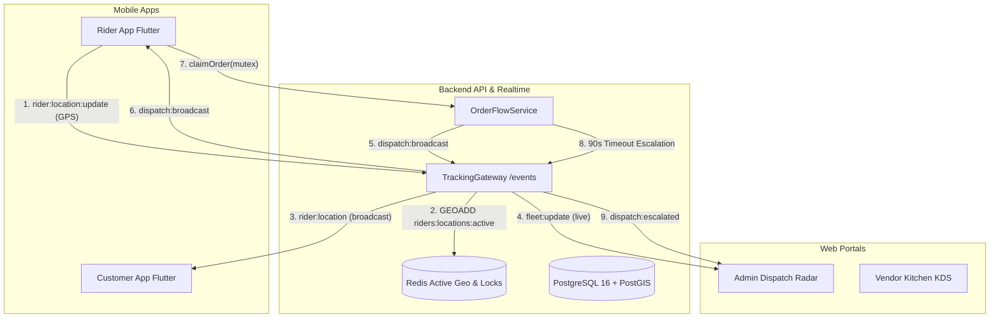

# Phase 2 Implementation Plan — Realtime & Maps Truth-Telling

> **Parent**: [`PROJECT_REVIEW_AND_PLAN.md`](./PROJECT_REVIEW_AND_PLAN.md) §5 Phase 2  
> **Precondition**: Phase 1 completed & verified (`94435d1`).  
> **Goal**: Replace all remaining scripted simulations, timer mocks, and static visual approximations with live, bidirectional WebSockets, real device GPS streaming, real interactive maps, and dispatch timeout escalation.

---

## 🗺️ High-Level Architectural Flow

---

## 📋 Task Breakdown & Work Sequence

| # | Task | Scope | Primary Files Affected |
| :--- | :--- | :--- | :--- |
| **2.1** | **Flutter Socket Client Infrastructure** | Mobile | `apps/customer_app/pubspec.yaml`, `apps/rider_app/pubspec.yaml`, `socket_service.dart`, `socket_providers.dart` |
| **2.2** | **Rider Live Location GPS Telemetry** | Mobile + Realtime | `apps/rider_app/.../duty_provider.dart`, `TrackingGateway.ts`, Redis `GEOADD` |
| **2.3** | **Customer Order Tracking with Real Google Maps** | Mobile | `apps/customer_app/.../tracking_provider.dart`, `tracking_map_view.dart`, Google Maps API manifest config |
| **2.4** | **Admin Live Fleet Radar & Interactive Map** | Web Portal | `apps/admin_portal/.../AdminDispatchPage.tsx`, Leaflet / OpenStreetMap integration, `admin_fleet` socket listener |
| **2.5** | **Dispatch Timeout Escalation & Aging Alerts** | Backend Engine | `OrderFlowService.ts`, `SystemSettings`, timeout cron/interval worker, `admin_hq` escalation event |
| **2.6** | **Push Notification Infrastructure (FCM Interface)** | Backend + Mobile | `NotificationModule`, `FCMService`, `POST /auth/device-token`, User `fcmToken` column |
| **2.7** | **Living Documentation & ADR Synchronization** | Docs | `ADR-004`, `TID-04`, `TID-05`, `WORK_BREAKDOWN.md` |

---

## Task 2.1 — Flutter Socket Client Infrastructure

### Problem
Neither mobile app has WebSocket connectivity. The Customer App runs a fake timer loop (`_startTelemetrySimulation` in `tracking_provider.dart:47-81`) that interpolates dummy coordinates. The Rider App uses a synthetic button or local trigger to display incoming orders without listening to server broadcasts.

### Implementation
1. Add `socket_io_client: ^3.0.2` to both `apps/customer_app/pubspec.yaml` and `apps/rider_app/pubspec.yaml`.
2. Create `core/network/socket_service.dart` in both apps:
   - Connects to `${ApiConstants.baseUrl}/events` namespace with `OptionBuilder().setTransports(['websocket']).setAuth({'token': jwtToken}).build()`.
   - Automatic reconnect with exponential backoff.
   - Lifecycle awareness (connects on user login, disconnects on logout, manages connection status).
3. Riverpod Providers:
   - `socketServiceProvider`: exposes connection state (`connected`, `connecting`, `disconnected`).
   - Typed event streams for domain consumers.

### Acceptance Criteria
- Both apps establish authenticated WebSocket connection to `deliveryos_api` `/events` namespace.
- Server logs confirmation: `Customer [phone] joined room user_[id]` and `Rider [phone] joined rider_[id] and riders_pool`.
- Flutter test suites verify socket lifecycle and event subscriptions with mocked socket clients.

---

## Task 2.2 — Rider Live Location GPS Telemetry

### Problem
Rider beaconing currently sends REST `PATCH /rider/duty` or fake Banani coordinates. It does not stream live coordinates to the socket server for instant zero-latency customer updates.

### Implementation
1. In `apps/rider_app/lib/features/dashboard/providers/duty_provider.dart`:
   - When rider toggles `Online`:
     - Request location permission (`Geolocator.requestPermission()`).
     - Start `Geolocator.getPositionStream(locationSettings: LocationSettings(accuracy: LocationAccuracy.high, distanceFilter: 15))`.
     - On each location tick: emit `rider:location:update` through `SocketService` with `{ latitude, longitude, speed, bearing, isOnline: true }`.
   - When rider toggles `Offline`:
     - Cancel position stream and emit offline status.
2. In `services/backend_api/src/modules/realtime/tracking.gateway.ts`:
   - Verify `rider:location:update` records coordinates into Redis geospatial index (`riders:locations:active` via `GEOADD`).
   - If rider has an active order, broadcast `{ latitude, longitude, bearing, speed, orderId }` directly to `order_{orderId}` room and `admin_fleet` room.

### Acceptance Criteria
- Physical/simulated GPS movement triggers `rider:location:update` on socket.
- Redis `GEOPOS riders:locations:active [riderId]` matches device coordinates.
- Latency from rider device tick to WebSocket dispatch < 100ms.

---

## Task 2.3 — Customer Order Tracking with Real Google Maps

### Problem
`apps/customer_app/.../tracking_map_view.dart` uses a hardcoded `CustomPaint` (`_RouteMapPainter`) with static coordinates `Positioned(left: 50, top: 60)`. It does not show actual roads, real store locations, customer drop-offs, or real-time rider progression.

### Implementation
1. Replace `_RouteMapPainter` in `tracking_map_view.dart` with a real `GoogleMap` widget (`google_maps_flutter`).
2. Implement dynamic marker rendering:
   - **Store Marker**: Restaurant location from `state.store` coordinates.
   - **Customer Marker**: Delivery drop-off location from `state.customer` coordinates.
   - **Rider Marker**: Moving vehicle marker with rotation matching `state.rider.bearing`.
3. Camera Controller:
   - On initialization: animate camera to `LatLngBounds` encompassing store and customer coordinates with padding.
   - When order is dispatched: smoothly pan/center to follow the rider marker.
4. Real-time telemetry consumption:
   - `TrackingNotifier` joins `order_{orderId}` room via socket on mount.
   - Listens to `order:status_changed` (updates stage: `PLACED` -> `PREPARING` -> `READY_FOR_PICKUP` -> `DISPATCHED` -> `DELIVERED`).
   - Listens to `rider:location` (updates rider coordinates, speed, and dynamically recalculated ETA).
   - Delete fake `_telemetryTimer` simulation code.
5. Android & iOS Map Setup:
   - Configure Google Maps API metadata in `AndroidManifest.xml` and `AppDelegate.swift` / `Info.plist`.
   - Support fallback UI if Google Maps key is missing or location services are disabled.

### Acceptance Criteria
- Customer order tracking screen renders live Google Map with real pins.
- As rider moves, rider pin slides smoothly across the map without restarting or jitter.
- Status updates push live from backend without pull-to-refresh or timers.

---

## Task 2.4 — Admin Live Fleet Radar & Interactive Map

### Problem
`AdminDispatchPage.tsx` displays only a tabular list of couriers and a text metrics card. The dispatcher cannot visually view rider geographic distribution or unassigned order locations on a map.

### Implementation
1. Integrate Leaflet / OpenStreetMap into `apps/admin_portal`:
   - Use `leaflet` + `@types/leaflet` (zero API billing key dependency, works out of the box).
   - Render full-width interactive map card on `AdminDispatchPage.tsx`.
2. Real-time fleet rendering:
   - Fetch initial fleet from `GET /admin/fleet`.
   - Connect admin socket client to `admin_fleet` and `admin_hq` rooms.
   - Update courier markers on the map live when `rider:location` events arrive.
   - Distinct marker icons by status:
     - 🟢 Green: Idle & Available (within dispatch radius)
     - 🔵 Blue: On Active Delivery Trip
     - 🟠 Orange: Approaching COD Cash Safety Limit
3. Plot unassigned orders:
   - Render amber pickup pins for `PLACED` orders requiring dispatch.
   - Clicking an order pin opens a quick dispatch card.

### Acceptance Criteria
- `AdminDispatchPage` displays live interactive map showing Dhaka pilot zones.
- Online couriers appear as markers and update position in real time as socket telemetry streams.
- `npm run build` in `admin_portal` passes with zero errors.

---

## Task 2.5 — Dispatch Timeout Escalation & Unassigned Aging

### Problem
If no rider claims a `PLACED` order within `riderSearchTimeoutSeconds` (90s), the order sits indefinitely in the unassigned pool without escalation or re-broadcasting.

### Implementation
1. In `services/backend_api/src/modules/order-flow/order-flow.service.ts`:
   - Implement scheduled dispatch scanner / timeout evaluator (runs every 30 seconds):
     - Finds orders in `PLACED` state (mode `RIDER_FIRST`) with `riderId == null` where `now - placedAt > riderSearchTimeoutSeconds`.
     - Escalation Tier 1 (> 90s): Re-broadcasts to riders with expanded search radius (3 km -> 6 km).
     - Escalation Tier 2 (> 180s): Emits high-priority alert `dispatch:escalated` to `admin_hq` WebSocket room.
2. In `apps/admin_portal/src/pages/admin/AdminDispatchPage.tsx`:
   - Unassigned Dispatch Radar card highlights escalated orders with urgent red pulsation and sound alert.
   - "Force Re-broadcast" and "Manual Assign" quick action buttons.

### Acceptance Criteria
- Unclaimed order automatically triggers radius expansion and admin alert after 90 seconds.
- Admin dispatch radar surfaces escalating wait times.
- Automated integration test `test-dispatch-escalation.ts` verifies tier 1 and tier 2 triggers.

---

## Task 2.6 — Push Notification Infrastructure (FCM Interface)

### Problem
When mobile apps are closed or in the background, WebSocket connections disconnect. Riders miss dispatch broadcasts, and customers miss order status changes.

### Implementation
1. Database Schema (`schema.prisma`):
   - Add `fcmToken String?` and `devicePlatform String?` to `User` model.
   - Generate and apply migration.
2. Backend Notification Module (`services/backend_api/src/modules/notifications/`):
   - `NotificationService`: Interface supporting `sendToUser(userId, title, body, data)` and `sendToRole(role, title, body, data)`.
   - `FCMProvider`: Integrates `firebase-admin` with graceful fallback to local console logger when `FIREBASE_SERVICE_ACCOUNT` is not configured.
   - Controller endpoint `POST /auth/device-token` with `@Body() { fcmToken, platform }`.
3. Event Integration:
   - Call `notificationService.sendToUser(order.customerId, 'Order Update', 'Your order is being prepared!')` on status transitions.
   - Call `notificationService.sendToUser(rider.userId, 'New Delivery Available', 'Order ORD-... nearby ready for pickup!')` on broadcast.

### Acceptance Criteria
- Device token can be registered via `POST /auth/device-token`.
- Status changes and broadcasts trigger notification dispatches without blocking or crashing if Firebase is unconfigured.
- Integration test verifies token registration and notification pipeline.

---

## Task 2.7 — Documentation & Invariants Synchronization

1. **ADR-004**: Update WebSocket Protocol record with client subscription flow, payload schemas, and room hierarchy.
2. **TID-04**: Document `order:join`, `rider:location:update`, and `dispatch:escalated` events.
3. **TID-05**: Document the 2-tier dispatch escalation state machine and radius expansion rules.
4. **WORK_BREAKDOWN.md**: Update Phase 2 tasks and verification checklists.

---

## 🎯 Definition of Done (Phase 2)

- [x] `socket_io_client` integrated into both Flutter apps with resilient connection management.
- [x] Rider live GPS stream emits real socket telemetry; Redis geo index updates in real time.
- [x] Customer tracking screen renders real `GoogleMap` with store, customer, and moving rider markers (zero `CustomPaint` fake simulation).
- [x] Admin Live Fleet Radar renders interactive map with live courier markers and unassigned order pins.
- [x] 90s dispatch timeout escalation triggers radius expansion and admin escalation event.
- [x] Notification infrastructure with `POST /auth/device-token` and status trigger hooks.
- [x] Both mobile apps pass `flutter analyze` and all unit/widget tests (Customer: 32/32, Rider: 28/28).
- [x] Both web portals pass `npm run build` cleanly (0 errors).
- [x] All backend test suites and new realtime/escalation test scripts pass 100% (11 suites verified).
