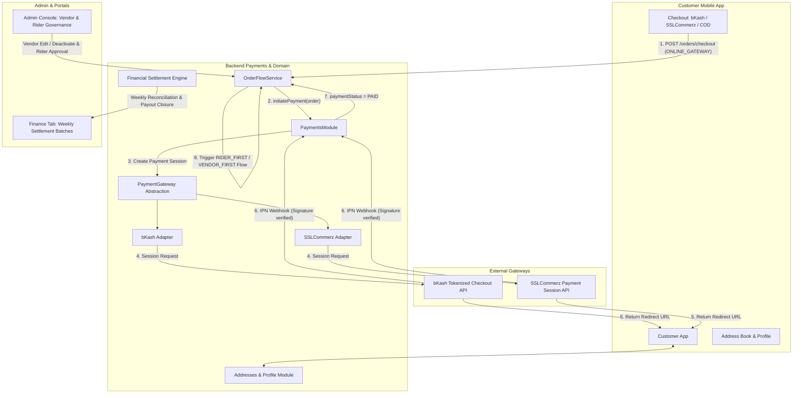

# Phase 3 Implementation Plan — Payments & Business Completeness

> **Parent**: [`PROJECT_REVIEW_AND_PLAN.md`](./PROJECT_REVIEW_AND_PLAN.md) §5 Phase 3  
> **Precondition**: Phase 2 completed & committed ([`aa33153`](file:///Users/bs0650/BS-23-Pro/DeliveryOS)).  
> **Goal**: Implement production online payments (bKash & SSLCommerz gateway adapters, webhooks, and session lifecycle), complete Customer Address Book CRUD & Profile management in mobile and backend, establish Admin Vendor governance and Rider approval workflows, build automated weekly Financial Settlement cycles matching ADR-009, and complete multi-language i18n localization across all apps and portals.

---

## 🗺️ High-Level Architectural Flow



---

## 📋 Task Breakdown & Work Sequence

| # | Task | Scope | Primary Files Affected | Effort |
| :--- | :--- | :--- | :--- | :--- |
| **3.1** | **Online Payment Gateway Stack & Webhook Verification** | Backend + DB | `schema.prisma`, `payments/`, `bkash.provider.ts`, `sslcommerz.provider.ts`, `orders/` | Large |
| **3.2** | **Customer Address Book & Profile Management** | Backend + Mobile | `addresses/`, `customer_addresses`, `customer_app/.../address/`, `profile/`, `cart_screen.dart` | Medium |
| **3.3** | **Admin Vendor Governance & Courier Approval Pipeline** | Backend + Admin Web | `admin.controller.ts`, `admin.service.ts`, `AdminVendorsPage.tsx`, `AdminRidersPage.tsx` | Medium |
| **3.4** | **Automated Financial Settlement Engine & Reconciliation** | Backend + Admin Web | `finance/`, `CommissionLedger`, `RiderTripLedger`, `AdminFinancePage.tsx` | Medium |
| **3.5** | **Complete Multi-Language Localization (i18n)** | Mobile + Portals | `customer_app/l10n/`, `rider_app/l10n/`, `admin_portal/i18n/`, `vendor_portal/i18n/` | Medium |
| **3.6** | **New ADR-011 & Living Documentation Sync** | Architecture Docs | `ADR-011`, `TID-03`, `TID-05`, `BRD-03`, `WORK_BREAKDOWN.md` | Small |
| **3.7** | **End-to-End Test Verification & Regression Shield** | Quality Assurance | `scripts/test-online-payments.ts`, `scripts/test-address-profile.ts`, `scripts/test-settlement-cycles.ts` | Medium |

---

## Task 3.1 — Online Payment Gateway Stack & Webhook Verification

### Problem & Core Business Invariant
`checkout.dto.ts` accepts `ONLINE_GATEWAY`, but orders previously had no gateway session creation, adapter abstraction, or webhook reconciliation. 

> [!IMPORTANT]
> **Online Payment Invariant**: When a customer chooses `ONLINE_GATEWAY`, the order **MUST NOT** be broadcasted to riders (`riders_pool`), alerted to vendor kitchen consoles, or escalated by timeout workers while `paymentStatus === PENDING`. Dispatch broadcast and kitchen alerting **occur exclusively after successful webhook verification (`paymentStatus === PAID`)**. If payment fails, is cancelled, or expires after 15 minutes, the order is cancelled with zero merchant or rider disruption.

### Implementation Details
1. **Prisma Schema Updates**:
   - Add `Payment` model to `services/backend_api/prisma/schema.prisma`:
     ```prisma
     model Payment {
       id               String        @id @default(uuid()) @db.Uuid
       orderId          String        @map("order_id") @db.Uuid
       gateway          String        @db.VarChar(50) // BKASH, SSLCOMMERZ, SANDBOX
       transactionId    String?       @unique @map("transaction_id") @db.VarChar(100)
       sessionKey       String?       @map("session_key") @db.VarChar(150)
       amount           Decimal       @db.Decimal(10, 2)
       currency         String        @default("BDT") @db.VarChar(10)
       status           PaymentStatus @default(PENDING)
       gatewayResponse  Json?         @map("gateway_response")
       paidAt           DateTime?     @map("paid_at") @db.Timestamptz
       failedAt         DateTime?     @map("failed_at") @db.Timestamptz
       createdAt        DateTime      @default(now()) @map("created_at") @db.Timestamptz
       updatedAt        DateTime      @default(now()) @updatedAt @map("updated_at") @db.Timestamptz

       order Order @relation(fields: [orderId], references: [id], onDelete: Cascade)
       @@index([orderId])
       @@map("payments")
     }
     ```
   - Generate and apply migration (`add_payments_table`).
2. **Gateway Abstraction Layer**:
   - Create interface `IPaymentGateway`:
     ```typescript
     export interface PaymentInitiationResult {
       paymentUrl: string;
       transactionId: string;
       sessionKey?: string;
     }

     export interface WebhookValidationResult {
       isValid: boolean;
       transactionId: string;
       orderId: string;
       amount: number;
       status: PaymentStatus;
       rawResponse: Record<string, unknown>;
     }

     export interface IPaymentGateway {
       readonly name: string;
       initiatePayment(params: PaymentInitiationParams): Promise<PaymentInitiationResult>;
       verifyWebhook(payload: Record<string, unknown>, headers: Record<string, string>): Promise<WebhookValidationResult>;
       queryTransaction(transactionId: string): Promise<PaymentStatus>;
     }
     ```
3. **Gateway Implementations**:
   - **`BkashGatewayAdapter`**: Integrates bKash Tokenized Checkout API v1.2.0 (token grant, create payment, execute payment callback).
   - **`SslCommerzGatewayAdapter`**: Integrates SSLCommerz Hosted Session API (`gwprocess/v4/api.php`) with IPN hash validation (`val_id` verification).
   - **`SandboxGatewayAdapter`**: Strictly enabled in `NODE_ENV !== 'production'` to provide deterministic simulated payment verification for automated test suites.
4. **Payments Controller & Service**:
   - `POST /payments/initiate`: Creates `Payment` record and returns `{ paymentUrl, transactionId }`.
   - `POST /payments/webhook/:gateway`: Idempotent webhook handler verifying HMAC/checksum signatures, updating `Payment` and `Order` (`paymentStatus = PAID`), and triggering dispatch broadcast in `OrderFlowService`.
   - `GET /payments/callback/:gateway`: User browser return redirect URL handler.
   - **Payment Verified Dispatch Trigger**: Added `OrderFlowService.handleOrderPaid(orderId)` which activates the `RIDER_FIRST` proximity broadcast or `VENDOR_FIRST` kitchen chime only after payment success.
   - **Pending Payment Expiration Worker**: 15-minute background sweep marking abandoned checkout attempts as `PaymentStatus.FAILED`.

---

## Task 3.2 — Customer Address Book & Profile Management

### Problem
The `CustomerAddress` entity exists in the database schema, but there are zero CRUD endpoints for it. Customer mobile users cannot save favorite addresses ("Home", "Work"), edit floor/notes, or manage their profile name and email.

### Implementation Details
1. **Backend Endpoints (`services/backend_api/src/modules/addresses/`)**:
   - `POST /customers/addresses`: Create new address with geofence validation.
   - `GET /customers/addresses`: List all saved addresses for authenticated user.
   - `PUT /customers/addresses/:id`: Update address line, building/floor, delivery note, coordinates.
   - `DELETE /customers/addresses/:id`: Remove saved address.
   - `PATCH /customers/addresses/:id/default`: Set target address as `isDefault = true` (clears others atomically).
   - `GET /customers/profile`: Retrieve customer profile, total completed orders, and saved addresses.
   - `PATCH /customers/profile`: Update customer full name and email.
2. **Customer App Flutter UI (`apps/customer_app/lib/features/`)**:
   - Create `features/address/` with Riverpod `addressProvider`:
     - `SavedAddressesScreen`: List of saved cards with default badges, swipe-to-delete, and "Add New Address".
     - `AddressEditModal`: Form for label (Home / Work / Other), address text, apartment/floor, delivery note, and map picker link.
   - Create `features/profile/` with `ProfileScreen`:
     - Customer details card, quick link to "Saved Addresses", language toggle, order history shortcut, and logout.
   - **Cart Checkout Integration**:
     - Replace static address field in `CartScreen` with an interactive address picker bottom-sheet populated from `addressProvider`.

---

## Task 3.3 — Admin Vendor Governance & Courier Approval Pipeline

### Problem
Super Admins cannot edit existing vendor outlets (change prep times, commission rates, delivery radius), cannot temporarily deactivate problematic stores, and have no approval queue for new delivery couriers.

### Implementation Details
1. **Database Schema Update**:
   - Add `isApproved Boolean @default(true) @map("is_approved")` to `Rider` model in `schema.prisma`.
   - For new public OTP rider registrations, set `isApproved = false` until approved by Super Admin.
2. **Backend Admin Endpoints (`services/backend_api/src/modules/admin/`)**:
   - `PATCH /admin/vendors/:id`: Update vendor outlet details (`name`, `branchName`, `contactPhone`, `commissionRate`, `deliveryRadiusKm`, `defaultPrepTimeMinutes`).
   - `PATCH /admin/vendors/:id/status`: Toggle `isActive` (activates/deactivates store; immediately updates customer discovery visibility).
   - `GET /admin/riders`: List couriers with filtering by `approvalStatus` (`PENDING`, `APPROVED`, `ALL`) and `onlineStatus`.
   - `PATCH /admin/riders/:id/approval`: Set `isApproved: true | false`.
   - `PATCH /admin/riders/:id/cash-limit`: Adjust `maxCashLimit` (e.g. increase limit for senior trusted couriers).
3. **Admin Portal UI (`apps/admin_portal/src/pages/admin/`)**:
   - **`AdminVendorsPage.tsx`**:
     - Add "Edit Store" dialog to adjust commission rate, delivery radius, and prep timer.
     - Add Status Toggle badge: `Active` (Green) / `Suspended` (Gray) with confirmation prompt.
   - **`AdminRidersPage.tsx`**:
     - Add "Approval Status" filter tab (`Pending Approval` badge with count).
     - Add "Approve Courier" and "Suspend Courier" action buttons.
     - Add "Edit Cash Limit" modal.

---

## Task 3.4 — Automated Financial Settlement Engine & Reconciliation

### Problem
`finance/settlement-export` generates raw CSV statements, but there is no automated settlement batch closure. Ledger entries remain indefinitely in `SettlementStatus.PENDING`, and there is no audit record of when payouts were executed or which batch they belonged to.

### Implementation Details
1. **Database Schema Updates**:
   - Add `SettlementBatch` model to `schema.prisma`:
     ```prisma
     model SettlementBatch {
       id                 String           @id @default(uuid()) @db.Uuid
       batchNumber        String           @unique @map("batch_number") @db.VarChar(30)
       startDate          DateTime         @map("start_date") @db.Timestamptz
       endDate            DateTime         @map("end_date") @db.Timestamptz
       totalOrders        Int              @map("total_orders")
       totalVendorPayout  Decimal          @map("total_vendor_payout") @db.Decimal(12, 2)
       totalRiderPayout   Decimal          @map("total_rider_payout") @db.Decimal(12, 2)
       totalPlatformMargin Decimal         @map("total_platform_margin") @db.Decimal(12, 2)
       status             SettlementStatus @default(SETTLED)
       executedByUserId   String?          @map("executed_by_user_id") @db.Uuid
       executedAt         DateTime         @default(now()) @map("executed_at") @db.Timestamptz

       @@map("settlement_batches")
     }
     ```
   - Add `settlementBatchId String? @map("settlement_batch_id") @db.Uuid` to `CommissionLedger` and `RiderTripLedger`.
2. **Financial Settlement Engine (`services/backend_api/src/modules/admin/finance/`)**:
   - `POST /admin/finance/settle-cycle`:
     - Queries all `CommissionLedger` and `RiderTripLedger` records where `settlementStatus = PENDING` and orders are `DELIVERED`.
     - Validates ADR-009 double-entry equality: $\sum \text{Customer} = \sum \text{Vendor} + \sum \text{Rider} + \sum \text{Platform Margin}$.
     - Creates atomic `SettlementBatch` and transitions matching ledgers to `SETTLED` in an ACID transaction.
   - **Weekly Automated Cron Job**: Evaluates settlement window every Sunday at 00:00 UTC with structured Slack/logger notifications.
3. **Admin Portal UI (`AdminFinancePage.tsx`)**:
   - Add "Settlement Cycles" tab displaying historical batches (`Batch #`, `Period`, `Payouts`, `Margin`, `Date`).
   - Add "Run Settlement Cycle" action button with confirmation dialog.

---

## Task 3.5 — Complete Multi-Language Localization (i18n)

### Problem
The Rider mobile app has hardcoded English strings throughout its screens. The Customer mobile app has several missing Bengali translations in new features (tracking, socket alerts). Web portals have untranslated text in newly added Phase 2/3 cards.

### Implementation Details
1. **Customer & Rider Mobile Apps**:
   - Complete `app_localizations.dart` translations for English (`en`) and Bengali (`bn`):
     - Order status messages, socket connection notifications, address labels, profile actions, payment methods.
   - Add full Bengali language toggle to `apps/rider_app` settings drawer.
2. **Admin & Vendor Web Portals**:
   - Expand `src/i18n/locales/en.json` and `bn.json` in both `apps/admin_portal` and `apps/vendor_portal` to cover all new Phase 2/3 UI elements (Live Map pins, Escalation alerts, Vendor Edit, Rider Approval, Settlement Cycle dialogs).

---

## Task 3.6 — Architectural Synchronization (ADR-011)

### Implementation Details
1. **Author `ADR-011`**:
   - Document `Multi-Gateway Online Payment Architecture & Webhook Idempotency`.
   - Specify HMAC signature validation protocols, webhook replay prevention, and gateway timeout reconciliation.
2. **Update Technical Specs**:
   - Update `TID-03`: Document payment, address, profile, and settlement endpoints.
   - Update `TID-05`: Document online payment gateway integration into order checkout state machine.
   - Update `WORK_BREAKDOWN.md`: Record Phase 3 implementation details and verification checklists.

---

## Task 3.7 — Comprehensive Verification & Regression Shield

### Implementation Details
1. **Automated Test Scripts (`services/backend_api/scripts/`)**:
   - `test-online-payments.ts`: Tests payment session initiation, webhook verification, signature replay rejection, and post-payment order state transition.
   - `test-address-profile.ts`: Tests complete address CRUD lifecycle, default address atomicity, and customer profile updates.
   - `test-settlement-cycles.ts`: Tests financial aggregation, double-entry equality check, batch creation, and ledger status update.
2. **Portal & Mobile Verification**:
   - `npm run build` in `apps/admin_portal` (0 errors).
   - `npm run build` in `apps/vendor_portal` (0 errors).
   - `flutter analyze` in `apps/customer_app` (0 errors, 0 warnings).
   - `flutter analyze` in `apps/rider_app` (0 errors, 0 warnings).
   - `flutter test` across all customer and rider test suites.
   - Full regression run of all 11 backend test suites (`npm run e2e:test`, etc.).

---

## 🎯 Definition of Done (Phase 3)

- [ ] `Payment` model and migration applied; `IPaymentGateway` interface implemented with bKash, SSLCommerz, and Sandbox adapters.
- [ ] Online payment initiation and signature-verified webhook endpoints operational.
- [ ] Customer address book CRUD endpoints and mobile `SavedAddressesScreen` / `ProfileScreen` fully operational.
- [ ] Admin Portal supports editing vendor parameters, deactivating/activating outlets, and approving couriers.
- [ ] Weekly Financial Settlement Engine reconciles ledgers and creates atomic `SettlementBatch` records.
- [ ] English and Bengali localization complete across both Flutter mobile apps and both web portals.
- [ ] `ADR-011`, `TID-03`, `TID-05`, and `WORK_BREAKDOWN.md` synchronized.
- [ ] Zero raw `any` types; all backend test suites and new Phase 3 tests pass 100%.
- [ ] Both Flutter apps pass `flutter analyze` and all unit/widget tests; both web portals build cleanly.
