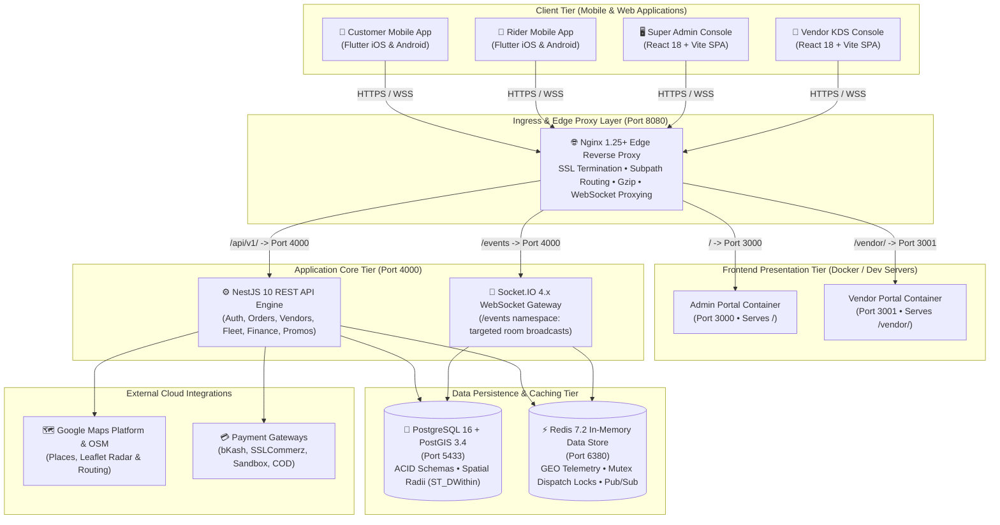
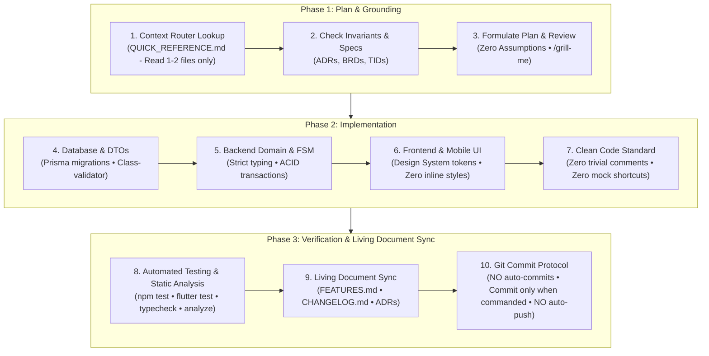

# DeliveryOS — On-Demand Hyperlocal Delivery Platform
### Enterprise Multi-Vendor Delivery Engine for Food, Grocery, Super Shop & Retail

Welcome to the **DeliveryOS** repository.  
DeliveryOS is a production-grade, multi-vertical on-demand delivery ecosystem engineered for hyper-growth logistics across emerging and global markets.

---

## 🌟 Platform Mission & Multi-Vertical Architecture

DeliveryOS provides a unified operational core that powers multiple retail and delivery business models on a single infrastructure:

- 🍔 **Food & Cloud Kitchens**: Real-time kitchen order display (KDS), preparation countdown timers, synthesized audio alerts, and automated rider dispatch.
- 🥦 **Grocery & Supermarkets**: Fast basket-building, category navigation, multi-weight items (`kg`, `500g`, `pack`), and high-density inventory stockout management.
- 💊 **Pharmacies & Healthcare**: OTC remedies, personal care, categorized prescription drops, and localized merchant support.
- 🏬 **Super Shops & Department Stores**: Multi-department product catalogs, mixed-item orders, and consolidated dispatch logistics.

### Monorepo Topology
```
DeliveryOS/
├── apps/
│   ├── admin_portal/       # Super Admin Control Tower (React 18 + Vite + TailwindCSS + Leaflet OSM)
│   ├── vendor_portal/      # Vendor Kitchen Display & Store Portal (React 18 + Vite + Web Audio API)
│   ├── customer_app/       # Consumer Ordering App (Flutter 3.19+ iOS & Android, Riverpod 3.3.2)
│   └── rider_app/          # Courier Duty & Dispatch Cockpit (Flutter 3.19+ iOS & Android, Riverpod 3.3.2)
│
├── services/
│   └── backend_api/        # Core API & Telemetry Engine (NestJS 10, PostgreSQL 16 + PostGIS, Redis 7.2)
│
├── deploy/
│   ├── docker-compose.yml  # Local multi-container topology (PostGIS, Redis, App Services, Nginx)
│   ├── init-postgis.sql    # Spatial extension bootstrap
│   └── nginx/              # Unified subpath reverse proxy configuration
│
└── context_docs/           # Authoritative living specifications & AI governance suite
```

---

## 🏗️ System Architecture & Ingress Topology

Traffic enters through a unified Nginx edge proxy on port 8080 and is routed to dedicated presentation containers, micro-services, and real-time gateways:



---

## ⚡ 5-Minute Local Setup & Execution Guide

Follow these steps to spin up the entire DeliveryOS ecosystem locally:

### 1. Prerequisites
- **Node.js**: v20.x LTS or newer
- **Docker & Docker Compose**: Docker Desktop 4.x or Linux Docker Engine
- **Flutter SDK**: 3.19.x or newer (for mobile apps)

### 2. Boot Data Infrastructure (PostgreSQL + PostGIS & Redis)
From the repository root, start the pre-configured database and cache containers:
```bash
docker compose -f deploy/docker-compose.yml up -d postgres redis
```
* PostgreSQL + PostGIS will be available on `localhost:5433` (Database: `deliveryos`, User: `postgres`, Password: `secretpassword`).
* Redis will be available on `localhost:6380`.

### 3. Initialize Database & Seed Master Data
Navigate to the backend API directory, install dependencies, run Prisma migrations, and execute the seeder:
```bash
cd services/backend_api
npm install
npx prisma migrate dev
npm run prisma:seed
```
The seed script generates:
- **Super Admin**: `admin@deliveryos.local` (Password: `admin123`)
- **Vendor Outlets**: Pizza Roma (Restaurant), Daily Fresh (Supermarket)
- **Menu Items & Variants**: Pizzas, beverages, groceries with topping options
- **Coupons & Banners**: `WELCOME50` coupon and promotional carousels
- **System Settings**: Configured for `RIDER_FIRST` dispatch flow and dual fee pricing

### 4. Run the Backend API & WebSocket Gateway
```bash
# Inside services/backend_api
npm run start:dev
```
* REST API available at `http://localhost:4000/api/v1`
* WebSocket Gateway running on `ws://localhost:4000/events`

### 5. Run the Web Portals
Open two separate terminal windows for the frontend control towers:

**Super Admin Operations Console (Port 3000)**:
```bash
cd apps/admin_portal
npm install
npm run dev
```
Open [http://localhost:3000](http://localhost:3000) (Login: `admin@deliveryos.local` / `admin123`).

**Vendor Kitchen Display System (Port 3001)**:
```bash
cd apps/vendor_portal
npm install
npm run dev
```
Open [http://localhost:3001](http://localhost:3001) (Login with merchant credentials from seed output).

### 6. Run the Mobile Applications (Customer & Rider)
In separate terminal windows:

**Customer Mobile App**:
```bash
cd apps/customer_app
flutter pub get
flutter run -d chrome # or run on connected iOS/Android emulator
```

**Rider Fleet Mobile App**:
```bash
cd apps/rider_app
flutter pub get
flutter run -d chrome # or run on connected iOS/Android emulator
```

### 7. (Optional) Run via Unified Edge Proxy (Nginx on Port 8080)
To run everything under the single-domain subpath reverse proxy:
```bash
docker compose -f deploy/docker-compose.yml up -d
```
All applications are unified at `http://localhost:8080`:
- `/` ➔ Super Admin Portal
- `/vendor/` ➔ Vendor KDS Portal
- `/api/v1/` ➔ Backend REST API
- `/events` ➔ Realtime WebSockets

---

## 📸 Platform Application Showcase

| 🖥️ Super Admin Control Tower | 🍳 Vendor Kitchen Display System (KDS) |
| :---: | :---: |
|  |  |
| **Centralized Dispatch & Financial Control**<br/>• Real-time dispatch engine toggle<br/>• Interactive Leaflet OpenStreetMap live fleet radar<br/>• URL deep-linked order overrides (`?orderNumber=...`)<br/>• RFC 4180 CSV financial settlement exports | **3-Lane High-Contrast Kitchen Kanban**<br/>• 3-stage progression (*New*, *Preparing*, *Ready*)<br/>• Digital prep SLA countdown timers<br/>• Web Audio API dual-tone synthesized bell chime<br/>• 1-click Rush Hour emergency pause |

| 📱 Customer Ordering Experience | 🛵 Rider Fleet Duty Cockpit |
| :---: | :---: |
|  |  |
| **Hyperlocal Store Discovery & Cart**<br/>• Dynamic hero promotions & category filters<br/>• Direct Add-to-Cart with conflict replacement dialog<br/>• 6-stage order tracking stepper & live courier radar<br/>• One-tap Switch-to-COD on payment failure | **Active Duty & 3-Step Fulfillment**<br/>• One-tap shift toggle with in-flight delivery lock<br/>• Dual-sensory 45s dispatch broadcast alert<br/>• Atomic Redis mutex order claiming (`SET NX EX`)<br/>• 5-minute doorstep customer unresponsive SOP |

---

## 🧭 Spec-Driven Development Workflow (3-Phase Protocol)

Every developer and AI assistant contributing to DeliveryOS adheres to the **3-Phase Spec-Driven Development Workflow**:



### 1. Phase 1: Plan & Grounding
- **Targeted Context**: Check [`context_docs/QUICK_REFERENCE.md`](context_docs/QUICK_REFERENCE.md) to load only the 1–2 files relevant to the task (zero token waste).
- **Invariant Verification**: Check architectural contracts in [`ADR Index`](context_docs/architecture-decision-records/README.md), [`BRDs`](context_docs/business-requirements-documents/README.md), and [`TIDs`](context_docs/technical-implementation-documents/README.md).
- **Zero Assumptions**: If any requirement or edge case is ambiguous, pause and ask structured questions with recommended options before writing code.

### 2. Phase 2: Implementation
- **Strict Type Safety**: Maintain `"strict": true` across backend and web portals with **zero raw `any`**.
- **Design System Governance**: Strictly consume centralized tokens (`AppColors`, `AppTypography`, `AppSpacing`, `AppRadius`, Tailwind semantic classes). **Zero raw inline styles or arbitrary colors**.
- **Production Realism**: Real code only with database transactions (`prisma.$transaction`). **Zero mock fallbacks**, **zero empty `TODO`s**, and **zero deleted failing tests**.
- **Clean Code Standard**: Express intent through self-documenting names. Add code comments **only** for complex algorithms, subtle business invariants, or tricky edge cases per `AGENT_RULES.md § 3.6`.

### 3. Phase 3: Verification & Living Document Sync
- **Automated Verification**: Run `npm run typecheck`, `npm run build`, and test suites (`npm run track1:test`, etc.) for backend/portals; run `flutter analyze` (0 errors) and `flutter test` for mobile apps.
- **Living Document Sync**: Immediately update [`FEATURES.md`](FEATURES.md) (line-level capability catalog), [`CHANGELOG.md`](CHANGELOG.md) (roadmap deliverables & release notes), and ADRs if architectural decisions evolved.
- **Git Invariant**: **NO auto-commits** (commit only upon explicit user command); **NO auto-push** (execute only local commits).

### 📋 Repeatable Engineering Checklists

<details>
<summary><b>Checklist A: Adding a New Feature or Sub-Feature</b></summary>

- [ ] **1. Grounding**: Consult `QUICK_REFERENCE.md` to load only the required 1–2 spec files.
- [ ] **2. Invariant Check**: Verify compliance with related ADRs, state machines, and business rules.
- [ ] **3. Schema Migration**: Create and run Prisma migrations with proper indexes and PostGIS spatial types if schema evolves.
- [ ] **4. Backend DTO & Service**: Strictly typed DTOs with `class-validator`, ACID transaction in service, standard API envelope.
- [ ] **5. Realtime Events**: Wire Socket.IO room joins/emits and Redis pub/sub if real-time updates are involved.
- [ ] **6. UI Implementation**: Centralized design system tokens, responsive layouts, error handling, loading states.
- [ ] **7. Automated Verification**: Backend test scripts, `npm run typecheck`, and `flutter analyze` / `flutter test`.
- [ ] **8. Living Docs Sync**: Add line item to `FEATURES.md`, record deliverable in `CHANGELOG.md`.
- [ ] **9. Commit Protocol**: Await explicit user command before executing `git commit`.

</details>

<details>
<summary><b>Checklist B: Fixing an Existing Feature or Bug</b></summary>

- [ ] **1. Root Cause Analysis**: Reproduce the issue with an automated test before modifying code.
- [ ] **2. Spec Verification**: Confirm intended behavior in BRD and TID documents; verify no invariant is violated.
- [ ] **3. Surgical Fix**: Apply targeted code changes without broad, unnecessary rewrites.
- [ ] **4. Type & Style Adherence**: Zero raw `any`, zero inline colors/styles, zero trivial comments.
- [ ] **5. Regression Testing**: Run regression test suites (`npm run track1:test`, `flutter test`, etc.).
- [ ] **6. Living Docs Sync**: Record fix in `CHANGELOG.md` under `### Fixed`, update `FEATURES.md` if behavior changed.
- [ ] **7. Commit Protocol**: Await explicit user command before executing `git commit`.

</details>

<details>
<summary><b>Checklist C: Code Refactoring & Modernization</b></summary>

- [ ] **1. Architectural Alignment**: Ensure refactoring aligns with ADRs and preserves established patterns.
- [ ] **2. Interface Preservation**: Preserve public API signatures, DTO contracts, and component prop interfaces.
- [ ] **3. Token Extraction**: Replace hardcoded values with design system tokens (`AppColors`, `AppTypography`, `AppSpacing`).
- [ ] **4. Dead Code Cleanup**: Delete unused methods, obsolete imports, and commented-out code completely.
- [ ] **5. Static Analysis & Tests**: Verify `npm run typecheck` exits 0, `flutter analyze` reports 0 issues, and tests pass 100%.
- [ ] **6. Living Docs Sync**: Document refactoring in `CHANGELOG.md` under `### Changed`.
- [ ] **7. Commit Protocol**: Await explicit user command before executing `git commit`.

</details>

---

## ⚡ Core Operational Invariants Matrix

Every human engineer and AI agent operating in this repository must uphold these non-negotiable standards:

| Invariant | Direct Rule Command | Authoritative Section in `AGENT_RULES.md` |
| :--- | :--- | :--- |
| **Commit Authority** | **NO AUTO-COMMITS**: Never run `git commit` autonomously. Run `git commit` **only** when explicitly commanded by the user. | [Git Protocol (§ 6.1)](context_docs/AGENT_RULES.md#6-git--version-control-protocol) |
| **Push Authority** | **NO AUTO-PUSH**: When commanded to commit, execute **ONLY the local commit**. Never run `git push` without an explicit, distinct push command. | [Git Protocol (§ 6.1)](context_docs/AGENT_RULES.md#6-git--version-control-protocol) |
| **Type Safety** | **ZERO RAW `any`**: Maintain strict typing (`"strict": true`). Declare explicit DTOs, interfaces, or Prisma types; never cast to `any`. | [Backend & Frontend Standards (§ 3)](context_docs/AGENT_RULES.md#3-technology-stack--architectural-standards) & [ADR-010](context_docs/architecture-decision-records/ADR-010-ai-driven-engineering-governance-and-no-auto-commits.md) |
| **Design System Invariant** | **ZERO INLINE STYLING**: Never use hardcoded inline colors (e.g. `Color(0x...)`, `Colors.amber`), arbitrary un-themed Tailwind values (`text-[#...]`), or scattered ad-hoc text styles. Use centralized tokens (`AppColors`, `AppTypography`, `AppSpacing`, Tailwind semantic classes). | [Design System Standard (§ 3.7)](context_docs/AGENT_RULES.md#37-design-system-standards-zero-arbitrary-inline-styles) |
| **Production Realism** | **ZERO PLACEHOLDER SHORTCUTS**: Implement real production code without mock fallbacks, empty `TODO`s, or deleted failing tests. | [Definition of Done (§ 5)](context_docs/AGENT_RULES.md#5-definition-of-done-dod) |
| **Architectural Sync** | **ADR SYNCHRONIZATION**: Any modification to dependencies, state machines, storage, or ingress requires an ADR update or creation. | [Pattern Consistency (§ 8.4)](context_docs/AGENT_RULES.md#8-pattern-consistency--living-documentation-protocol) & [ADR Index](context_docs/architecture-decision-records/README.md) |
| **Code Commenting** | **NO TRIVIAL COMMENTS**: Do not add comments on basic code, obvious functions, simple UI widgets, or routine boilerplate. Code must be self-documenting. Add comments **only** for complex algorithms, subtle business invariants, or tricky edge cases. | [Clean Code & Minimal Comments (§ 3.6)](context_docs/AGENT_RULES.md#36-code-cleanliness--commenting-standards) |
| **Active Clarification** | **ZERO ASSUMPTIONS**: If a requirement or user prompt is ambiguous, pause and ask structured questions with recommended options before executing. | [Active Interview Protocol (§ 7)](context_docs/AGENT_RULES.md#7-zero-assumption--active-interview-protocol) |

---

## 📖 Master Documentation Index & Task Router

All authoritative system rules, business workflows, technical specifications, and architecture decisions are maintained in `context_docs/`:

1. **[Quick Reference & Context Router](./context_docs/QUICK_REFERENCE.md)** — Token-efficient task-to-document routing table (load 1–2 files only).
2. **[Spec-Driven Development Workflow](#-spec-driven-development-workflow-3-phase-protocol)** — Authoritative 3-phase engineering protocol (Plan ➔ Implement ➔ Verify & Sync) and repeatable checklists directly on this README.
3. **[Master AI Agent Rules & Invariants](./context_docs/AGENT_RULES.md)** — Engineering standards, DoD, and governance.
4. **[Master System Feature Catalog](./FEATURES.md)** — Line-level, granular catalog of every capability across all 5 sub-projects.
5. **[Changelog, Milestones & Engineering Roadmap](./CHANGELOG.md)** — Step-by-step engineering roadmap, active milestone tracker, and standardized Keep a Changelog (SemVer) release history.
6. **[Business Requirements Documents (BRD)](./context_docs/business-requirements-documents/README.md)**:
   - [`BRD-00: Master Product Overview`](./context_docs/business-requirements-documents/00-master-product-overview.md)
   - [`BRD-01: Executive Summary & Vision`](./context_docs/business-requirements-documents/01-executive-summary-and-vision.md)
   - [`BRD-02: Stakeholder Roles & Personas`](./context_docs/business-requirements-documents/02-stakeholder-roles-and-personas.md)
   - [`BRD-03: Core Business Rules & Workflows`](./context_docs/business-requirements-documents/03-core-business-rules-and-workflows.md)
   - [`BRD-04: Customer Experience & Journey`](./context_docs/business-requirements-documents/04-customer-experience-and-journey.md)
   - [`BRD-05: Merchant & Vendor Operations`](./context_docs/business-requirements-documents/05-merchant-and-vendor-operations.md)
   - [`BRD-06: Rider Fleet & Dispatch Handbook`](./context_docs/business-requirements-documents/06-rider-fleet-and-dispatch-handbook.md)
   - [`BRD-07: Admin Operations & Pilot Guide`](./context_docs/business-requirements-documents/07-admin-operations-and-pilot-guide.md)
7. **[Technical Implementation Documents (TID)](./context_docs/technical-implementation-documents/README.md)**:
   - [`TID-01: System Architecture & Tech Stack`](./context_docs/technical-implementation-documents/01-system-architecture-and-tech-stack.md)
   - [`TID-02: Database Schema & Data Models`](./context_docs/technical-implementation-documents/02-database-schema-and-data-models.md)
   - [`TID-03: API Specifications & Endpoints`](./context_docs/technical-implementation-documents/03-api-specifications-and-endpoints.md)
   - [`TID-04: Realtime Events & WebSocket Protocol`](./context_docs/technical-implementation-documents/04-realtime-events-and-websocket-protocol.md)
   - [`TID-05: Order State Machine & Dispatch Engine`](./context_docs/technical-implementation-documents/05-order-state-machine-and-dispatch-engine.md)
   - [`TID-06: Frontend & Mobile Architecture`](./context_docs/technical-implementation-documents/06-frontend-and-mobile-architecture.md)
   - [`TID-07: Deployment, DevOps & Environment Setup`](./context_docs/technical-implementation-documents/07-deployment-devops-and-environment-setup.md)
8. **[Architecture Decision Records (ADRs)](./context_docs/architecture-decision-records/README.md)**:
   - [`ADR-001`](./context_docs/architecture-decision-records/ADR-001-modular-monorepo-and-ingress-topology.md): Modular Monorepo Architecture & Nginx Edge Ingress Topology
   - [`ADR-002`](./context_docs/architecture-decision-records/ADR-002-dynamic-dual-order-flow-fsm.md): Dynamic Dual Order Flow State Machine
   - [`ADR-003`](./context_docs/architecture-decision-records/ADR-003-postgis-spatial-engine-and-redis-geohash.md): Spatial PostGIS Geofencing & Redis Geohash
   - [`ADR-004`](./context_docs/architecture-decision-records/ADR-004-atomic-dispatch-claim-mutex.md): Atomic Dispatch Claim Mutex
   - [`ADR-005`](./context_docs/architecture-decision-records/ADR-005-micro-frontends-and-subpath-routing.md): Micro-Frontends & Subpath Reverse Proxy
   - [`ADR-006`](./context_docs/architecture-decision-records/ADR-006-dual-store-frontend-paradigm-and-websocket-invalidation.md): Dual-Store Frontend Paradigm & WebSocket Invalidation
   - [`ADR-007`](./context_docs/architecture-decision-records/ADR-007-web-audio-api-synthesized-kds-chime.md): Web Audio API Synthesized KDS Chime
   - [`ADR-008`](./context_docs/architecture-decision-records/ADR-008-immutable-jsonb-historical-snapshots.md): Immutable JSONB Historical Snapshots
   - [`ADR-009`](./context_docs/architecture-decision-records/ADR-009-deterministic-financial-accounting-ledger.md): Deterministic Financial Accounting Ledger
   - [`ADR-010`](./context_docs/architecture-decision-records/ADR-010-ai-driven-engineering-governance-and-no-auto-commits.md): AI-Driven Engineering Governance & No-Auto-Commits
   - [`ADR-011`](./context_docs/architecture-decision-records/ADR-011-multi-gateway-online-payment-and-webhook-idempotency.md): Multi-Gateway Payment & Webhook Idempotency
