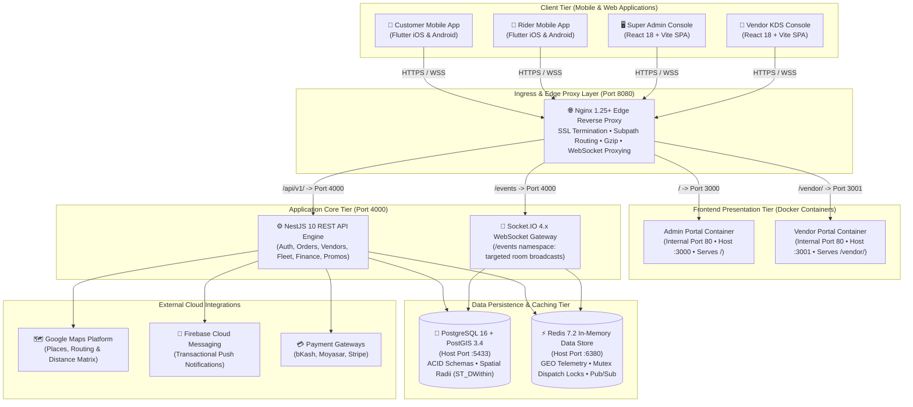

# DeliveryOS — On-Demand Hyperlocal Delivery Platform
### Multi-Vendor Delivery Solution for Food, Grocery, Super Shop & Retail

Welcome to the **DeliveryOS** repository. This repository houses the complete business, operational, and technical architecture for a production-grade on-demand multi-vertical delivery ecosystem.

---

## 📁 Repository Structure & Context Suite

All core documentation, business handbooks, technical specifications, and AI development rules are located in the top-level **`context_docs/`** directory:

```
DeliveryOS/
├── AGENTS.md                                    # Quick entry point for AI coding agents
├── README.md                                    # Master project README
│
└── context_docs/                                # Authoritative project context directory
    ├── AGENT_RULES.md                           # Master AI engineering rules, standards & DoD
    ├── QUICK_REFERENCE.md                       # Task-to-File Context Router
    │
    ├── architecture-decision-records/           # Architecture Decision Records (ADRs)
    │   ├── README.md                            # ADR Master Index, lifecycle & AI protocol
    │   └── ADR-001 through ADR-010              # Infrastructure, FSM, GIS, Concurrency & AI ADRs
    │
    ├── business-requirements-documents/         # For founders, business stakeholders & non-tech users
    │   ├── README.md                            # Business suite guide & index
    │   ├── 00-master-product-overview.md        # Master non-technical showcase & 4-app feature guide
    │   ├── 01-executive-summary-and-vision.md   # High-level vision, multi-vertical model & KPIs
    │   ├── 02-stakeholder-roles-and-personas.md # Customer, Store Manager, Rider & Admin personas
    │   ├── 03-core-business-rules-and-workflows.md# Order lifecycle, Flat vs Distance fees, commissions
    │   ├── 04-customer-experience-and-journey.md# Screen-by-screen customer app journey & smart re-order
    │   ├── 05-merchant-and-vendor-operations.md # Kitchen/Store order board, stock toggles & menus
    │   ├── 06-rider-fleet-and-dispatch-handbook.md# 3-step smooth fulfillment, broadcast dispatch & cash rules
    │   └── 07-admin-operations-and-pilot-guide.md# Master admin controls & 10-vendor 1-month pilot playbook
    │
    └── technical-implementation-documents/      # For AI coding agents & software engineers
        ├── README.md                            # Technical index & AI Agent coding rules
        ├── 01-system-architecture-and-tech-stack.md# System topology, Flutter/React/NestJS monorepo layout
        ├── 02-database-schema-and-data-models.md# Complete PostgreSQL 16 + PostGIS DDL & spatial indexes
        ├── 03-api-specifications-and-endpoints.md# REST API contracts (/api/v1), DTOs & response envelopes
        ├── 04-realtime-events-and-websocket-protocol.md# Socket.IO rooms, events, audio triggers & map streaming
        ├── 05-order-state-machine-and-dispatch-engine.md# Formal FSM, Redis GEO searches & atomic claim mutexes
        ├── 06-frontend-and-mobile-architecture.md# Flutter Riverpod, RTL i18n, native dialer, React SPA RBAC
        └── 07-deployment-devops-and-environment-setup.md# Docker Compose, Nginx proxy, .env.example & seed script
```

---

## 🎯 Platform Highlights

- **Multi-Vertical**: Supports restaurants/cafes, grocery stores, pharmacies, super shops, and retail merchants.
- **Client Mobile Apps**: Native-performance cross-platform apps for **Customers** and **Riders** built on **Flutter** (iOS & Android).
- **Dedicated Web Portals**: Independent Single Page Applications (SPAs) built on **React.js (Vite + TailwindCSS)** — the **Super Admin Master Console** (authoritative Enterprise Indigo palette, port 3000) and the **Vendor Store & Kitchen Console** (warm Amber/Orange culinary palette with live audio alerts, port 3001).
- **Backend & Realtime**: Enterprise **NestJS** (Node.js/TypeScript), **PostgreSQL 16 with PostGIS** for spatial geospatial queries, and **Redis 7** for live tracking and pub/sub.
- **Multi-Region & Localization**: Built from Day 1 to support **SAR & BDT** currencies, plus multilingual capabilities (**English, Arabic RTL, and Bengali**).
- **Lean MVP Experience**: Simplified 3-step rider fulfillment, admin-configurable delivery fees (Flat vs Distance), smart re-order validation, and direct phone contact shortcuts.

---

## 🏗️ System Architecture & Ingress Topology



---

## 📖 Quick Links

- **[Master Work Breakdown Structure (WBS)](./WORK_BREAKDOWN.md)**
- **[Architecture Decision Records (ADRs)](./context_docs/architecture-decision-records/README.md)**
- **[Master Product Overview & Feature Guide (Non-Technical)](./context_docs/business-requirements-documents/00-master-product-overview.md)**
- **[AI Agent Rules & Operating Procedures](./context_docs/AGENT_RULES.md)**
- **[Business Requirements Suite](./context_docs/business-requirements-documents/README.md)**
- **[Technical Implementation Suite](./context_docs/technical-implementation-documents/README.md)**


