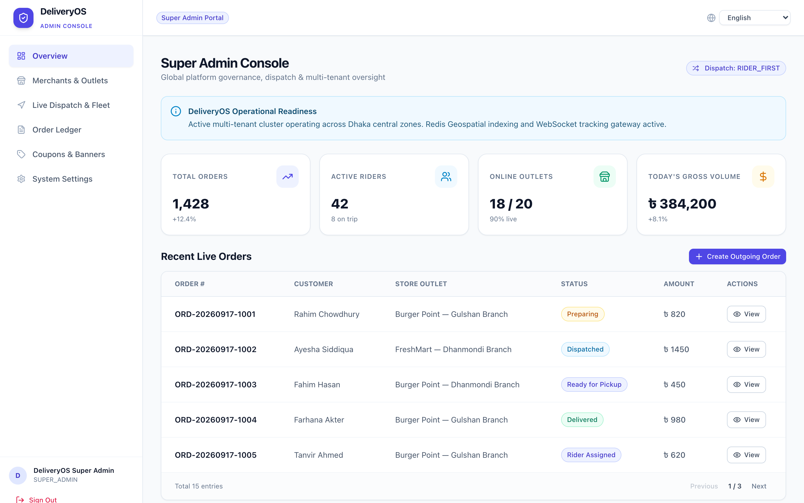
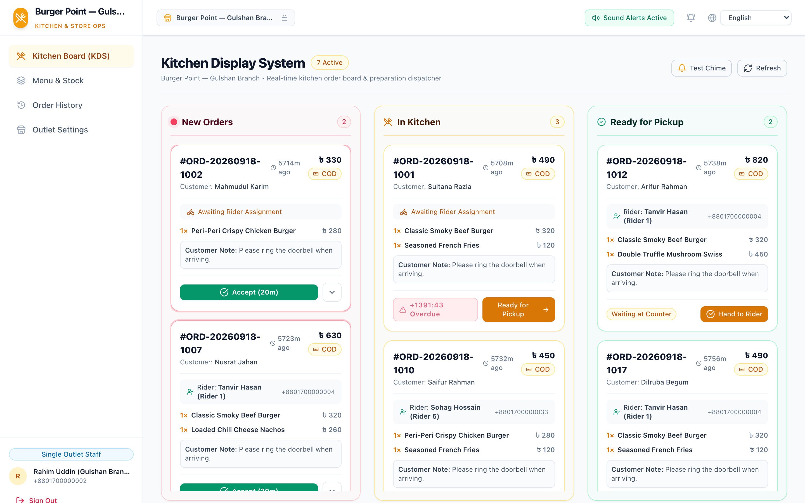
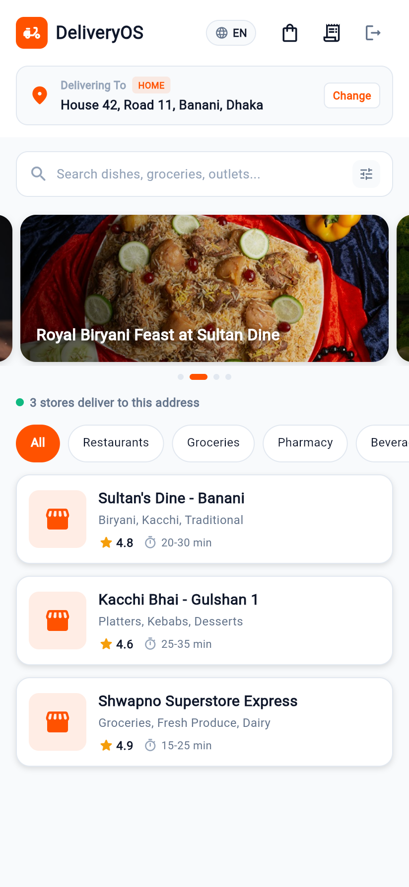
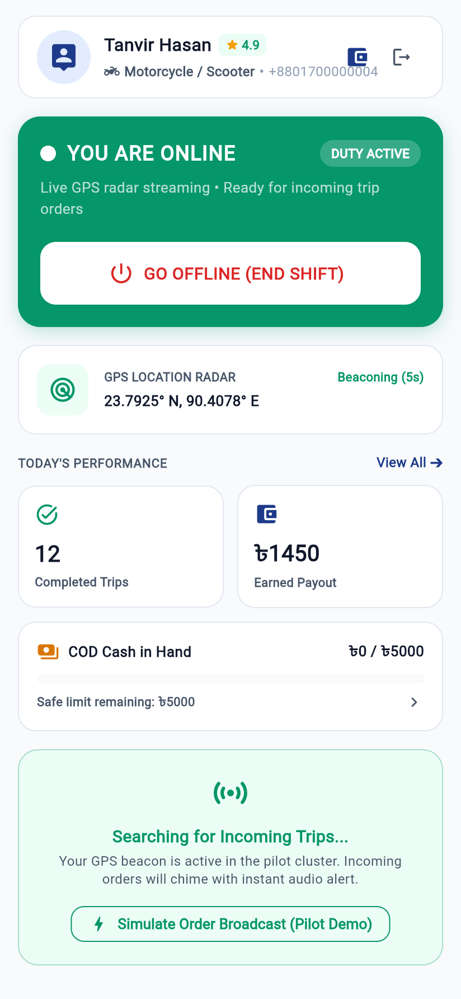
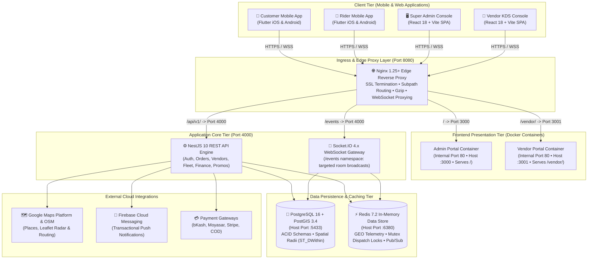

# DeliveryOS — On-Demand Hyperlocal Delivery Platform
### Multi-Vendor Delivery Solution for Food, Grocery, Super Shop & Retail

Welcome to the **DeliveryOS** repository. This repository houses the complete business, operational, and technical architecture for a production-grade on-demand multi-vertical delivery ecosystem.

---

## 📁 Repository Structure & Context Suite

This project follows **Spec-Driven Agentic Development**. All core documentation, business handbooks, technical specifications, and AI governance standards are maintained in the top-level **`context_docs/`** suite, with zero duplicate prose between guides:

```
DeliveryOS/
├── AGENTS.md                                    # Quick entry point & governance rules for AI coding agents
├── README.md                                    # Master project architectural overview
├── FEATURES.md                                  # Line-level granular feature catalog across all 5 sub-projects
├── CHANGELOG.md                                 # Standardized Keep a Changelog (SemVer) release history
├── WORK_BREAKDOWN.md                            # Step-by-step engineering roadmap & milestone tracker
│
└── context_docs/                                # Authoritative project context directory
    ├── AGENT_RULES.md                           # Master AI engineering rules, standards & DoD
    ├── QUICK_REFERENCE.md                       # Task-to-File Context Router (Read 1-2 docs only)
    │
    ├── architecture-decision-records/           # Architecture Decision Records (ADRs)
    │   ├── README.md                            # ADR Master Index, lifecycle & AI protocol
    │   └── ADR-001 through ADR-011              # Monorepo, FSM, GIS, Mutex, Microfrontends, Payments
    │
    ├── business-requirements-documents/         # For founders, business stakeholders & non-tech users
    │   ├── README.md                            # Business suite guide & index
    │   ├── 00-master-product-overview.md        # Master non-technical showcase & 4-app feature guide
    │   ├── 01-executive-summary-and-vision.md   # High-level vision, multi-vertical model & KPIs
    │   ├── 02-stakeholder-roles-and-personas.md # Customer, Store Manager, Rider & Admin personas
    │   ├── 03-core-business-rules-and-workflows.md# Order lifecycle, Flat vs Distance fees, commissions
    │   ├── 04-customer-experience-and-journey.md# Screen-by-screen customer journey, search & re-order
    │   ├── 05-merchant-and-vendor-operations.md # Kitchen KDS board, stock toggles & operating hours
    │   ├── 06-rider-fleet-and-dispatch-handbook.md# 3-step fulfillment, broadcast dispatch & cash rules
    │   └── 07-admin-operations-and-pilot-guide.md# Super admin controls, fleet radar & 10-vendor pilot
    │
    └── technical-implementation-documents/      # For AI coding agents & software engineers
        ├── README.md                            # Technical index & AI Agent coding rules
        ├── 01-system-architecture-and-tech-stack.md# Topology, Flutter/React/NestJS monorepo layout
        ├── 02-database-schema-and-data-models.md# PostgreSQL 16 + PostGIS DDL & spatial indexes
        ├── 03-api-specifications-and-endpoints.md# REST API contracts (/api/v1), DTOs & response envelopes
        ├── 04-realtime-events-and-websocket-protocol.md# Socket.IO rooms, events, audio triggers & map telemetry
        ├── 05-order-state-machine-and-dispatch-engine.md# Formal FSM, Redis GEO searches & atomic claim mutexes
        ├── 06-frontend-and-mobile-architecture.md# Flutter Riverpod 3.3.2, RTL i18n, React SPA RBAC
        └── 07-deployment-devops-and-environment-setup.md# Docker Compose, Nginx proxy, .env.example & seed script
```

---

## 🎯 Platform Highlights

- **Multi-Vertical Commercial Ready**: Supports restaurants, cloud kitchens, grocery stores, super shops, and pharmacies.
- **Client Mobile Apps (Flutter 3.19+, Riverpod 3.3.2)**: High-performance cross-platform apps for **Customers** and **Riders** with background GPS foreground services and instant sensory dispatch chimes.
- **Dedicated Web Portals (React 18 + Vite + TailwindCSS)**:
  - **Super Admin Master Console (`/`)**: Enterprise Indigo control tower on port 3000 featuring interactive Leaflet OpenStreetMap live radar, deep-linked order overrides (`?orderNumber=...`), courier approval queue, and RFC 4180 CSV settlement exports.
  - **Vendor Store & Kitchen Console (`/vendor/`)**: High-contrast culinary amber KDS on port 3001 with 3-lane Kanban progression, in-memory Web Audio API synthesized chimes ([ADR-007](context_docs/architecture-decision-records/ADR-007-web-audio-api-synthesized-kds-chime.md)), 1-click Rush Hour Pause, and sold-out menu retention.
- **Backend Core & Spatial Telemetry**: Enterprise **NestJS 10**, **PostgreSQL 16 with PostGIS 3.4** for range queries (`ST_DWithin`), and **Redis 7.2** for sub-100ms geospatial clustering and atomic claim mutexes ([ADR-004](context_docs/architecture-decision-records/ADR-004-atomic-dispatch-claim-mutex.md)).
- **Multi-Region & Localization**: Full multi-currency support (**BDT & SAR**) with 2-decimal deterministic accounting ([ADR-009](context_docs/architecture-decision-records/ADR-009-deterministic-financial-accounting-ledger.md)), plus multilingual capabilities (**English, Arabic RTL, and Bengali**).

---

## 📸 Platform Application Showcase

DeliveryOS delivers a unified multi-tier experience across high-density web control towers and mobile applications:

### 1. 🖥️ Super Admin Master Console
> **Centralized platform control tower**: Real-time dispatch engine toggle, live operational KPI metrics (Active Deliveries, System Revenue, Active Fleet), and tabular order management with instant status filters.



---

### 2. 🍳 Vendor Kitchen Display System (KDS)
> **Culinary & merchant operations console**: Three-stage Kanban progression (*New Orders*, *Preparing*, *Ready for Pickup*), SLA preparation countdown timers, synthesized Web Audio chimes, and one-tap order actions.



---

### 3. 📱 Mobile Applications: Customer & Rider Fleet
> **Flutter applications**: High-contrast UI, low-latency WebSocket updates, PostGIS/Redis GPS spatial telemetry, and localized multi-region support.

| 📱 Customer Ordering Experience | 🛵 Rider Fleet Duty Cockpit |
| :---: | :---: |
|  |  |
| **Hyperlocal Store Discovery & Promos**<br/>• Live address selector & promotional banners<br/>• Multi-vertical category grid<br/>• Dynamic vendor cards with delivery time & fee | **Active Duty & Dispatch Radar**<br/>• One-tap shift toggle (`YOU ARE ONLINE`)<br/>• Live GPS radar beaconing (`23.7925° N, 90.4078° E`)<br/>• Shift earnings, completed trips & COD safety limits |

---

## 🏗️ System Architecture & Ingress Topology



---

## 📖 Quick Links & Specifications Router

- **[Master Feature Catalog (Granular Line-by-Line)](./FEATURES.md)**
- **[Changelog & Release Notes (Keep a Changelog / SemVer)](./CHANGELOG.md)**
- **[Task-to-File Context Router](./context_docs/QUICK_REFERENCE.md)**
- **[Master Work Breakdown Structure (WBS)](./WORK_BREAKDOWN.md)**
- **[Architecture Decision Records (ADRs)](./context_docs/architecture-decision-records/README.md)**
- **[AI Agent Rules & Operating Invariants](./context_docs/AGENT_RULES.md)**
- **[Business Requirements Documents Suite (BRD)](./context_docs/business-requirements-documents/README.md)**
- **[Technical Implementation Documents Suite (TID)](./context_docs/technical-implementation-documents/README.md)**
