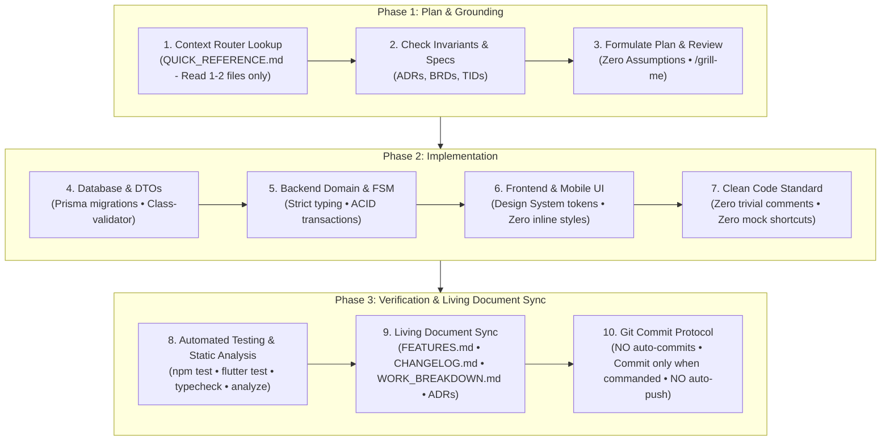

# Spec-Driven Development Workflow
### Authoritative 3-Phase Engineering Protocol for AI Agents & Human Engineers

> **MANDATORY FOR ALL AI CODING ASSISTANTS & DEVELOPERS:**  
> DeliveryOS is engineered under **Spec-Driven Agentic Development**. Specifications, architecture records, and living catalogs are **authoritative single sources of truth**—not afterthoughts.  
> Every modification, new feature, bug fix, or refactor must follow this **3-Phase Workflow** sequentially.

---

## 🧭 The 3-Phase Spec-Driven Development Lifecycle

---

## 📌 Phase 1: Plan & Grounding (Context & Verification)

Before generating or modifying any code, establish complete grounding in the system's specifications:

### 1.1. Targeted Context Router Lookup
- **Zero Token Waste**: Never load the entire documentation directory into context.
- Open **[`context_docs/QUICK_REFERENCE.md`](./QUICK_REFERENCE.md)** and identify the **exact 1 or 2 files** required for your task.
- Read only the target files (e.g. `TID-03` for REST APIs, `TID-05` for Dispatch FSM, `BRD-05` for Vendor KDS).

### 1.2. Invariant & Contract Verification
Cross-check requirements against the authoritative architectural specifications:
- **Architecture Decision Records**: Verify compliance with [`ADR Index`](./architecture-decision-records/README.md) (`ADR-001` through `ADR-011`).
- **State Machine Invariants**: Check `ADR-002` for order status transitions (`PLACED` ➔ `RIDER_ASSIGNED` ➔ `PREPARING` ➔ `READY_FOR_PICKUP` ➔ `DISPATCHED` ➔ `DELIVERED`).
- **Financial Invariants**: Check `ADR-009` for deterministic 2-decimal arithmetic (`DECIMAL(10,2)`).
- **Concurrency & Locking**: Check `ADR-004` for Redis mutex locks (`SET NX EX 45`).

### 1.3. Plan Formulation & Ambiguity Resolution
- Formulate a clear implementation plan detailing:
  - Exact files to create or modify.
  - Schema adjustments and migrations.
  - API endpoint contracts and DTO structures.
  - UI components and state management bindings.
  - Automated verification strategy.
- **Active Clarification (Zero Assumptions)**: If any requirement, edge case, or user instruction is ambiguous:
  - **Pause immediately** before making changes.
  - Ask structured questions with concrete recommended options (`"(Recommended) ..."`).
  - Use the `/grill-me` protocol when aligning on complex design choices.

---

## ⚙️ Phase 2: Implementation (Strict Standards & Realism)

Execute code changes adhering strictly to the operational invariants defined in [`AGENT_RULES.md`](./AGENT_RULES.md):

### 2.1. Strict Typing (Zero Raw `any`)
- Maintain `"strict": true` TypeScript standards across backend and web portals.
- **Never cast to `any`**: Use explicit DTOs, TypeScript interfaces, or generated Prisma types.
- Validate all incoming API request payloads using `class-validator` and `class-transformer`.
- Ensure all Flutter models declare type-safe `fromJson` and `toJson` methods.

### 2.2. Design System Compliance (Zero Inline Styling)
- **Flutter Mobile Apps (`apps/customer_app`, `apps/rider_app`)**:
  - **Colors**: Strictly use `AppColors.*` (e.g. `AppColors.primary`, `AppColors.surface`, `AppColors.textPrimary`). Never use raw `Color(0x...)` or un-themed `Colors.*`.
  - **Typography**: Strictly use `AppTypography.*` (e.g. `AppTypography.headingMedium`, `AppTypography.bodyMedium`). Never use scattered ad-hoc `TextStyle(...)`.
  - **Spacing & Radius**: Strictly use `AppSpacing.*` and `AppRadius.*`. Never use arbitrary magic numbers.
- **Web Portals (`apps/admin_portal`, `apps/vendor_portal`)**:
  - Strictly use semantic Tailwind classes (`primary-*`, `brand-*`, `surface-*`, `status-*`).
  - Use reusable component primitives (`Button`, `Badge`, `Modal`, `PageHeader`, `StatCard`, `EmptyState`, `StockToggleSwitch`).
  - Never write inline `style={{ ... }}` or un-themed hex utility classes (`text-[#...]`).

### 2.3. Production Realism (Zero Placeholder Shortcuts)
- Implement real, production-ready code with full database transactions (`prisma.$transaction`).
- **Zero Mock Fallbacks**: Never return mock JSON in production controllers or repositories.
- **Zero Empty `TODO`s**: Every code path must be fully implemented, including error boundaries and rollbacks.
- **Zero Deleted Tests**: Never delete or bypass a failing test to simulate completion. Fix the root cause.

### 2.4. Clean Code & Minimal Comments
- Follow [`AGENT_RULES.md § 3.6`](./AGENT_RULES.md#36-code-cleanliness--commenting-standards).
- **Zero Trivial Comments**: Do not add comments on obvious code, getters/setters, routine boilerplate, standard UI widgets, or simple DTO mappings. Code must be self-documenting.
- Add comments **only** when explaining non-obvious business invariants, complex algorithms, or tricky platform-specific workarounds.
- Delete obsolete code cleanly; never leave commented-out blocks.

---

## 🧪 Phase 3: Verification & Living Document Sync

No task is complete until it is rigorously verified and all living documentation is synchronized:

### 3.1. Automated Testing & Static Analysis
Run automated test scripts and linters for all impacted projects:
- **Backend API**:
  - `npm run typecheck` / `npm run build`
  - Relevant test scripts: `npm run track1:test`, `npm run payment:test`, `npm run cancel:test`, `npm run settlement:test`
- **Web Portals**:
  - `npm run typecheck` (`tsc --noEmit`)
  - `npm run build` (Rollup build validation)
  - Portal test scripts: `npm run test:admin`, `npm run test:kds`
- **Mobile Apps (Customer & Rider)**:
  - `flutter analyze` (Must pass with 0 errors and 0 warnings)
  - `flutter test` (Unit and widget test suites must pass 100%)

### 3.2. Living Document Synchronization
Update the authoritative repository catalogs immediately upon code completion:
1. **[`FEATURES.md`](../FEATURES.md)**: Add or update the granular, line-by-line feature entry with exact screen/controller mappings.
2. **[`CHANGELOG.md`](../CHANGELOG.md)**: Record the changes under `[Unreleased]` or the active version following [Keep a Changelog](https://keepachangelog.com/) (`Added`, `Changed`, `Fixed`).
3. **[`WORK_BREAKDOWN.md`](../WORK_BREAKDOWN.md)**: Mark completed task checkboxes (`[x]`) and record deliverables.
4. **[`ADR Index`](./architecture-decision-records/README.md)**: If the change modified dependencies, ingress routing, state machines, or financial models, update the existing ADR or author a new record (e.g. `ADR-012`).

### 3.3. Git & Version Control Protocol
- **NO AUTO-COMMITS**: Never run `git commit` autonomously. Run `git commit` **only** when explicitly commanded by the user (e.g. `"make a commit"`).
- **NO AUTO-PUSH**: Never run `git push` autonomously. When commanded to commit, execute **only the local commit**. An explicit, distinct push command (e.g. `"push to remote"`) is required.
- **Conventional Commits**: Format commit messages strictly: `<type>(<scope>): <clear imperative description>`.

---

## 📋 Concrete Engineering Checklists

### Checklist A: Adding a New Feature or Sub-Feature
- [ ] **1. Grounding**: Consult `QUICK_REFERENCE.md` to identify the required 1–2 spec files.
- [ ] **2. Invariant Check**: Verify compliance with related ADRs, state machines, and business rules.
- [ ] **3. Schema Migration**: If new fields/tables are required, create and run Prisma migrations with proper indexes and spatial types.
- [ ] **4. Backend DTO & Service**:
  - [ ] Create strictly typed DTOs with `class-validator`.
  - [ ] Implement service methods wrapped in `prisma.$transaction`.
  - [ ] Expose controller endpoints returning the standard API envelope (`{ success, statusCode, message, data }`).
- [ ] **5. Realtime Events**: Wire Socket.IO room joins, emits, and Redis pub/sub if real-time updates are involved.
- [ ] **6. UI Implementation**:
  - [ ] Use centralized Design System tokens (`AppColors`, `AppTypography`, `AppSpacing` / Tailwind semantic tokens).
  - [ ] Consume API via TanStack Query (React) or Riverpod AsyncNotifier (Flutter).
  - [ ] Implement responsive layouts, loading states, and error handling.
- [ ] **7. Automated Verification**: Run backend test scripts, `npm run typecheck`, and `flutter analyze` / `flutter test`.
- [ ] **8. Living Docs Sync**:
  - [ ] Add line-level item to `FEATURES.md`.
  - [ ] Add entry to `CHANGELOG.md`.
  - [ ] Check off task in `WORK_BREAKDOWN.md`.
- [ ] **9. Commit Protocol**: Await explicit user command before executing `git commit`.

---

### Checklist B: Fixing an Existing Feature or Bug
- [ ] **1. Root Cause Analysis**: Reproduce the issue with an automated test script or unit test before changing code.
- [ ] **2. Spec Verification**: Confirm intended behavior in BRD and TID documents; verify no invariant is violated.
- [ ] **3. Surgical Fix**: Apply targeted code changes without broad, unnecessary rewrites.
- [ ] **4. Type & Style Adherence**:
  - [ ] Maintain strict typing (zero raw `any`).
  - [ ] Adhere to design system tokens (zero inline colors/styles).
  - [ ] Keep code clean with zero trivial comments.
- [ ] **5. Regression Testing**: Run full regression test suites (`npm run track1:test`, `flutter test`, etc.) to ensure zero breakage.
- [ ] **6. Living Docs Sync**:
  - [ ] Record fix in `CHANGELOG.md` under `### Fixed`.
  - [ ] Update `FEATURES.md` if capability behavior changed.
  - [ ] Update `WORK_BREAKDOWN.md` if task relates to a roadmap milestone.
- [ ] **7. Commit Protocol**: Await explicit user command before executing `git commit`.

---

### Checklist C: Code Refactoring & Modernization
- [ ] **1. Architectural Alignment**: Ensure refactoring aligns with ADRs and does not introduce competing libraries.
- [ ] **2. Interface Preservation**: Preserve public API signatures, DTO contracts, and component prop interfaces.
- [ ] **3. Token Extraction**: Replace hardcoded values with design system tokens (`AppColors`, `AppTypography`, `AppSpacing`).
- [ ] **4. Dead Code Cleanup**: Delete unused methods, obsolete imports, and commented-out code completely.
- [ ] **5. Clean Comments**: Strip out trivial or obvious code comments per `AGENT_RULES.md § 3.6`.
- [ ] **6. Static Analysis**: Verify `npm run typecheck` exits 0 and `flutter analyze` reports 0 issues.
- [ ] **7. Test Suite Pass**: Verify that all unit and integration tests pass cleanly without modifications to test assertions.
- [ ] **8. Living Docs Sync**: Document refactoring in `CHANGELOG.md` under `### Changed`.
- [ ] **9. Commit Protocol**: Await explicit user command before executing `git commit`.
