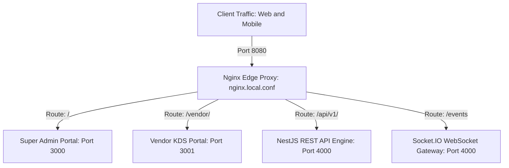

# ADR-001: Modular Monorepo Architecture & Nginx Edge Ingress Topology

## Status
**Accepted** (2026-09-18)

---

## Context & Problem Statement
DeliveryOS comprises four client applications (Customer App, Rider App, Super Admin Console, Vendor KDS), a NestJS API engine, and real-time streaming services.

We required an architectural layout that prevents version drift across shared business contracts, maximizes AI coding agent navigation efficiency, and provides a unified single-port ingress (`8080`) for local and production deployment without microservice network complexity.

---

## Decision Drivers
- **Cognitive Cohesion**: Frontends, backend, and database schemas evolve under unified TypeScript and Dart contracts.
- **AI Agent Context Efficiency**: Autonomous agents navigate the entire client-server surface in a single workspace.
- **Zero Port Collisions**: Unified edge ingress on port `8080` routes cleanly to all applications.
- **Deterministic Orchestration**: One command spins up the complete multi-container stack.

---

## Considered Options
1. **Multi-Repo Architecture**: Separate git repositories per app. *(Rejected: High overhead, contract desynchronization, complex CI/CD)*.
2. **Polyrepo Microservices**: Fragmented microservice backends. *(Rejected: Network hop latency, distributed tracing overhead)*.
3. **Modular Monorepo with Nginx Edge Ingress (Chosen)**: Unified repository structure with `/apps`, `/services`, and `/deploy`.

---

## Decision Outcome
Chosen option: **Modular Monorepo with Nginx Edge Ingress**.



### Positive Consequences
- **Single Command Boot**: `docker compose -f deploy/docker-compose.yml up -d` launches the entire ecosystem.
- **Clean Separation of Concerns**: Clear demarcation between UI (`apps/`), domain logic (`services/`), and ops (`deploy/`).
- **Unified SSL & Security**: Nginx manages rate-limiting, CORS, and subpath proxies centrally.

### Negative Consequences & Mitigations
- *Trade-off*: Monorepo build times scale with project size.
- *Mitigation*: Docker layer caching and independent npm workspaces prevent unnecessary rebuilds.

---

## Technical Implementation Details

```text
DeliveryOS/
├── apps/
│   ├── admin_portal/       # React 18 + Vite (Super Admin Master Console)
│   ├── vendor_portal/      # React 18 + Vite (Vendor Kitchen KDS)
│   ├── customer_app/       # Flutter Cross-Platform Mobile
│   └── rider_app/          # Flutter Cross-Platform Mobile
├── services/
│   └── backend_api/        # NestJS 10 + Prisma ORM + Socket.IO
└── deploy/
    ├── docker-compose.yml  # Multi-container local orchestration
    └── nginx.local.conf    # Edge ingress reverse proxy
```

### Ingress Routing Specifications:
- `http://localhost:8080/` ➔ Proxied to `admin_portal:80`
- `http://localhost:8080/vendor/` ➔ Proxied to `vendor_portal:80/vendor/`
- `http://localhost:8080/api/v1/` ➔ Proxied to `backend_api:4000/api/v1/`
- `ws://localhost:8080/events` ➔ Upgraded to `backend_api:4000/events`

---

## Compliance & Verification
- Verify build integrity: `npm run build` in [`apps/admin_portal`](file:///Users/bs0650/BS-23-Pro/DeliveryOS/apps/admin_portal), [`apps/vendor_portal`](file:///Users/bs0650/BS-23-Pro/DeliveryOS/apps/vendor_portal), and [`services/backend_api`](file:///Users/bs0650/BS-23-Pro/DeliveryOS/services/backend_api).
- Verify ingress: `curl -I http://localhost:8080/` and `curl -I http://localhost:8080/vendor/`.
