# ADR-002: Dynamic Dual Order Dispatch Finite State Machine (`RIDER_FIRST` vs `VENDOR_FIRST`)

## Status
Accepted (2026-09-19)

## Context & Problem Statement
Hyperlocal on-demand logistics ecosystems face differing operational requirements depending on the merchant category:
1. **Restaurants / Hot Food**: If the kitchen cooks immediately but no courier is available nearby, the food sits on the counter, turns cold, and leads to customer complaints and restaurant food waste.
2. **Groceries / Supermarkets / Retail**: Items are packaged off shelves ahead of time. Summons for a courier should occur only after items are boxed and ready for counter pickup.

Previously, many delivery platforms hardcoded a single sequential flow or attempted a third "PARALLEL" mode that created race conditions between couriers and kitchens. We needed a clean, production-hardened finite state machine (FSM) that dynamically switches between two proven flows without code changes.

## Decision Drivers
- **Zero Food Waste (Hot Food)**: Eliminate situations where restaurants prepare orders that are subsequently cancelled due to lack of riders.
- **Retail Fulfillment Efficiency**: Prevent couriers from waiting 20 minutes inside grocery stores while store clerks pick items from aisles.
- **Dynamic Operational Governance**: The platform operator must be able to toggle the mode at runtime via `system_settings` or per-store configuration without restarting services.
- **Simplicity over Over-Engineering**: Reject unstable parallel flows that cause synchronization deadlocks.

## Considered Options
1. **Fixed Vendor-First Flow Only**: Always trigger vendor kitchen first; find rider when packaged. (Causes food waste in restaurant pilots).
2. **Fixed Rider-First Flow Only**: Always find rider first. (Creates idle waiting times for retail/grocery couriers).
3. **Tri-State with Parallel Mode**: Attempt simultaneous vendor prep and rider search. (Rejected due to high race conditions and cancellation complexity).
4. **Configurable Dual Mode (`RIDER_FIRST` and `VENDOR_FIRST`) (Chosen)**: Two strictly validated sequential FSM paths toggled dynamically via database/Redis configuration.

## Decision Outcome
Chosen option: **Configurable Dual Mode (`OrderFlowMode`)**, because it cleanly separates the lifecycle into two deterministic state machines:

```mermaid
flowchart TD
    subgraph RIDER_FIRST["Mode A: RIDER_FIRST (Zero Food Waste — Hot Food)"]
        A1["Order PLACED"] --> A2["Status -> RIDER_SEARCH<br/>(Broadcast to riders_pool; Vendor chime held)"]
        A2 --> A3["Courier Claims Order (Redis Mutex)"]
        A3 --> A4["Status -> RIDER_ASSIGNED<br/>Vendor chime sounds & Kitchen accepts"]
        A4 --> A5["Status -> PREPARING (Kitchen cooks)"]
        A5 --> A6["Status -> READY_FOR_PICKUP"]
        A6 --> A7["Status -> DISPATCHED (Counter Handover)"]
        A7 --> A8["Status -> DELIVERED (Dropoff Complete)"]
    end

    subgraph VENDOR_FIRST["Mode B: VENDOR_FIRST (Traditional Retail / Supermarket)"]
        B1["Order PLACED"] --> B2["Status -> PLACED<br/>(Vendor chime sounds immediately)"]
        B2 --> B3["Vendor accepts & packages goods<br/>Status -> PREPARING"]
        B3 --> B4["Vendor marks READY_FOR_PICKUP"]
        B4 --> B5["Status -> RIDER_SEARCH<br/>(Broadcast to riders_pool)"]
        B5 --> B6["Courier Claims Order -> RIDER_ASSIGNED"]
        B6 --> B7["Status -> DISPATCHED (Counter Handover)"]
        B7 --> B8["Status -> DELIVERED (Dropoff Complete)"]
    end
```



### Positive Consequences
- **Predictable Restaurant Operations**: In `RIDER_FIRST`, kitchens only cook when a delivery courier is physically secured and en route.
- **Runtime Adaptability**: Platform operators can toggle `ORDER_FLOW_MODE` via `PATCH /admin/settings` instantaneously.
- **Zero Race Conditions**: Eliminates the parallel mode state synchronization bug where rider and vendor claim events overlap.

### Negative Consequences / Trade-offs
- In `RIDER_FIRST`, if rider search takes 90 seconds, customer sees a slightly delayed kitchen acceptance timestamp, requiring transparent status copy in the customer app.

## Technical Implementation Details
- Implemented in [`order-flow.service.ts`](file:///Users/bs0650/BS-23-Pro/DeliveryOS/services/backend_api/src/modules/order-flow/order-flow.service.ts).
- Configuration stored in PostgreSQL table `system_settings` under key `order_flow_config` with schema:
  ```json
  {
    "mode": "RIDER_FIRST",
    "rider_search_timeout_seconds": 90
  }
  ```
- Cached in Redis for sub-millisecond retrieval during checkout processing.

## Compliance & Verification
- Unit & integration tests in `apps/admin_portal/scripts/test-admin-console.ts` verify switching between `RIDER_FIRST` and `VENDOR_FIRST` and restoring state safely.
- Verified in `apps/vendor_portal/scripts/test-kds-operations.ts` through live order feeding and 3-lane kitchen progression.
