# ADR-002: Dynamic Dual Order Dispatch Finite State Machine (`RIDER_FIRST` vs `VENDOR_FIRST`)

## Status
**Accepted** (2026-09-19)

---

## Context & Problem Statement
Hyperlocal logistics requires divergent fulfillment sequences based on merchant category:
1. **Restaurants (Hot Food)**: If cooking begins before securing a courier, food turns cold during dispatch delays, resulting in food waste and refunds.
2. **Groceries & Retail**: Products must be picked, packed, and verified on shelves before summoning a courier to avoid idle wait times.

Hardcoding a single flow or attempting concurrent "parallel" dispatch introduces race conditions and cancellation deadlocks. A deterministic finite state machine (FSM) is required that switches modes dynamically via configuration.

---

## Decision Drivers
- **Zero Food Waste**: Prevent prepared meals from sitting uncollected.
- **Courier Efficiency**: Minimize courier dwell time inside retail outlets.
- **Dynamic Configuration**: Allow runtime switching via `system_settings` without restarting services.
- **Race Condition Prevention**: Eliminate parallel state synchronization deadlocks.

---

## Considered Options
1. **Fixed Vendor-First Only**: Always cook first. *(Rejected: Causes food waste when couriers are unavailable)*.
2. **Fixed Rider-First Only**: Always dispatch courier first. *(Rejected: Causes excessive courier wait times in retail/grocery)*.
3. **Tri-State Parallel Dispatch**: Broadcast to couriers and kitchen simultaneously. *(Rejected: High concurrency conflicts upon cancellation)*.
4. **Configurable Sequential Dual Mode (Chosen)**: Two strictly validated sequential FSM paths toggled dynamically.

---

## Decision Outcome
Chosen option: **Configurable Sequential Dual Mode (`OrderFlowMode`)**.

```mermaid
flowchart TD
    subgraph RF["Mode A: RIDER_FIRST (Zero Food Waste — Restaurants)"]
        A1["Order PLACED"] --> A2["Status: RIDER_SEARCH<br/>(Broadcast to riders_pool)"]
        A2 --> A3["Courier Claims Order (Redis Mutex)"]
        A3 --> A4["Status: RIDER_ASSIGNED<br/>(Vendor chime sounds)"]
        A4 --> A5["Status: PREPARING (Kitchen cooks)"]
        A5 --> A6["Status: READY_FOR_PICKUP"]
        A6 --> A7["Status: DISPATCHED (Handover)"]
        A7 --> A8["Status: DELIVERED"]
    end

    subgraph VF["Mode B: VENDOR_FIRST (Retail & Grocery)"]
        B1["Order PLACED"] --> B2["Status: PLACED<br/>(Vendor chime sounds immediately)"]
        B2 --> B3["Vendor packs goods<br/>Status: PREPARING"]
        B3 --> B4["Vendor marks READY_FOR_PICKUP"]
        B4 --> B5["Status: RIDER_SEARCH<br/>(Broadcast to riders_pool)"]
        B5 --> B6["Courier Claims -> RIDER_ASSIGNED"]
        B6 --> B7["Status: DISPATCHED (Handover)"]
        B7 --> B8["Status: DELIVERED"]
    end
```



### Positive Consequences
- **Food Quality Preservation**: Kitchens only cook once a courier is physically confirmed and en route.
- **Instant Mode Switching**: Admins switch fulfillment logic dynamically via `PATCH /admin/settings`.
- **Zero Race Conditions**: Clean sequential transitions eliminate overlapping assignment states.

### Negative Consequences & Mitigations
- *Trade-off*: In `RIDER_FIRST`, if rider search takes 60–90 seconds, kitchen acceptance appears delayed to the customer.
- *Mitigation*: Customer app displays explicit "Matching nearby delivery partner" progress indicator.

---

## Technical Implementation Details
- Core state machine implemented in [`order-flow.service.ts`](file:///Users/bs0650/BS-23-Pro/DeliveryOS/services/backend_api/src/modules/order-flow/order-flow.service.ts).
- Stored in `system_settings` table under `order_flow_config`:
  ```json
  {
    "mode": "RIDER_FIRST",
    "rider_search_timeout_seconds": 90
  }
  ```
- Cached in Redis for sub-millisecond retrieval during checkout processing.

---

## Compliance & Verification
- Unit & integration verification: [`test-admin-console.ts`](file:///Users/bs0650/BS-23-Pro/DeliveryOS/apps/admin_portal/scripts/test-admin-console.ts) validates runtime switching.
- KDS verification: [`test-kds-operations.ts`](file:///Users/bs0650/BS-23-Pro/DeliveryOS/apps/vendor_portal/scripts/test-kds-operations.ts) validates 3-lane kitchen progression across both modes.
