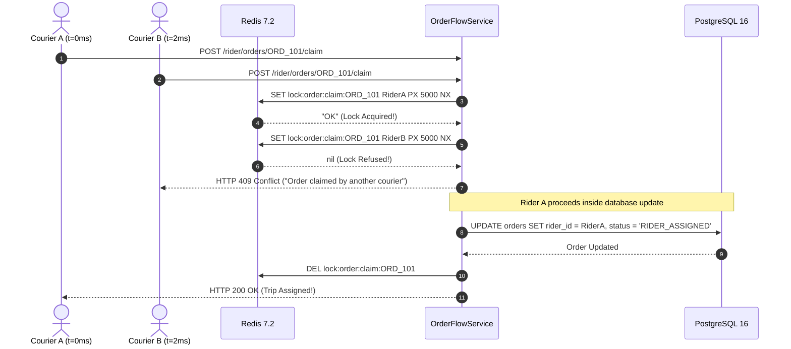

# ADR-004: High-Concurrency Order Dispatch Claiming via Redis Atomic Distributed Mutex

## Status
Accepted (2026-09-20)

## Context & Problem Statement
When an order is broadcast to nearby couriers in the `riders_pool`, multiple couriers receive the push alert simultaneously. Under high traffic or in high-density areas, 5 to 20 couriers may tap "Accept Order" within the exact same millisecond.

If handled naively:
1. Multiple HTTP worker threads read `order.riderId == null` from the database.
2. Multiple threads issue database updates.
3. Two or more couriers believe they have secured the order and travel to the merchant, creating severe operational conflicts and courier distrust.

## Decision Drivers
- **Strict Single-Winner Guarantee**: Exactly one courier must be assigned to the delivery.
- **Immediate Rejection Feedback**: Losing couriers must receive an immediate `409 Conflict` response with an explanatory message rather than hanging or seeing delayed errors.
- **Deadlock Protection**: If a server process crashes mid-claim, the lock must expire automatically without stranding the order forever.
- **Sub-10ms Locking Latency**: Locking cannot introduce noticeable delays in the courier UI.

## Considered Options
1. **Pessimistic Database Locking (`SELECT FOR UPDATE`)**: Lock the order row in PostgreSQL during the transaction. (Rejected: High database row lock contention; risk of transaction timeouts under heavy database loads).
2. **Optimistic Concurrency Control (Version / Timestamp column)**: Compare versions on update. (Rejected: Requires full transaction rollback and extra database roundtrips).
3. **Redis Atomic Distributed Mutex (`SET key val PX 5000 NX`) (Chosen)**: Use Redis single-threaded atomic operations to acquire the claim lock before executing database updates.

## Decision Outcome
Chosen option: **Redis Atomic Distributed Mutex**, because:
- `SET lock:order:claim:${orderId} ${riderId} PX 5000 NX` is an atomic, single-cycle operation executed in $<1$ ms by Redis.
- If the key already exists (`NX` condition fails), Redis returns `null`, and the backend immediately rejects the incoming request with `409 Conflict`.
- A 5000ms TTL (`PX 5000`) guarantees that if the backend process crashes before releasing the lock, the lock auto-releases without manual intervention.



### Positive Consequences
- **Absolute Concurrency Safety**: Guaranteed single assignment regardless of traffic spikes.
- **Lightning Fast Response**: Non-winning couriers get immediate rejection without burdening PostgreSQL.
- **Fail-Safe Self-Healing**: 5-second TTL prevents deadlocks.

### Negative Consequences / Trade-offs
- Requires Redis to be healthy and reachable. (Mitigated: Redis has container health checks and automatic restarts).

## Technical Implementation Details
Implemented in [`order-flow.service.ts`](file:///Users/bs0650/BS-23-Pro/DeliveryOS/services/backend_api/src/modules/order-flow/order-flow.service.ts):
```typescript
const lockKey = `lock:order:claim:${orderId}`;
const acquired = await this.redis.set(lockKey, riderId, 'PX', 5000, 'NX');

if (!acquired) {
  throw new ConflictException(
    'This delivery order has already been claimed by another courier.',
  );
}

try {
  // Verify order status and assign courier in PostgreSQL
  return await this.prisma.order.update({
    where: { id: orderId },
    data: { riderId, status: OrderStatus.RIDER_ASSIGNED },
  });
} finally {
  await this.redis.del(lockKey);
}
```

## Compliance & Verification
- Verified by automated dispatch override and claim tests in `apps/admin_portal/scripts/test-admin-console.ts` (Section 6).
- Guarded in the courier mobile app by Riverpod exception interception in `trip_provider.dart`.
