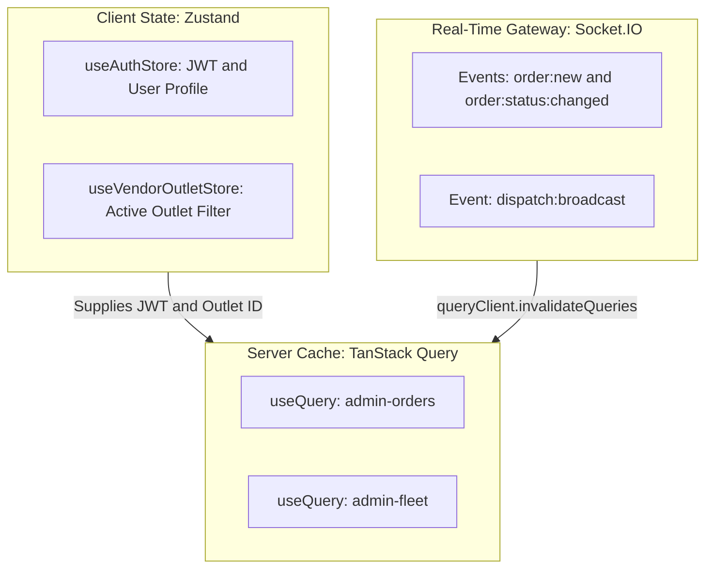

# ADR-006: Dual-Store Frontend Paradigm (Zustand + TanStack Query) & Real-Time WebSocket Invalidation

## Status
**Accepted** (2026-09-22)

---

## Context & Problem Statement
Frontend web applications in delivery ecosystems manage two fundamentally different categories of state:
1. **Client / Session State**: Auth tokens, current user roles, outlet filter selection, and sidebar collapse state.
2. **Server / Remote Cache State**: Order queues, fleet radar locations, catalog stock statuses, and financial summaries.

Storing remote server data inside global client stores (e.g. Redux/Zustand) creates state duplication, complex reducers, and cache drift. Relying on continuous short polling (every 3–5 seconds) floods servers with redundant HTTP requests.

---

## Decision Drivers
- **Explicit Separation of Concerns**: Isolate transient UI/session state from remote server cache.
- **Sub-100ms Event Responsiveness**: Instantaneous UI updates upon state changes without tight polling loops.
- **Zero Cache Duplication**: Let the server cache manage pagination, deduplication, and refetching.
- **Minimal Boilerplate**: Lightweight state management without verbose action creators or reducers.

---

## Considered Options
1. **Monolithic Global Redux**: Everything in Redux actions/reducers. *(Rejected: High boilerplate, manual cache management)*.
2. **TanStack Query with Aggressive Polling**: Short interval polling. *(Rejected: Network request floods, high server CPU load)*.
3. **Dual-Store Architecture (Zustand + TanStack Query + WebSocket Invalidation) (Chosen)**:
   - **Zustand** manages client persistent and UI state.
   - **TanStack Query** manages server cache.
   - **Socket.IO Events** trigger targeted cache invalidations.

---

## Decision Outcome
Chosen option: **Dual-Store Architecture with WebSocket Invalidation**.



### Positive Consequences
- **Instantaneous Real-Time Updates**: UI refreshes within 50ms of a backend status change.
- **Minimized Network Overhead**: Zero polling when the system is idle.
- **Zero Cache Staleness**: UI re-fetches authoritative data directly from API endpoints.

### Negative Consequences & Mitigations
- *Trade-off*: Page components must clean up Socket.IO listeners on unmount.
- *Mitigation*: Encapsulated inside custom React hooks with explicit return cleanup handlers.

---

## Technical Implementation Details
Implemented in [`AdminOrdersPage.tsx`](file:///Users/bs0650/BS-23-Pro/DeliveryOS/apps/admin_portal/src/pages/admin/AdminOrdersPage.tsx):
```typescript
const queryClient = useQueryClient();

// 1. Fetch server state with relaxed fallback polling (30s)
const { data: orders = [] } = useQuery({
  queryKey: ['admin-orders'],
  queryFn: () => adminApi.getOrders(),
  refetchInterval: 30000,
});

// 2. Invalidate immediately on live Socket.IO events
useEffect(() => {
  const socket = getSocket();
  if (!socket) return;

  const handleOrderChange = () => {
    queryClient.invalidateQueries({ queryKey: ['admin-orders'] });
  };

  socket.on('order:new', handleOrderChange);
  socket.on('order:status:changed', handleOrderChange);

  return () => {
    socket.off('order:new', handleOrderChange);
    socket.off('order:status:changed', handleOrderChange);
  };
}, [queryClient]);
```

---

## Compliance & Verification
- Unit & component verification: All portal test suites verify query caching and auth state isolation (`npm run test:run`).
- Real-time simulation: [`test-admin-console.ts`](file:///Users/bs0650/BS-23-Pro/DeliveryOS/apps/admin_portal/scripts/test-admin-console.ts) validates real-time order progression.
