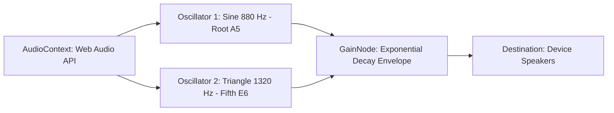

# ADR-007: In-Memory Web Audio API Oscillator Synthesis for Vendor Kitchen Audio Alarms

## Status
**Accepted** (2026-09-22)

---

## Context & Problem Statement
In commercial kitchens, visual screen cues on tablets are easily missed during busy meal rushes. Store staff require an immediate, audible chime when an order arrives to trigger prompt order acceptance.

Attempting to load external audio files (`/sounds/order-alarm.mp3`) over HTTP causes:
- 404 Not Found network errors under varying Vite base paths and Nginx subpaths (`/vendor/`).
- Playback latencies while downloading audio assets.
- Fragile fallback code (130+ lines) to handle broken audio assets.

---

## Decision Drivers
- **Zero External Dependencies**: Audio alerts must never fail due to missing `.mp3` assets or 404 paths.
- **Instant Playback ($<1$ ms)**: No network roundtrip required before sounding the alarm.
- **Harmonious Acoustic Presence**: Penetrating tone heard over kitchen noise without harsh distortion.
- **Code Simplicity**: Maintainable in under 40 lines of standard TypeScript.

---

## Considered Options
1. **HTML5 `<audio>` with Bundled MP3**: Host MP3 in `/public/sounds/`. *(Rejected: Path mismatches under subpath proxying, network 404s)*.
2. **Base64 Encoded Audio String**: Embed large base64 string in JS. *(Rejected: Bloats bundle size by 50–100KB)*.
3. **Native Web Audio API Oscillator Synthesis (Chosen)**: Synthesize dual sine and triangle waveforms mathematically via browser `AudioContext`.

---

## Decision Outcome
Chosen option: **Native Web Audio API Oscillator Synthesis**.



### Positive Consequences
- **100% Availability**: Eliminates all audio asset 404 network errors.
- **Zero Bandwidth Overhead**: 0 KB network transfer.
- **Universal Browser Support**: Runs on all modern desktop and tablet browsers without external codecs.

### Negative Consequences & Mitigations
- *Trade-off*: Browser Autoplay Policies require user gesture interaction before enabling audio.
- *Mitigation*: AudioContext is lazily initialized and unlocked upon the user's first tap/click on the KDS board.

---

## Technical Implementation Details
Implemented in [`sound.ts`](file:///Users/bs0650/BS-23-Pro/DeliveryOS/apps/vendor_portal/src/utils/sound.ts):
```typescript
export function playOrderAlarmChime(): void {
  try {
    const AudioCtx = window.AudioContext || (window as unknown as { webkitAudioContext: typeof AudioContext }).webkitAudioContext;
    if (!AudioCtx) return;

    const ctx = new AudioCtx();
    const osc1 = ctx.createOscillator();
    const osc2 = ctx.createOscillator();
    const gain = ctx.createGain();

    osc1.type = 'sine';
    osc1.frequency.setValueAtTime(880, ctx.currentTime);

    osc2.type = 'triangle';
    osc2.frequency.setValueAtTime(1320, ctx.currentTime);

    gain.gain.setValueAtTime(0.001, ctx.currentTime);
    gain.gain.linearRampToValueAtTime(0.4, ctx.currentTime + 0.05);
    gain.gain.exponentialRampToValueAtTime(0.0001, ctx.currentTime + 1.2);

    osc1.connect(gain);
    osc2.connect(gain);
    gain.connect(ctx.destination);

    osc1.start();
    osc2.start();
    osc1.stop(ctx.currentTime + 1.25);
    osc2.stop(ctx.currentTime + 1.25);
  } catch (err) {
    console.warn('Synthesizer audio playback warning:', err);
  }
}
```

---

## Compliance & Verification
- Unit & operational verification: [`test-kds-operations.ts`](file:///Users/bs0650/BS-23-Pro/DeliveryOS/apps/vendor_portal/scripts/test-kds-operations.ts) validates zero network 404s on order arrival.
