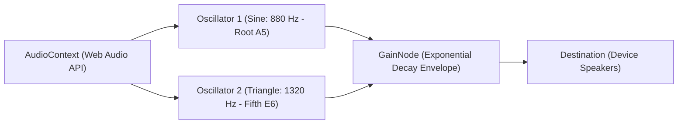

# ADR-007: In-Memory Web Audio API Oscillator Synthesis for Vendor Kitchen Audio Alarms

## Status
Accepted (2026-09-22)

## Context & Problem Statement
In a restaurant kitchen, visual notifications on a tablet are insufficient during busy service. When an order arrives, store staff require an immediate, audible chime to capture attention and trigger the 3-minute acceptance window.

Previously, the sound utility attempted to load an external audio asset (`/sounds/order-alarm.mp3`) over HTTP. In local setups, containerized Nginx subpaths, and offline situations, this led to `404 Not Found` network console errors, audio playback failures, and 130+ lines of fallback logic.

## Decision Drivers
- **Zero External Asset Dependencies**: The audio alert must never fail due to missing `.mp3` files or network 404s.
- **Immediate Playback (<1ms)**: No network roundtrip to download audio chunks before triggering the bell.
- **Harmonious Culinary Tone**: The sound must be pleasant yet piercing enough to be heard over commercial kitchen noise.
- **Simplicity**: Maintainable in under 50 lines of clean TypeScript.

## Considered Options
1. **HTML5 `<audio>` tag with Bundled MP3**: Store a 50KB `.mp3` file in `/public/sounds/`. (Rejected: Subject to Vite base path mismatches, missing file 404s, and browser caching bugs).
2. **Base64 Encoded Audio String**: Embed a large base64 MP3 string inside source code. (Rejected: Bloats JavaScript bundle by 50–100KB; fragile to maintain).
3. **Native Web Audio API Oscillator Synthesis (Chosen)**: Use the browser's native `AudioContext` to synthesize dual sine and triangle waveforms mathematically in memory.

## Decision Outcome
Chosen option: **Native Web Audio API Oscillator Synthesis**, because:
- It requires **zero external assets** and makes **zero HTTP requests**.
- Dual oscillators create a warm, harmonious chime (880 Hz root $A_5$ + 1320 Hz perfect fifth overtone $E_6$).
- An exponential gain envelope creates a fast attack (50ms) followed by natural acoustic decay (1.2s).



### Positive Consequences
- **100% Reliability**: Completely eliminates `404 Not Found` errors in browser consoles.
- **Zero Asset Overhead**: Zero kilobytes added to network requests.
- **Pure Web Standards**: Works universally on modern browsers (Chrome, Safari, Firefox, Edge, Android/iOS WebViews).

### Negative Consequences / Trade-offs
- Web browsers enforce an "Autoplay Policy" requiring at least one initial user interaction (e.g. click anywhere on the screen) before audio can sound. (Handled gracefully with fallback catches).

## Technical Implementation Details
Implemented in [`apps/vendor_portal/src/utils/sound.ts`](file:///Users/bs0650/BS-23-Pro/DeliveryOS/apps/vendor_portal/src/utils/sound.ts):
```typescript
export function playOrderAlarmChime(): void {
  try {
    const AudioCtx = window.AudioContext || (window as unknown as { webkitAudioContext: typeof AudioContext }).webkitAudioContext;
    if (!AudioCtx) return;

    const ctx = new AudioCtx();
    const osc1 = ctx.createOscillator();
    const osc2 = ctx.createOscillator();
    const gainNode = ctx.createGain();

    osc1.type = 'sine';
    osc1.frequency.setValueAtTime(880, ctx.currentTime);

    osc2.type = 'triangle';
    osc2.frequency.setValueAtTime(1320, ctx.currentTime);

    gainNode.gain.setValueAtTime(0.001, ctx.currentTime);
    gainNode.gain.linearRampToValueAtTime(0.4, ctx.currentTime + 0.05);
    gainNode.gain.exponentialRampToValueAtTime(0.0001, ctx.currentTime + 1.2);

    osc1.connect(gainNode);
    osc2.connect(gainNode);
    gainNode.connect(ctx.destination);

    osc1.start();
    osc2.start();
    osc1.stop(ctx.currentTime + 1.25);
    osc2.stop(ctx.currentTime + 1.25);
  } catch (err) {
    console.warn('Synthesizer audio playback warning:', err);
  }
}
```

## Compliance & Verification
- Tested and verified in `apps/vendor_portal/scripts/test-kds-operations.ts`.
- Verified zero network requests logged in browser network tabs upon order arrivals.
