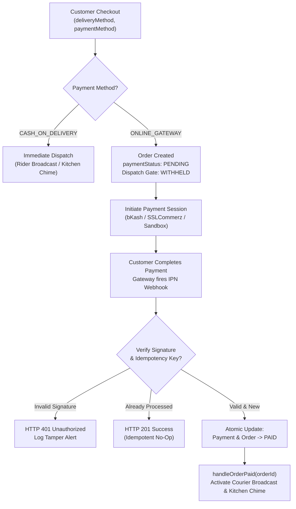

# ADR-011: Multi-Gateway Online Payment Architecture, Webhook Idempotency & Payment-Gated Order Dispatch

## Status
**Accepted** (2026-09-24)

---

## Context & Problem Statement
In modern on-demand delivery platforms, reliable payment processing and strict financial reconciliation are critical. The platform requires support for both Cash on Delivery (COD) and multiple online payment gateways (bKash, SSLCommerz, and local Sandbox simulator).

Furthermore, online payment introduces critical failure modes:
1. **Premature Kitchen & Courier Dispatch**: If an online order is broadcast to riders or alerted to the kitchen before payment is confirmed, merchants waste food preparation costs and couriers travel for orders that may never be funded.
2. **Webhook Replay & Duplicate Settlements**: Payment gateway webhooks frequently retry on network timeouts, risking duplicate ledger accruals or race conditions if not idempotent.
3. **Webhook Spoofing**: Unauthenticated or tampered IPN webhooks could fraudulently mark unpaid orders as `PAID`.
4. **Abandoned Unpaid Orders**: Online orders that are initiated but abandoned left in `PENDING` state clutter kitchen displays and lock inventory.

---

## Decision

We enforce an adapter-based payment architecture with cryptographic webhook security and a strict **Payment-Gated Order Dispatch Invariant**.

### 1. Payment-Gated Order Dispatch Invariant
When a customer selects `ONLINE_GATEWAY`:
- The order is created in `PLACED` status with `paymentStatus: PENDING`.
- **Zero Premature Broadcast**: The backend strictly withholds order dispatch broadcasting to the nearby courier fleet and does not emit the vendor kitchen KDS alert while `paymentStatus === PENDING`.
- **Atomic Dispatch Activation**: Upon successful cryptographic verification of the gateway webhook confirming `PAID`, `OrderFlowService.handleOrderPaid(orderId)` immediately triggers the appropriate order flow (`RIDER_FIRST` courier broadcast or `VENDOR_FIRST` kitchen chime).
- For `CASH_ON_DELIVERY`, immediate dispatch is preserved as defined in [ADR-002](./ADR-002-dynamic-dual-order-flow-fsm.md).



### 2. Multi-Gateway Adapter Topology
Payment integrations implement a common `PaymentGatewayAdapter` interface:
```typescript
export interface PaymentGatewayAdapter {
  initiatePayment(order: Order, amount: number, customerPhone: string): Promise<PaymentSessionResult>;
  verifyWebhook(payload: unknown, headers: Record<string, string>): Promise<WebhookVerificationResult>;
}
```
- **`BkashGatewayAdapter`**: Tokenized checkout flow with create/execute payment lifecycle and signature verification.
- **`SslCommerzGatewayAdapter`**: Hosted checkout session with IPN verification and hash validation.
- **`SandboxGatewayAdapter`**: In-memory and local development simulator utilizing HMAC-SHA256 signatures (`x-webhook-signature`).

### 3. Cryptographic Webhook Security & Idempotency
1. **Signature Verification**: Every incoming webhook must validate its cryptographic signature (`HMAC-SHA256` or gateway secret) before parsing payload. Unsigned or tampered requests return `401 Unauthorized`.
2. **Database-Enforced Idempotency**: The `Payment` entity stores unique `transactionId`. If a webhook arrives for a payment that is already `PAID`, the service returns `201 OK` immediately without re-triggering ledger transactions or duplicate dispatches.

### 4. 15-Minute Unpaid Order Expiration
A scheduled cron routine cleans up abandoned online orders:
- Orders placed with `ONLINE_GATEWAY` whose `paymentStatus` remains `PENDING` for longer than 15 minutes are transitioned to `CANCELLED` (with `cancellationReason: 'Payment session expired'`).
- The associated `Payment` record is marked `FAILED`.

### 5. Automated Financial Settlement Engine
To ensure clean merchant and courier ledger payouts:
- The Super Admin settlement engine aggregates all completed orders with `PENDING` `CommissionLedger` and `RiderTripLedger` records.
- Generates immutable `SettlementBatch` records grouping net vendor payouts and courier earnings.
- Transitions ledger records atomically from `PENDING` to `SETTLED` in a single database transaction.

---

## Consequences

### Positive
- **Zero Loss from Unpaid Orders**: Merchants and couriers never incur resource waste on abandoned online checkout sessions.
- **Webhook Resilience**: Safe against replayed or out-of-order webhook delivery from third-party gateway providers.
- **Financial Auditability**: Double-entry ledger batches guarantee clear reconciliation between GMV, commissions, gateway fees, and net payouts.

### Negative / Trade-Offs
- Customers who take time to complete payment on external gateway apps experience a brief pause before hearing order acceptance confirmation.
- Requires reliable clock synchronization and secure gateway credential management across production environments.
