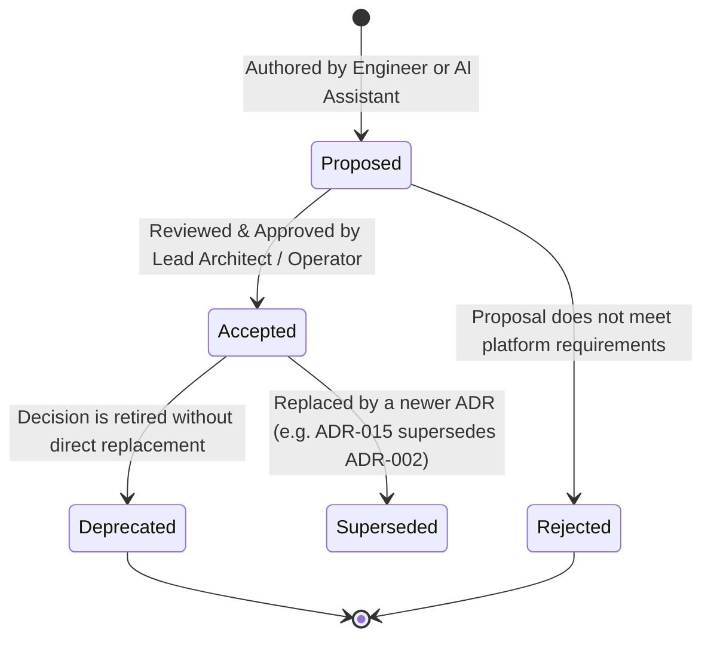

# Architecture Decision Records (ADRs)

Welcome to the **DeliveryOS Architecture Decision Records (ADRs)** repository.

This directory maintains the permanent, version-controlled history of all major architectural, engineering, and infrastructure decisions made across the DeliveryOS platform. 

Because DeliveryOS development is **AI-driven**, this ADR framework serves as a living contract between human software architects and autonomous AI coding assistants.

---

## 🧭 ADR Index

| ID | Title | Status | Date | Scope |
| :--- | :--- | :--- | :--- | :--- |
| **[ADR-001](./ADR-001-modular-monorepo-and-ingress-topology.md)** | Modular Monorepo Architecture & Nginx Edge Ingress Topology | **Accepted** | 2026-09-18 | System Architecture / Infrastructure |
| **[ADR-002](./ADR-002-dynamic-dual-order-flow-fsm.md)** | Dynamic Dual Order Dispatch Finite State Machine (`RIDER_FIRST` vs `VENDOR_FIRST`) | **Accepted** | 2026-09-19 | Core Backend / State Machine |
| **[ADR-003](./ADR-003-postgis-spatial-engine-and-redis-geohash.md)** | Tiered Spatial Architecture: PostGIS Ellipsoid Geofencing & Redis Geohash Radar | **Accepted** | 2026-09-19 | Database / Realtime Telemetry |
| **[ADR-004](./ADR-004-atomic-dispatch-claim-mutex.md)** | High-Concurrency Order Dispatch Claiming via Redis Atomic Distributed Mutex | **Accepted** | 2026-09-20 | Concurrency Control / Dispatch |
| **[ADR-005](./ADR-005-micro-frontends-and-subpath-routing.md)** | Micro-Frontend Separation & Nginx Subpath Proxying (`/` vs `/vendor/`) | **Accepted** | 2026-09-21 | Frontend / Ingress Routing |
| **[ADR-006](./ADR-006-dual-store-frontend-paradigm-and-websocket-invalidation.md)** | Dual-Store Paradigm (Zustand + TanStack Query) & Real-Time WebSocket Invalidation | **Accepted** | 2026-09-22 | Frontend Architecture / WebSockets |
| **[ADR-007](./ADR-007-web-audio-api-synthesized-kds-chime.md)** | In-Memory Web Audio API Oscillator Synthesis for Vendor Kitchen Audio Alarms | **Accepted** | 2026-09-22 | Web App / Vendor KDS |
| **[ADR-008](./ADR-008-immutable-jsonb-historical-snapshots.md)** | Immutable Historical Order Snapshots using JSONB for Audit Integrity | **Accepted** | 2026-09-22 | Database / E-Commerce Integrity |
| **[ADR-009](./ADR-009-deterministic-financial-accounting-ledger.md)** | Deterministic Floating-Point Math & Double-Entry Commission Settlement Ledger | **Accepted** | 2026-09-22 | Financial Ledger / Commission |
| **[ADR-010](./ADR-010-ai-driven-engineering-governance-and-no-auto-commits.md)** | Autonomous AI Engineering Governance, Type Invariants & Version Control Boundaries | **Accepted** | 2026-09-22 | AI Governance / Quality Invariants |

---

## 🔄 ADR Lifecycle & States

Every ADR transitions through clear lifecycle states:



- **Proposed**: Under review, pending technical validation and operator approval.
- **Accepted**: Active architectural policy. All software modules and AI coding agents **must strictly conform**.
- **Superseded**: Replaced by a newer decision (must reference `Superseded by ADR-XXX`).
- **Deprecated**: No longer in effect.

---

## 🤖 AI-Driven Development Integration Protocol

When an AI Coding Agent or Engineer operates in the DeliveryOS repository, they must observe the following protocol:

### 1. Pre-Implementation Architectural Alignment
Before proposing or writing code that alters database schemas, ingress routing, state machines, or caching topologies:
- The agent **must check this ADR directory** to confirm existing architectural invariants.
- If a requested change conflicts with an **Accepted** ADR, the agent must alert the operator and explain the conflict before proceeding.

### 2. When to Author a New ADR
A new ADR **must** be created whenever a change introduces:
1. A new primary dependency, database engine, or cloud service.
2. A modification to the core order state machine or dispatch algorithm.
3. A change in ingress reverse-proxy routing, port topologies, or session storage.
4. A breaking API response envelope or inter-process communication protocol.

### 3. Documentation Style Standard: Clear, Concise & Lean
- **No Overpopulation**: Keep every ADR concise, actionable, and strictly relevant. Do not include narrative filler, hypothetical roadmaps, or duplicated background.
- **Visual & Structural Clarity**: Favor sequence diagrams, state machines, data schemas, and copy-paste-ready code over long prose.

### 4. ADR Structure Standard
Every ADR must follow this standardized Markdown structure:
```markdown
# ADR-XXX: [Descriptive Title]

## Status
[Proposed | Accepted | Superseded by ADR-YYY | Deprecated]

## Context & Problem Statement
[What problem are we solving? What constraints exist?]

## Decision Drivers
- [Driver 1: e.g. Zero external asset dependencies]
- [Driver 2: e.g. Sub-millisecond geofencing speed]

## Considered Options
1. [Option 1]
2. [Option 2]
3. [Option 3]

## Decision Outcome
Chosen option: "[Option X]", because [justification].

### Positive Consequences
- [Benefit 1]
- [Benefit 2]

### Negative Consequences / Trade-offs
- [Trade-off 1]
- [Mitigation strategy]

## Technical Implementation Details
[Code snippets, SQL schemas, sequence diagrams, or configuration examples]

## Compliance & Verification
[How tests and CI/CD pipelines enforce this decision]
```
