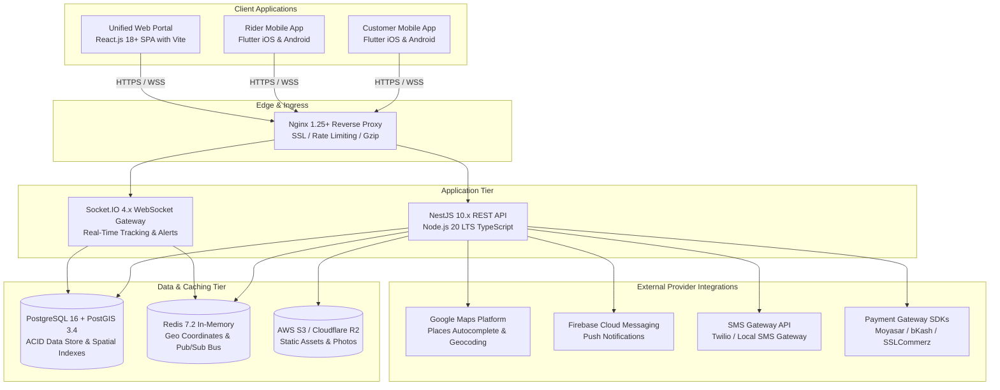

# 01 — System Architecture & Technology Stack

This document defines the high-level system topology, software architectural patterns, directory structure, and technical dependencies for the **DeliveryOS** platform.

---

## 1. System Topology & Component Diagram



---

## 2. Technology Stack & Version Matrix

| Tier | Technology | Version | Purpose & Rationale |
| :--- | :--- | :--- | :--- |
| **Mobile Apps** | **Flutter / Dart** | Flutter 3.19+ / Dart 3.3+ | Single codebase targeting iOS and Android with 60fps rendering, Google Maps SDK, native background geolocation, and RTL Arabic auto-mirroring. |
| **Admin Portal** | **React.js + Vite** | React 18.2+ / Vite 5+ | Super Admin Master Console with authoritative Enterprise Indigo/Slate theme, fleet radar, dispatch override, and settings. |
| **Vendor Portal** | **React.js + Vite** | React 18.2+ / Vite 5+ | Dedicated Merchant & Kitchen Console (KDS) with warm Amber/Orange culinary theme, audio alarm, and catalog stock toggles. |
| **Backend API** | **NestJS** | NestJS 10.x / Node.js 20 LTS | Enterprise TypeScript framework with modular architecture, strict dependency injection, and auto-generated Swagger/OpenAPI specifications. |
| **Primary Database** | **PostgreSQL** | PostgreSQL 16.x | Relational ACID database ensuring financial integrity, foreign key cascades, and complex order transaction isolation. |
| **Spatial Engine** | **PostGIS** | PostGIS 3.4+ | Spatial indexing (`ST_DWithin`, `ST_MakePoint`) for millisecond-speed geofence restaurant discovery and boundary checks. |
| **Cache & Realtime**| **Redis** | Redis 7.2+ | Sub-millisecond rider location caching (`GEOADD`, `GEORADIUS`), distributed locks for order dispatch, and WebSocket session state. |
| **WebSockets** | **Socket.IO** | Socket.IO 4.7+ | Bidirectional real-time communication for kitchen sound alerts, order state change broadcasts, and live rider map tracking. |
| **Reverse Proxy** | **Nginx** | 1.25+ (Alpine) | SSL/TLS termination, request buffering, static asset serving, and WebSocket proxying (`Upgrade: websocket`). |

---

## 3. Recommended Repository & Directory Structure

To maximize engineering efficiency, the project is organized as a clean modular monorepo:

```
DeliveryOS/
├── apps/
│   ├── customer_app/           # Flutter Customer App (iOS & Android)
│   │   ├── lib/
│   │   │   ├── core/           # Constants, themes, network, localization (en/ar/bn)
│   │   │   ├── features/       # auth, home, store, cart, checkout, tracking, reorder
│   │   │   └── main.dart
│   │   └── pubspec.yaml
│   │
│   ├── rider_app/              # Flutter Rider App (iOS & Android)
│   │   ├── lib/
│   │   │   ├── core/           # Background location service, audio alerts, network
│   │   │   ├── features/       # duty_toggle, order_broadcast, fulfillment, wallet
│   │   │   └── main.dart
│   │   └── pubspec.yaml
│   │
│   ├── admin_portal/           # React.js SPA (Vite + TailwindCSS - Enterprise Indigo)
│   │   ├── src/
│   │   │   ├── components/     # UI components (Button, Modal, Table, LanguageSelector)
│   │   │   ├── pages/admin/    # Dashboard, Vendors, Dispatch, Orders, Promotions, Settings
│   │   │   ├── routes/         # RoleGuard & Super Admin routing
│   │   │   ├── layouts/        # AdminLayout & AuthLayout
│   │   │   └── main.tsx
│   │   └── package.json
│   │
│   └── vendor_portal/          # React.js SPA (Vite + TailwindCSS - Warm Amber/Orange)
│       ├── src/
│       │   ├── components/     # KDSOrderCard, CountdownTimer, OutletSwitcher, UI
│       │   ├── pages/vendor/   # KDS Kitchen Console, Catalog & Stock, Settings, Orders Ledger
│       │   ├── routes/         # RoleGuard & Vendor Admin routing
│       │   ├── layouts/        # VendorLayout & AuthLayout
│       │   └── main.tsx
│       └── package.json
│
├── services/
│   └── backend_api/            # NestJS Backend API
│       ├── src/
│       │   ├── common/         # Guards, decorators, filters, interceptors, utils
│       │   ├── config/         # Environment configuration (SAR/BDT, Gateways)
│       │   ├── database/       # Prisma or TypeORM schema & PostGIS migrations
│       │   ├── modules/
│       │   │   ├── auth/       # Phone OTP, JWT, Role guards
│       │   │   ├── users/      # Customers, Vendors, Riders, Admins
│       │   │   ├── vendors/    # Store management, Categories, Menus/SKUs
│       │   │   ├── orders/     # FSM state machine, checkout, validation
│       │   │   ├── dispatch/   # Redis Geo broadcast & manual override
│       │   │   ├── tracking/   # Socket.IO gateway & live coordinates
│       │   │   ├── billing/    # Commission ledger & batch settlement export
│       │   │   └── notifications/ # Push notification (FCM) & SMS
│       │   ├── app.module.ts
│       │   └── main.ts
│       └── package.json
│
├── deploy/                     # Docker Compose, Nginx ingress conf, SQL scripts
│   ├── docker-compose.yml      # Local development multi-container stack
│   ├── docker-compose.prod.yml # Production Cloud VPS stack (SSL & certbot)
│   ├── nginx.local.conf        # Edge ingress proxy configuration
│   └── init-postgis.sql        # PostGIS extension initialization
│
└── README.md
```

---

## 4. Security & Role-Based Access Control (RBAC)

The backend enforces stateless JWT authentication with refresh token rotation and hierarchical Role Guards:

```
                  ┌──────────────────────┐
                  │    JWT Auth Guard    │
                  └──────────┬───────────┘
                             │
            ┌────────────────┴────────────────┐
            ▼                                 ▼
┌───────────────────────┐         ┌───────────────────────┐
│  SUPER_ADMIN Guard    │         │  VENDOR_ADMIN Guard   │
├───────────────────────┤         ├───────────────────────┤
│ Full read/write access│         │ Scoped to single      │
│ across all entities   │         │ `vendor_id` via JWT   │
└───────────────────────┘         └───────────────────────┘
            │                                 │
            ▼                                 ▼
┌───────────────────────┐         ┌───────────────────────┐
│     RIDER Guard       │         │    CUSTOMER Guard     │
├───────────────────────┤         ├───────────────────────┤
│ Scoped to trips and   │         │ Scoped to own orders, │
│ active assignments    │         │ carts, and addresses  │
└───────────────────────┘         └───────────────────────┘
```

- **Vendor Scope Isolation**: NestJS interceptors automatically inject `WHERE vendor_id = req.user.vendorId` into all database queries executed by vendor users, preventing cross-tenant data leaks.
- **Super Admin Bypass**: Requests with role `SUPER_ADMIN` bypass vendor scope isolation, allowing central editing of any store's catalog or settings.
- **Rate Limiting**: Nginx and NestJS Throttler guard all public endpoints (especially Phone OTP requests: max 3 requests per 5 minutes per IP/phone).
