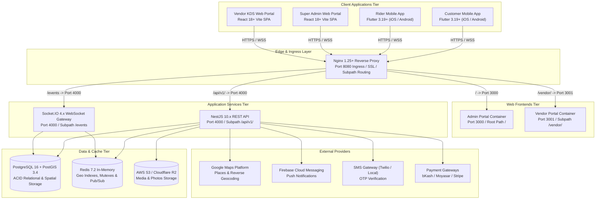

# 01 — System Architecture & Technology Stack

Technical topology, software architecture patterns, repository directory layout, dependencies, and role-based security boundaries for DeliveryOS.

---

## 1. System Topology & Ingress Architecture



---

## 2. Technology Stack & Version Specifications

- **Mobile Client Applications**:
  - **Framework**: Flutter 3.19+ / Dart 3.3+.
  - **State Management**: Riverpod 3.3.2 (Feature-first architecture).
  - **Networking & Storage**: Dio with JWT interceptors; secure shared preferences.
  - **Hardware Integrations**: Android Foreground Location Service, native dialer (`tel:`), native turn-by-turn navigation (`google.navigation:` / `maps.apple.com`).
  - **Localization**: Built-in RTL auto-mirroring (Arabic `ar`), English (`en`), Bengali (`bn`).
- **Web Applications**:
  - **Framework**: React 18.2+ / Vite 5+ SPA.
  - **Styling**: Tailwind CSS 3.4+ (Admin: Enterprise Indigo/Slate; Vendor: Warm Amber/Orange).
  - **State & Data**: TanStack Query 5.x with Socket.IO cache invalidation; Zustand auth session.
  - **Audio Engine**: Web Audio API oscillator synthesis (D5 587.33 Hz + A5 880 Hz).
  - **Mapping Engine**: Leaflet 1.9+ with OpenStreetMap tiles (Zero API cost).
- **Backend Application Services**:
  - **Runtime & Framework**: Node.js 20 LTS / NestJS 10.x with TypeScript 5.x.
  - **API Protocols**: RESTful JSON API (`/api/v1`) with Swagger/OpenAPI; Socket.IO 4.7+ (`/events`).
  - **Concurrency Engine**: Redis distributed mutex (`SET NX EX 45`) for atomic order claiming.
- **Data & Storage Tier**:
  - **Relational Database**: PostgreSQL 16.x (ACID transactions, foreign key cascades).
  - **Spatial Engine**: PostGIS 3.4+ (`GEOGRAPHY(Point, 4326)`, `ST_DWithin`, GiST indexing).
  - **In-Memory Cache & Pub/Sub**: Redis 7.2+ (`GEOADD`, `GEOSEARCH`, Pub/Sub bus).
  - **Object Storage**: AWS S3 / Cloudflare R2 for dish photos and merchant banners.
- **Edge Ingress**:
  - **Reverse Proxy**: Nginx 1.25+ Alpine (Port 8080 local ingress, subpath routing, WebSocket upgrades).

---

## 3. Monorepo Directory Organization

```
DeliveryOS/
├── apps/
│   ├── customer_app/           # Flutter Customer App (iOS & Android)
│   │   ├── lib/core/           # Constants, networking, themes, i18n (en/ar/bn), storage
│   │   └── lib/features/       # auth, discovery, store, cart, checkout, tracking, reorder
│   ├── rider_app/              # Flutter Rider App (iOS & Android)
│   │   ├── lib/core/           # Background location service, audio alerts, networking
│   │   └── lib/features/       # auth, dashboard, trips (3-step fulfillment), earnings
│   ├── admin_portal/           # React 18 Vite SPA (Enterprise Indigo theme - Port 3000)
│   │   ├── src/components/     # LiveFleetMap (Leaflet), UI primitives, Modals
│   │   └── src/pages/admin/    # Dashboard, Dispatch, Orders, Promotions, Vendors, Settings
│   └── vendor_portal/          # React 18 Vite SPA (Warm Amber culinary theme - Port 3001)
│       ├── src/components/     # KDSOrderCard, CountdownTimer, OutletSwitcher
│       ├── src/pages/vendor/   # KDS Kitchen Console, Catalog & Stock, Settings, Orders
│       └── src/utils/sound.ts  # Web Audio API in-memory oscillator chime
├── services/
│   └── backend_api/            # NestJS Backend API (Port 4000)
│       └── src/modules/        # auth, users, vendors, orders, dispatch, tracking, billing
├── deploy/                     # Docker Compose, Nginx ingress config, PostGIS SQL scripts
└── context_docs/               # Authoritative BRDs, TIDs, ADRs, and WBS documentation
```

---

## 4. Security & Role-Based Access Control (RBAC)

- **Authentication Protocol**: Stateless JWT with short-lived access tokens (15m–24h) and secure refresh tokens (30d).
- **Role Hierarchy**:
  - `SUPER_ADMIN`: Unrestricted global read/write authority across all tenants and entities.
  - `VENDOR_ADMIN`: Scoped to merchant outlets. Injected multi-tenant constraint: `WHERE vendor_id = req.user.vendorId` (or brand-wide for `ALL_OUTLETS_MASTER`).
  - `RIDER`: Scoped to assigned deliveries and active trip operations.
  - `CUSTOMER`: Scoped to user's own orders, carts, and saved addresses.
- **Rate Limiting**: NestJS Throttler guards public endpoints (Phone OTP: max 3 requests / 15 min per IP/phone).
- **Payment Verification Gate**: Webhook ingress strictly verified via cryptographic HMAC signatures (`x-webhook-signature`).
