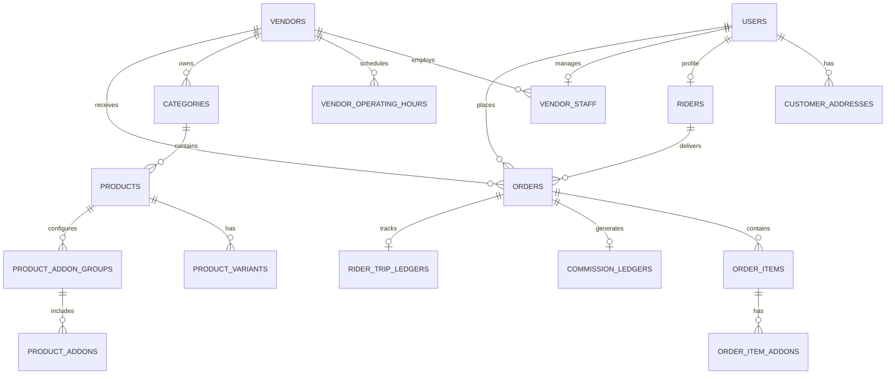

# 02 — Database Schema & Data Models

This document defines the production relational database schema and spatial models for **DeliveryOS** using **PostgreSQL 16** with the **PostGIS** extension. 

It provides both the complete **Prisma Schema definition** and raw **PostgreSQL DDL with Spatial Indexes** ready for migrations.

---

## 1. Relational Entity Relationship Diagram (ERD)



---

## 2. PostgreSQL DDL with PostGIS Spatial Types

```sql
-- 1. Initialize PostGIS and UUID Extensions
CREATE EXTENSION IF NOT EXISTS "uuid-ossp";
CREATE EXTENSION IF NOT EXISTS "postgis";

-- 2. Enumerated Types
CREATE TYPE user_role AS ENUM ('SUPER_ADMIN', 'VENDOR_ADMIN', 'RIDER', 'CUSTOMER');
CREATE TYPE account_status AS ENUM ('PENDING_APPROVAL', 'ACTIVE', 'SUSPENDED');
CREATE TYPE vendor_vertical AS ENUM ('FOOD', 'GROCERY', 'SUPER_SHOP', 'PHARMACY');
CREATE TYPE order_status AS ENUM (
  'PLACED', 
  'ACCEPTED', 
  'PREPARING', 
  'READY_FOR_PICKUP', 
  'DISPATCHED', 
  'DELIVERED', 
  'CANCELLED'
);
CREATE TYPE payment_method AS ENUM ('CASH_ON_DELIVERY', 'ONLINE_GATEWAY');
CREATE TYPE payment_status AS ENUM ('PENDING', 'PAID', 'REFUNDED', 'FAILED');
CREATE TYPE settlement_status AS ENUM ('PENDING', 'PROCESSING', 'SETTLED');
CREATE TYPE delivery_fee_mode AS ENUM ('FIXED_FLAT', 'DISTANCE_TIERED');

-- 3. Users Table
CREATE TABLE users (
    id UUID PRIMARY KEY DEFAULT uuid_generate_v4(),
    phone VARCHAR(20) UNIQUE NOT NULL,
    full_name VARCHAR(100) NOT NULL,
    email VARCHAR(100),
    role user_role NOT NULL DEFAULT 'CUSTOMER',
    status account_status NOT NULL DEFAULT 'ACTIVE',
    created_at TIMESTAMP WITH TIME ZONE DEFAULT CURRENT_TIMESTAMP,
    updated_at TIMESTAMP WITH TIME ZONE DEFAULT CURRENT_TIMESTAMP
);

-- 4. Customer Addresses Table (With PostGIS Spatial Geography)
CREATE TABLE customer_addresses (
    id UUID PRIMARY KEY DEFAULT uuid_generate_v4(),
    user_id UUID NOT NULL REFERENCES users(id) ON DELETE CASCADE,
    label VARCHAR(30) NOT NULL DEFAULT 'Home', -- 'Home', 'Work', 'Other'
    address_line TEXT NOT NULL,
    building_floor VARCHAR(100),
    delivery_note TEXT,
    coordinates GEOGRAPHY(Point, 4326) NOT NULL,
    is_default BOOLEAN DEFAULT FALSE,
    created_at TIMESTAMP WITH TIME ZONE DEFAULT CURRENT_TIMESTAMP
);
CREATE INDEX idx_customer_addresses_geo ON customer_addresses USING GIST(coordinates);

-- 5. Vendors / Merchants Table (With PostGIS Location & Radius)
CREATE TABLE vendors (
    id UUID PRIMARY KEY DEFAULT uuid_generate_v4(),
    name VARCHAR(150) NOT NULL,
    vertical vendor_vertical NOT NULL DEFAULT 'FOOD',
    contact_phone VARCHAR(20) NOT NULL,
    logo_url TEXT,
    banner_url TEXT,
    coordinates GEOGRAPHY(Point, 4326) NOT NULL,
    address_text TEXT NOT NULL,
    commission_rate NUMERIC(5, 2) NOT NULL DEFAULT 15.00, -- e.g. 15.00%
    delivery_radius_km NUMERIC(5, 2) NOT NULL DEFAULT 5.00,
    is_active BOOLEAN DEFAULT TRUE,
    is_busy BOOLEAN DEFAULT FALSE,
    created_at TIMESTAMP WITH TIME ZONE DEFAULT CURRENT_TIMESTAMP,
    updated_at TIMESTAMP WITH TIME ZONE DEFAULT CURRENT_TIMESTAMP
);
CREATE INDEX idx_vendors_geo ON vendors USING GIST(coordinates);

-- 6. Vendor Operating Hours Table
CREATE TABLE vendor_operating_hours (
    id UUID PRIMARY KEY DEFAULT uuid_generate_v4(),
    vendor_id UUID NOT NULL REFERENCES vendors(id) ON DELETE CASCADE,
    day_of_week SMALLINT NOT NULL CHECK (day_of_week BETWEEN 0 AND 6), -- 0=Sunday, 6=Saturday
    open_time TIME NOT NULL,
    close_time TIME NOT NULL,
    is_closed BOOLEAN DEFAULT FALSE,
    UNIQUE(vendor_id, day_of_week)
);

-- 7. Categories Table
CREATE TABLE categories (
    id UUID PRIMARY KEY DEFAULT uuid_generate_v4(),
    vendor_id UUID REFERENCES vendors(id) ON DELETE CASCADE, -- NULL = Global Category
    name VARCHAR(100) NOT NULL,
    image_url TEXT,
    sort_order INT DEFAULT 0,
    is_active BOOLEAN DEFAULT TRUE
);

-- 8. Products / Items Table
CREATE TABLE products (
    id UUID PRIMARY KEY DEFAULT uuid_generate_v4(),
    vendor_id UUID NOT NULL REFERENCES vendors(id) ON DELETE CASCADE,
    category_id UUID REFERENCES categories(id) ON DELETE SET NULL,
    name VARCHAR(150) NOT NULL,
    description TEXT,
    base_price NUMERIC(10, 2) NOT NULL CHECK (base_price >= 0),
    unit_type VARCHAR(20) DEFAULT 'piece', -- 'piece', 'kg', '500g', 'plate'
    image_url TEXT,
    is_in_stock BOOLEAN DEFAULT TRUE,
    sort_order INT DEFAULT 0,
    created_at TIMESTAMP WITH TIME ZONE DEFAULT CURRENT_TIMESTAMP,
    updated_at TIMESTAMP WITH TIME ZONE DEFAULT CURRENT_TIMESTAMP
);
CREATE INDEX idx_products_vendor ON products(vendor_id);

-- 9. Product Variants Table
CREATE TABLE product_variants (
    id UUID PRIMARY KEY DEFAULT uuid_generate_v4(),
    product_id UUID NOT NULL REFERENCES products(id) ON DELETE CASCADE,
    name VARCHAR(100) NOT NULL, -- 'Small', 'Medium', 'Large'
    price_modifier NUMERIC(10, 2) NOT NULL DEFAULT 0.00, -- +/- relative to base_price
    is_in_stock BOOLEAN DEFAULT TRUE
);

-- 10. Product Addon Groups & Addons Table
CREATE TABLE product_addon_groups (
    id UUID PRIMARY KEY DEFAULT uuid_generate_v4(),
    product_id UUID NOT NULL REFERENCES products(id) ON DELETE CASCADE,
    title VARCHAR(100) NOT NULL, -- e.g. "Choose Sauce", "Extras"
    min_selection INT DEFAULT 0,
    max_selection INT DEFAULT 1
);

CREATE TABLE product_addons (
    id UUID PRIMARY KEY DEFAULT uuid_generate_v4(),
    addon_group_id UUID NOT NULL REFERENCES product_addon_groups(id) ON DELETE CASCADE,
    name VARCHAR(100) NOT NULL,
    price NUMERIC(10, 2) NOT NULL DEFAULT 0.00
);

-- 11. Riders Table
CREATE TABLE riders (
    id UUID PRIMARY KEY DEFAULT uuid_generate_v4(),
    user_id UUID UNIQUE NOT NULL REFERENCES users(id) ON DELETE CASCADE,
    vehicle_type VARCHAR(50) NOT NULL DEFAULT 'motorcycle',
    is_online BOOLEAN DEFAULT FALSE,
    cash_in_hand NUMERIC(10, 2) DEFAULT 0.00,
    max_cash_limit NUMERIC(10, 2) DEFAULT 5000.00,
    current_location GEOGRAPHY(Point, 4326),
    updated_at TIMESTAMP WITH TIME ZONE DEFAULT CURRENT_TIMESTAMP
);
CREATE INDEX idx_riders_geo ON riders USING GIST(current_location);

-- 12. System Settings Table (Master Platform Config)
CREATE TABLE system_settings (
    key VARCHAR(50) PRIMARY KEY,
    value JSONB NOT NULL,
    description TEXT,
    updated_at TIMESTAMP WITH TIME ZONE DEFAULT CURRENT_TIMESTAMP
);
-- Example Default Settings Insert
INSERT INTO system_settings (key, value, description) VALUES
('delivery_fee_config', '{"mode": "FIXED_FLAT", "flat_rate": 50.0, "base_fee": 30.0, "base_km": 2.0, "per_km_rate": 10.0}', 'Delivery fee mode and pricing tiers'),
('region_config', '{"currency": "BDT", "currency_symbol": "৳", "default_locale": "en", "tax_percentage": 0.0}', 'Regional currency and localization parameters');

-- 13. Orders Table
CREATE TABLE orders (
    id UUID PRIMARY KEY DEFAULT uuid_generate_v4(),
    order_number VARCHAR(20) UNIQUE NOT NULL, -- e.g. "ORD-20261001-1042"
    customer_id UUID NOT NULL REFERENCES users(id),
    vendor_id UUID NOT NULL REFERENCES vendors(id),
    rider_id UUID REFERENCES riders(id),
    status order_status NOT NULL DEFAULT 'PLACED',
    
    subtotal NUMERIC(10, 2) NOT NULL,
    delivery_fee NUMERIC(10, 2) NOT NULL,
    tax_amount NUMERIC(10, 2) NOT NULL DEFAULT 0.00,
    total_amount NUMERIC(10, 2) NOT NULL,
    
    payment_method payment_method NOT NULL DEFAULT 'CASH_ON_DELIVERY',
    payment_status payment_status NOT NULL DEFAULT 'PENDING',
    
    delivery_address_snapshot JSONB NOT NULL, -- Freezes address and coords at time of order
    customer_phone_snapshot VARCHAR(20) NOT NULL,
    
    prep_time_minutes INT,
    customer_notes TEXT,
    rejection_reason TEXT,
    
    placed_at TIMESTAMP WITH TIME ZONE DEFAULT CURRENT_TIMESTAMP,
    accepted_at TIMESTAMP WITH TIME ZONE,
    picked_up_at TIMESTAMP WITH TIME ZONE,
    delivered_at TIMESTAMP WITH TIME ZONE,
    cancelled_at TIMESTAMP WITH TIME ZONE
);
CREATE INDEX idx_orders_customer ON orders(customer_id);
CREATE INDEX idx_orders_vendor ON orders(vendor_id);
CREATE INDEX idx_orders_status ON orders(status);

-- 14. Order Items Table
CREATE TABLE order_items (
    id UUID PRIMARY KEY DEFAULT uuid_generate_v4(),
    order_id UUID NOT NULL REFERENCES orders(id) ON DELETE CASCADE,
    product_id UUID NOT NULL REFERENCES products(id),
    product_name_snapshot VARCHAR(150) NOT NULL,
    unit_price NUMERIC(10, 2) NOT NULL,
    quantity INT NOT NULL CHECK (quantity > 0),
    total_price NUMERIC(10, 2) NOT NULL,
    variant_snapshot JSONB,
    addons_snapshot JSONB
);

-- 15. Commission & Financial Ledgers
CREATE TABLE commission_ledgers (
    id UUID PRIMARY KEY DEFAULT uuid_generate_v4(),
    order_id UUID UNIQUE NOT NULL REFERENCES orders(id) ON DELETE CASCADE,
    vendor_id UUID NOT NULL REFERENCES vendors(id),
    gross_amount NUMERIC(10, 2) NOT NULL,
    commission_rate NUMERIC(5, 2) NOT NULL,
    commission_amount NUMERIC(10, 2) NOT NULL,
    net_vendor_payable NUMERIC(10, 2) NOT NULL,
    settlement_status settlement_status NOT NULL DEFAULT 'PENDING',
    settled_at TIMESTAMP WITH TIME ZONE,
    created_at TIMESTAMP WITH TIME ZONE DEFAULT CURRENT_TIMESTAMP
);
CREATE INDEX idx_commission_vendor ON commission_ledgers(vendor_id);
CREATE INDEX idx_commission_status ON commission_ledgers(settlement_status);

-- 16. Rider Trip Ledgers
CREATE TABLE rider_trip_ledgers (
    id UUID PRIMARY KEY DEFAULT uuid_generate_v4(),
    order_id UUID UNIQUE NOT NULL REFERENCES orders(id) ON DELETE CASCADE,
    rider_id UUID NOT NULL REFERENCES riders(id),
    delivery_earnings NUMERIC(10, 2) NOT NULL,
    cod_collected NUMERIC(10, 2) NOT NULL DEFAULT 0.00,
    status settlement_status NOT NULL DEFAULT 'PENDING',
    created_at TIMESTAMP WITH TIME ZONE DEFAULT CURRENT_TIMESTAMP
);
```

---

## 3. Critical Spatial Discovery Query

To locate vendors within delivery radius of a customer's location `(lat, lng)`:

```sql
SELECT 
    v.id, 
    v.name, 
    v.vertical, 
    v.logo_url,
    ROUND((ST_Distance(v.coordinates, ST_SetSRID(ST_MakePoint(:lng, :lat), 4326)::geography) / 1000)::numeric, 2) AS distance_km
FROM vendors v
WHERE v.is_active = TRUE
  AND ST_DWithin(v.coordinates, ST_SetSRID(ST_MakePoint(:lng, :lat), 4326)::geography, v.delivery_radius_km * 1000)
ORDER BY distance_km ASC;
```
