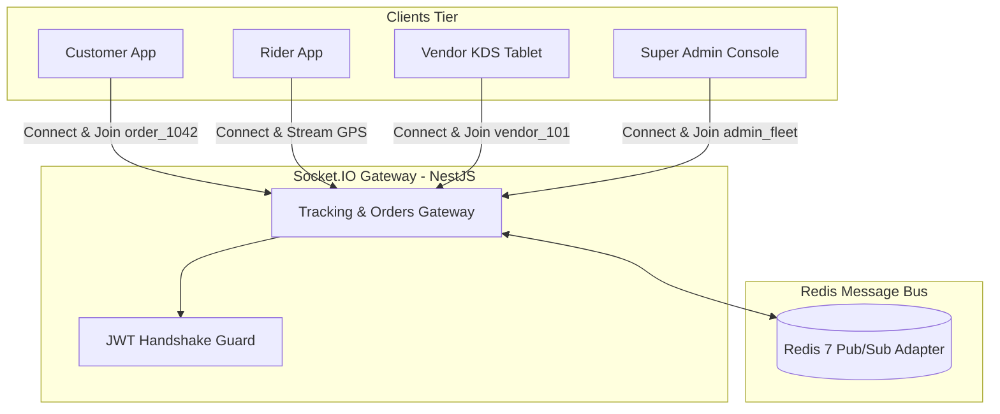

# 04 — Real-Time WebSockets & Event Protocol

This document defines the real-time bidirectional communication layer for **DeliveryOS** powered by **Socket.IO 4.x** and **Redis Adapter** for horizontal scaling.

---

## 1. WebSocket Gateway Architecture



- **Connection URL**: `wss://api.domain.com/events`
- **Authentication**: JWT token sent during handshake:
```javascript
const socket = io("https://api.domain.com/events", {
  auth: {
    token: "eyJhbGciOi..."
  },
  transports: ["websocket"]
});
```

---

## 2. Room Architecture & Subscription Model

Upon successful authentication, clients are joined to scoped rooms based on their identity:

| Stakeholder | Auto-Joined Rooms | Dynamic Rooms |
| :--- | :--- | :--- |
| **Customer** | `user_{userId}` | `order_{orderId}` (joined when opening active order tracking screen) |
| **Vendor** | `vendor_{vendorId}` | N/A (listens for all new incoming store orders) |
| **Rider** | `rider_{riderId}`, `riders_pool` | `order_{orderId}` (joined upon order claim) |
| **Super Admin** | `admin_hq`, `admin_fleet` | N/A (receives global order alerts & fleet updates) |

---

## 3. Real-Time Event Catalog

### 3.1 Vendor Order Events

#### Event: `order:new` (Server → Vendor Tablet)
- **Description**: Fired immediately when a customer submits checkout. Triggers continuous audio alarm on the vendor console until accepted.
- **Room**: `vendor_{vendorId}`
- **Payload Schema**:
```json
{
  "event": "order:new",
  "data": {
    "orderId": "c1f7a4e2-...",
    "orderNumber": "ORD-20261001-1042",
    "itemCount": 2,
    "totalAmount": 550.0,
    "paymentMethod": "CASH_ON_DELIVERY",
    "customerNotes": "Extra napkins please",
    "items": [
      {
        "name": "Spicy Beef Burger",
        "quantity": 1,
        "variant": "Large",
        "addons": ["Extra Cheese"]
      },
      {
        "name": "French Fries",
        "quantity": 1,
        "variant": "Regular",
        "addons": []
      }
    ],
    "placedAt": "2026-10-01T12:05:00.000Z"
  }
}
```

---

### 3.2 Rider Dispatch & Location Events

#### Event: `rider:location:update` (Rider App → Server)
- **Description**: Emitted by active online riders every 5–8 seconds. Updates Redis Geo index and broadcasts to active order rooms.
- **Payload Schema**:
```json
{
  "latitude": 23.780887,
  "longitude": 90.419065,
  "bearing": 182.5,
  "speed": 24.0, // km/h
  "activeOrderId": "c1f7a4e2-..." // null if idle
}
```

#### Event: `dispatch:broadcast` (Server → Nearby Riders)
- **Description**: Sent to online riders in the `riders_pool` within the store's delivery radius.
- **Room**: `riders_pool` (targeted via socket IDs)
- **Payload Schema**:
```json
{
  "event": "dispatch:broadcast",
  "data": {
    "orderId": "c1f7a4e2-...",
    "orderNumber": "ORD-20261001-1042",
    "vendorName": "Burger Spot",
    "vendorAddress": "Road 11, Banani, Dhaka",
    "distanceToVendorKm": 0.8,
    "deliveryArea": "Gulshan 2, Dhaka",
    "riderEarnings": 40.0,
    "timeoutSeconds": 45
  }
}
```

---

### 3.3 Customer Live Tracking Events

#### Event: `order:rider:moved` (Server → Customer App)
- **Description**: Streamed to customer tracking screen during active delivery.
- **Room**: `order_{orderId}`
- **Payload Schema**:
```json
{
  "event": "order:rider:moved",
  "data": {
    "orderId": "c1f7a4e2-...",
    "riderLocation": {
      "latitude": 23.781200,
      "longitude": 90.418500,
      "bearing": 175.0
    },
    "estimatedMinutesRemaining": 8
  }
}
```

#### Event: `order:status:changed` (Server → Customer & Admin)
- **Description**: Fired whenever an order transitions states.
- **Room**: `order_{orderId}`, `user_{customerId}`, `admin_hq`
- **Payload Schema**:
```json
{
  "event": "order:status:changed",
  "data": {
    "orderId": "c1f7a4e2-...",
    "previousStatus": "PREPARING",
    "newStatus": "READY_FOR_PICKUP",
    "timestamp": "2026-10-01T12:20:00.000Z"
  }
}
```

---

## 4. Reconnection & Resilience Rules

1. **Heartbeat Pings**: Handled every 25 seconds by Socket.IO (`pingTimeout: 20000`, `pingInterval: 25000`).
2. **Offline Re-Sync**: If a vendor tablet temporarily disconnects from Wi-Fi, upon reconnecting it automatically calls `GET /vendor/orders/live` via HTTP to re-synchronize active order states before resuming real-time socket events.
3. **Sound Alert Loop (Frontend)**: The audio alarm in the vendor web portal runs in a persistent HTML5 Audio loop until the state transition `ACCEPTED` or `REJECTED` is confirmed by the server.
