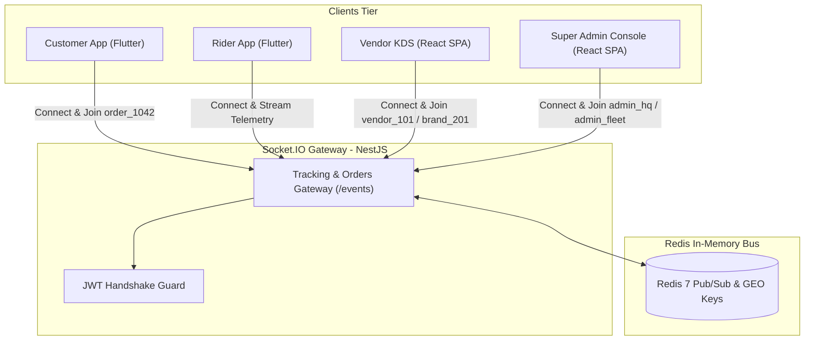

# 04 — Real-Time WebSockets & Event Protocol

This document defines the real-time bidirectional communication layer for **DeliveryOS** powered by **Socket.IO 4.x** and the **Redis Pub/Sub Adapter** for horizontal clustering.

---

## 1. WebSocket Gateway Architecture



- **Connection URL**: `wss://api.domain.com/events` (locally `ws://localhost:8080/events`)
- **Authentication**: JWT token passed during initial handshake:
```javascript
const socket = io("https://api.domain.com/events", {
  auth: {
    token: "eyJhbGciOi..."
  },
  transports: ["websocket"]
});
```

---

## 2. Room Architecture & Subscription Model

Upon successful handshake, the gateway assigns sockets to targeted rooms based on stakeholder identity:

| Stakeholder | Auto-Joined Rooms | Dynamic Rooms | Description & Purpose |
| :--- | :--- | :--- | :--- |
| **Customer** | `user_{userId}` | `order_{orderId}` | Receives real-time state changes, courier coordinates, and cancellation alerts. |
| **Vendor Staff** | `vendor_{vendorId}` | N/A | Receives incoming kitchen orders (`order:new`), cancellations, and status changes. |
| **Brand Owner** | `brand_{brandId}` | `vendor_{vendorId}` | Multi-outlet brand stream receiving consolidated updates across all brand branches. |
| **Rider Fleet** | `rider_{riderId}`, `riders_pool` | `order_{orderId}` | Receives broadcast alerts (`dispatch:broadcast`), cancellation notices, and chat. |
| **Super Admin** | `admin_hq`, `admin_fleet` | N/A | Global control tower: live courier GPS radar, unassigned orders, and escalation alerts. |

---

## 3. Real-Time Event Catalog

### 3.1 Client-to-Server Dynamic Actions

#### `join:order` / `leave:order`
- **Sender**: Customer Mobile App, Rider Mobile App
- **Payload**: `{ "orderId": "order-uuid" }`
- **Action**: Dynamically joins or leaves `order_${orderId}` room during active screen view.

#### `rider:location:update`
- **Sender**: Rider Mobile App
- **Payload**:
```json
{
  "latitude": 23.780887,
  "longitude": 90.419065,
  "bearing": 182.5,
  "speed": 24.0,
  "activeOrderId": "order-uuid" // null if courier is idle
}
```
- **Action**: Updates Redis Geo index (`riders:locations`), relays to `admin_fleet` room, and streams to `order_${orderId}` if actively delivering.

---

### 3.2 Vendor & Kitchen Events

#### `order:new` (Server ➔ Vendor KDS & Admin)
- **Rooms**: `vendor_{vendorId}`, `brand_{brandId}`, `admin_hq`
- **Action**: Triggers persistent Web Audio API oscillator chime loop on KDS ([ADR-007](context_docs/architecture-decision-records/ADR-007-web-audio-api-synthesized-kds-chime.md)).
- **Payload**:
```json
{
  "orderId": "c1f7a4e2-...",
  "orderNumber": "ORD-20261001-1042",
  "itemCount": 2,
  "totalAmount": 550.0,
  "paymentMethod": "CASH_ON_DELIVERY",
  "customerNotes": "Extra napkins please",
  "items": [
    {
      "name": "Spicy Beef Burger",
      "quantity": 1,
      "variant": "Large",
      "addons": ["Extra Cheese"]
    }
  ],
  "placedAt": "2026-10-01T12:05:00.000Z"
}
```

---

### 3.3 Rider Dispatch & Telemetry Events

#### `dispatch:broadcast` (Server ➔ Nearby Couriers)
- **Target**: Couriers in `riders_pool` within merchant delivery radius.
- **Payload**:
```json
{
  "orderId": "c1f7a4e2-...",
  "orderNumber": "ORD-20261001-1042",
  "vendorName": "Burger Spot - Banani",
  "vendorAddress": "Road 11, Banani, Dhaka",
  "distanceToVendorKm": 0.8,
  "deliveryArea": "Gulshan 2, Dhaka",
  "riderEarnings": 45.0,
  "timeoutSeconds": 45
}
```

#### `dispatch:escalated` (Server ➔ Admin Console)
- **Room**: `admin_hq`
- **Description**: Emitted when an order remains unclaimed across dispatch tiers:
  - **Tier 1 (45s)**: Search radius expands from 3 km to 6 km.
  - **Tier 2 (90s)**: Search radius expands to 10 km and triggers an urgent priority alert on the Super Admin Live Radar.
- **Payload**:
```json
{
  "orderId": "c1f7a4e2-...",
  "orderNumber": "ORD-20261001-1042",
  "tier": 2,
  "unassignedSeconds": 95,
  "timestamp": "2026-10-01T12:06:35.000Z"
}
```

---

### 3.4 Order Progression & Exception Events

#### `order:status:changed` (Server ➔ Customer, Vendor, Admin)
- **Rooms**: `order_{orderId}`, `vendor_{vendorId}`, `brand_{brandId}`, `admin_hq`
- **Payload**:
```json
{
  "orderId": "c1f7a4e2-...",
  "orderNumber": "ORD-20261001-1042",
  "previousStatus": "PLACED",
  "newStatus": "PREPARING",
  "prepTimeMinutes": 20,
  "timestamp": "2026-10-01T12:07:00.000Z"
}
```

#### `order:cancelled` (Server ➔ Customer, Vendor, Rider, Admin)
- **Rooms**: `order_{orderId}`, `vendor_{vendorId}`, `rider_{riderId}`, `admin_hq`
- **Description**: Broadcast when an order is cancelled by customer, vendor, or administrator.
- **Action**: KDS removes order from board, rider app displays full-screen cancellation banner with reason, Redis mutex locks are released.
- **Payload**:
```json
{
  "orderId": "c1f7a4e2-...",
  "orderNumber": "ORD-20261001-1042",
  "cancelledBy": "CUSTOMER",
  "reason": "Customer cancelled before cooking started",
  "refundInitiated": false,
  "timestamp": "2026-10-01T12:08:00.000Z"
}
```

#### `order:payment:verified` (Server ➔ Customer, Vendor)
- **Rooms**: `order_{orderId}`, `vendor_{vendorId}`, `admin_hq`
- **Description**: Emitted when online payment gateway webhook succeeds. Unlocks the kitchen preparation queue.
- **Payload**:
```json
{
  "orderId": "c1f7a4e2-...",
  "paymentStatus": "PAID",
  "transactionId": "TXN-982141",
  "timestamp": "2026-10-01T12:05:30.000Z"
}
```

#### `order:delivery_failed` (Server ➔ Admin HQ & Store)
- **Rooms**: `admin_hq`, `vendor_{vendorId}`
- **Description**: Emitted when a courier executes the 5-minute unresponsive customer SOP (`POST /orders/:id/issue`).
- **Payload**:
```json
{
  "orderId": "c1f7a4e2-...",
  "orderNumber": "ORD-20261001-1042",
  "riderId": "rider-uuid",
  "reason": "Customer unreachable at doorstep after 5 min wait",
  "timestamp": "2026-10-01T12:35:00.000Z"
}
```

---

## 4. Reconnection & Resilience Standards

1. **Heartbeat Protocol**: Pings every 25 seconds (`pingTimeout: 20000`, `pingInterval: 25000`).
2. **HTTP State Reconciliation**: Upon network reconnection, web portals and mobile apps execute a background HTTP refetch (`GET /vendor/orders/live`, `GET /orders/:id`) before processing buffered socket events ([ADR-006](context_docs/architecture-decision-records/ADR-006-dual-store-frontend-paradigm-and-websocket-invalidation.md)).
3. **Audio Alarm Guaranteed Silence**: The Web Audio API alarm loop runs strictly until all orders with `status === 'PLACED' || status === 'RIDER_ASSIGNED'` have transitioned to `PREPARING` or `CANCELLED`.
