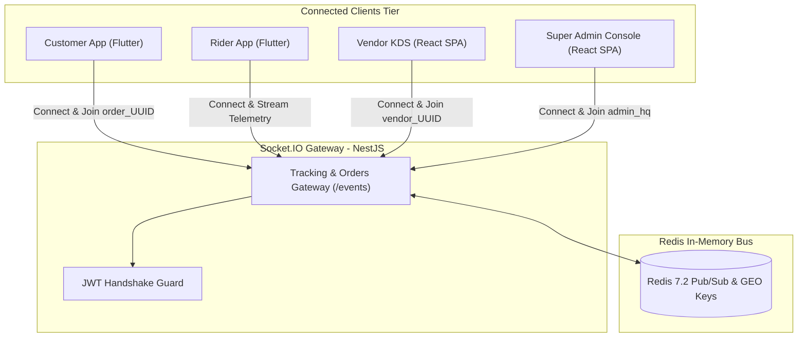

# 04 — Real-Time WebSockets & Event Protocol

Real-time bidirectional event architecture, Socket.IO 4.x room structures, event schemas, payload DTOs, and reconnection invariants for DeliveryOS.

---

## 1. WebSocket Gateway Topology & Handshake



- **Connection URL**: `wss://api.domain.com/events` (locally `ws://localhost:8080/events`)
- **Transport**: `["websocket"]` (polling disabled in production for low latency)
- **Handshake Authentication**:
  ```javascript
  const socket = io("https://api.domain.com/events", {
    auth: { token: "Bearer <jwt_token>" },
    transports: ["websocket"]
  });
  ```

---

## 2. Room Architecture & Subscription Matrix

Upon authenticated handshake, sockets are auto-assigned to primary rooms based on user role and may join dynamic temporary rooms:

| Stakeholder Role | Auto-Joined Rooms | Dynamic Scoped Rooms | Purpose & Event Influx |
| :--- | :--- | :--- | :--- |
| **Customer** | `user_{userId}` | `order_{orderId}` | Order state updates, moving courier coordinates, cancellation alerts. |
| **Vendor Staff** | `vendor_{vendorId}` | N/A | Incoming orders (`order:new`), cancellations, status changes. |
| **Brand Owner** | `brand_{brandId}` | `vendor_{vendorId}` | Consolidated stream of orders across all merchant brand branches. |
| **Rider Fleet** | `rider_{riderId}`, `riders_pool` | `order_{orderId}` | Radius broadcast alerts (`dispatch:broadcast`), cancellation notices. |
| **Super Admin** | `admin_hq`, `admin_fleet` | N/A | Global radar updates, unassigned escalations, and audit events. |

---

## 3. Real-Time Event Catalog

### 3.1 Client-to-Server Dynamic Actions

#### `join:order` / `leave:order`
- **Direction**: Client ➔ Server
- **Senders**: Customer App, Rider App
- **Payload**: `{ "orderId": "uuid" }`
- **Action**: Binds or unbinds socket to `order_{orderId}` room during active screen lifecycle.

#### `rider:location:update`
- **Direction**: Client ➔ Server
- **Sender**: Rider App (background telemetry)
- **Payload**:
  ```json
  {
    "latitude": 23.780887,
    "longitude": 90.419065,
    "bearing": 182.5,
    "speed": 24.0,
    "activeOrderId": "uuid" // null if courier is idle
  }
  ```
- **Action**: Executes Redis `GEOADD riders:locations`, broadcasts to `admin_fleet`, and relays to `order_{activeOrderId}`.

---

### 3.2 Vendor & Kitchen Display Events

#### `order:new`
- **Direction**: Server ➔ Vendor KDS & Admin Console
- **Target Rooms**: `vendor_{vendorId}`, `brand_{brandId}`, `admin_hq`
- **Action**: Triggers persistent Web Audio API bell chime on KDS ([ADR-007](context_docs/architecture-decision-records/ADR-007-web-audio-api-synthesized-kds-chime.md)).
- **Payload**:
  ```json
  {
    "orderId": "uuid",
    "orderNumber": "ORD-20261001-0042",
    "itemCount": 2,
    "totalAmount": 550.0,
    "paymentMethod": "CASH_ON_DELIVERY",
    "customerNotes": "Extra spicy please",
    "items": [{ "name": "Burger", "quantity": 1, "variant": "Large", "addons": ["Cheese"] }],
    "riderAssigned": true,
    "placedAt": "2026-10-01T12:05:00.000Z"
  }
  ```

---

### 3.3 Rider Dispatch & Telemetry Events

#### `dispatch:broadcast`
- **Direction**: Server ➔ Nearby Couriers
- **Target Room**: Couriers in `riders_pool` within merchant delivery radius.
- **Action**: Displays modal with 45s countdown and haptic vibration alert.
- **Payload**:
  ```json
  {
    "orderId": "uuid",
    "orderNumber": "ORD-20261001-0042",
    "vendorName": "Pizza Point",
    "vendorAddress": "Road 11, Banani, Dhaka",
    "distanceToVendorKm": 1.2,
    "deliveryArea": "Gulshan 2",
    "riderEarnings": 40.0,
    "timeoutSeconds": 45
  }
  ```

#### `dispatch:escalated`
- **Direction**: Server ➔ Super Admin Console
- **Target Room**: `admin_hq`
- **Trigger**: Order unassigned across escalation tiers:
  - *Tier 1 (45s)*: Radius expands to 6 km.
  - *Tier 2 (90s)*: Radius expands to 10 km and emits `dispatch:escalated`.
- **Payload**:
  ```json
  {
    "orderId": "uuid",
    "orderNumber": "ORD-20261001-0042",
    "tier": 2,
    "unassignedSeconds": 92,
    "timestamp": "2026-10-01T12:06:32.000Z"
  }
  ```

---

### 3.4 Order Progression & Exception Events

#### `order:status:changed`
- **Direction**: Server ➔ All Stakeholders
- **Target Rooms**: `order_{orderId}`, `vendor_{vendorId}`, `brand_{brandId}`, `admin_hq`
- **Payload**:
  ```json
  {
    "orderId": "uuid",
    "orderNumber": "ORD-20261001-0042",
    "previousStatus": "PLACED",
    "newStatus": "PREPARING",
    "prepTimeMinutes": 20,
    "timestamp": "2026-10-01T12:07:00.000Z"
  }
  ```

#### `order:cancelled`
- **Direction**: Server ➔ All Stakeholders
- **Target Rooms**: `order_{orderId}`, `vendor_{vendorId}`, `rider_{riderId}`, `admin_hq`
- **Action**: KDS removes order; rider app surfaces cancellation banner and releases courier; Redis mutex released.
- **Payload**:
  ```json
  {
    "orderId": "uuid",
    "orderNumber": "ORD-20261001-0042",
    "cancelledBy": "CUSTOMER" | "VENDOR_ADMIN" | "SUPER_ADMIN",
    "reason": "Cancelled before cooking started",
    "refundInitiated": false,
    "timestamp": "2026-10-01T12:08:00.000Z"
  }
  ```

#### `order:payment:verified`
- **Direction**: Server ➔ Customer, Vendor, Admin
- **Target Rooms**: `order_{orderId}`, `vendor_{vendorId}`, `admin_hq`
- **Action**: Emitted upon gateway webhook confirmation, unlocking order for dispatch/kitchen.
- **Payload**:
  ```json
  {
    "orderId": "uuid",
    "paymentStatus": "PAID",
    "transactionId": "TXN-982141",
    "timestamp": "2026-10-01T12:05:30.000Z"
  }
  ```

#### `order:delivery_failed`
- **Direction**: Server ➔ Admin HQ & Vendor
- **Target Rooms**: `admin_hq`, `vendor_{vendorId}`
- **Payload**:
  ```json
  {
    "orderId": "uuid",
    "orderNumber": "ORD-20261001-0042",
    "riderId": "uuid",
    "reason": "Customer unreachable at doorstep after 5 min wait",
    "timestamp": "2026-10-01T12:35:00.000Z"
  }
  ```

---

## 4. Reconnection & Resilience Standards

1. **Heartbeat Protocol**: Gateway sends ping every 25 seconds (`pingInterval: 25000`, `pingTimeout: 20000`).
2. **HTTP State Reconciliation Invariant**: On network reconnect, apps and portals execute background HTTP refetch (`GET /vendor/orders/live`, `GET /orders/:id`) before processing buffered socket messages ([ADR-006](context_docs/architecture-decision-records/ADR-006-dual-store-frontend-paradigm-and-websocket-invalidation.md)).
3. **Audio Silence Invariant**: Web Audio chime loop terminates strictly when zero unaccepted orders remain in KDS Lane 1.
