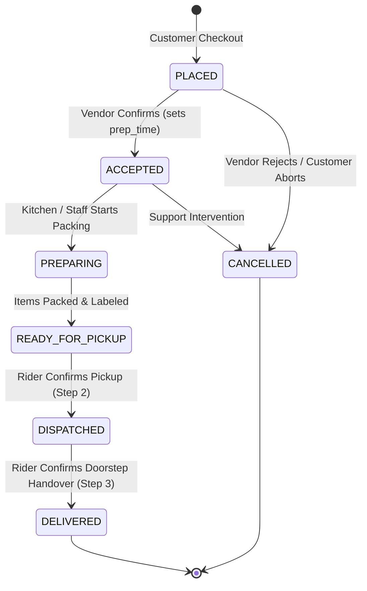

# 05 — Order State Machine & Dispatch Engine

This document specifies the internal mechanics of the **Order Finite State Machine (FSM)** and the **Real-Time Proximity Broadcast Dispatch Engine**.

---

## 1. Formal Order State Machine (FSM)

Every order transition must be validated against the formal transition matrix before persisting to PostgreSQL.



### Transition Validation Matrix:

| From State | Allowed Target State | Triggered By | Side Effects & Actions |
| :--- | :--- | :--- | :--- |
| `PLACED` | `ACCEPTED` | Vendor Store Manager | Sets `accepted_at`, stores `prep_time_minutes`, notifies customer. |
| `PLACED` | `CANCELLED` | Vendor (Reject) or Admin | Sets `cancelled_at`, cancels payment/releases auth hold. |
| `ACCEPTED` | `PREPARING` | Vendor Store Manager | Updates customer progress stepper. |
| `PREPARING` | `READY_FOR_PICKUP`| Vendor Store Manager | Triggers **Dispatch Engine Broadcast** to nearby online riders. |
| `READY_FOR_PICKUP` | `DISPATCHED` | Assigned Rider | Sets `picked_up_at`, locks order, activates live map streaming. |
| `DISPATCHED` | `DELIVERED` | Assigned Rider | Sets `delivered_at`, writes commission ledger, credits rider wallet, marks COD cash. |
| *Any* | `CANCELLED` | Super Admin | Admin emergency override. |

---

## 2. Redis Geospatial Indexing & Rider Coordinates

Rider coordinates are stored in Redis using high-speed spatial keys rather than writing to PostgreSQL on every GPS tick:

- **Redis Key**: `riders:locations:active`
- **Location Update Command**:
```typescript
// NestJS Redis Service:
await redis.geoadd(
  'riders:locations:active',
  longitude,
  latitude,
  riderId
);
```

---

## 3. Proximity Radius Broadcast Algorithm

When an order transitions to `READY_FOR_PICKUP` (or when a vendor accepts), the dispatch engine executes a spatial search:

```typescript
// 1. Locate online, available riders within radius (e.g. 4 km of the store)
async function findNearbyRiders(vendorLat: number, vendorLng: number, radiusKm: number = 4) {
  // Redis GEOSEARCH (or GEORADIUS)
  const nearbyRiderIds = await redis.geosearch(
    'riders:locations:active',
    'FROMLONLAT',
    vendorLng,
    vendorLat,
    'BYRADIUS',
    radiusKm,
    'km',
    'WITHDIST',
    'ASC'
  );

  // Filter out riders who are currently busy on an active trip
  const availableRiders = [];
  for (const [riderId, distance] of nearbyRiderIds) {
    const isBusy = await redis.exists(`rider:active_order:${riderId}`);
    if (!isBusy) {
      availableRiders.push({ riderId, distanceKm: parseFloat(distance) });
    }
  }

  return availableRiders;
}
```

---

## 4. Concurrency Protection & Distributed Lock (Atomic Claim)

To prevent the race condition where multiple riders tap "Accept" on the broadcasted trip simultaneously, the backend utilizes an atomic **Redis Distributed Mutex**:

```typescript
async function claimOrder(orderId: string, riderId: string): Promise<boolean> {
  const lockKey = `lock:order_claim:${orderId}`;
  
  // 1. Try to acquire exclusive lock for 10 seconds
  const acquired = await redis.set(lockKey, riderId, 'NX', 'EX', 10);
  if (!acquired) {
    throw new ConflictException('This order has already been accepted by another rider.');
  }

  try {
    // 2. Perform DB Transaction
    await prisma.$transaction(async (tx) => {
      const order = await tx.orders.findUnique({ where: { id: orderId } });
      if (order.rider_id !== null) {
        throw new ConflictException('Order already assigned.');
      }

      // Assign rider to order
      await tx.orders.update({
        where: { id: orderId },
        data: { rider_id: riderId }
      });

      // Mark rider busy in Redis
      await redis.set(`rider:active_order:${riderId}`, orderId);
    });

    return true;
  } finally {
    // 3. Release lock
    await redis.del(lockKey);
  }
}
```

---

## 5. Dispatch Escalation & Fallback Protocol

```
┌────────────────────────────────────────────────────────┐
│  T = 0s: Broadcast to riders within 3 km radius        │
└───────────────────────────┬────────────────────────────┘
                            │ (If unassigned after 45s)
                            ▼
┌────────────────────────────────────────────────────────┐
│  T = 45s: Expand broadcast radius to 6 km              │
└───────────────────────────┬────────────────────────────┘
                            │ (If unassigned after 90s)
                            ▼
┌────────────────────────────────────────────────────────┐
│  T = 90s: Raise Warning in Super Admin Master Console  │
│  Dispatcher clicks "Manual Assign" ──► Selects Rider   │
└────────────────────────────────────────────────────────┘
```
