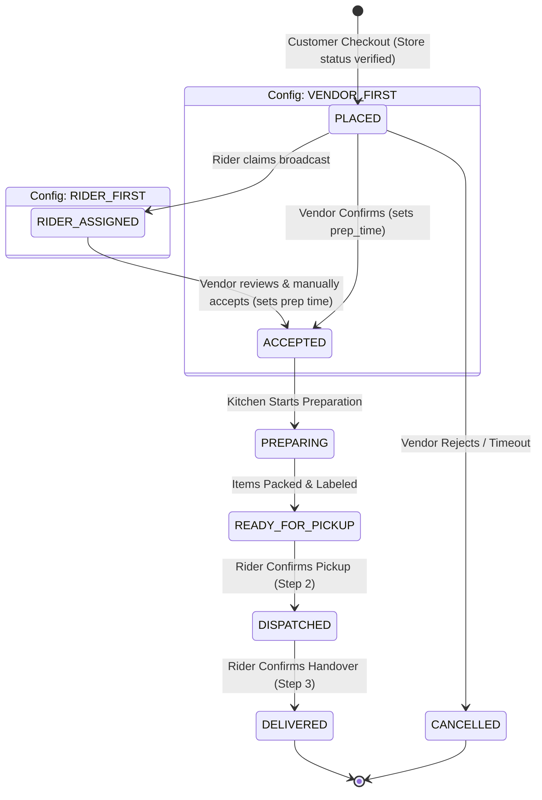

# 05 — Order State Machine & Dispatch Engine

This document specifies the internal mechanics of the **Order Finite State Machine (FSM)** and the **Real-Time Proximity Broadcast Dispatch Engine**.

---

## 1. Formal Order State Machine (FSM)

Every order transition must be validated against the formal transition matrix before persisting to PostgreSQL.

## 1. Formal Order State Machine (FSM)

The system supports two sequence modes based on `order_flow_config.mode`:
- **`RIDER_FIRST` (Zero Food Waste Mode)**: `PLACED` → `RIDER_ASSIGNED` → `ACCEPTED` → `PREPARING` → `READY_FOR_PICKUP` → `DISPATCHED` → `DELIVERED`.
- **`VENDOR_FIRST` (Traditional Retail Mode)**: `PLACED` → `ACCEPTED` → `PREPARING` → `READY_FOR_PICKUP` → `DISPATCHED` → `DELIVERED`.

> [!IMPORTANT]
> **Payment-Gated Dispatch Invariant (ADR-011)**:
> When `paymentMethod === ONLINE_GATEWAY`, an order in `PLACED` state with `paymentStatus === PENDING` will **NOT** broadcast to the courier pool or sound the kitchen alarm. Dispatch broadcast is held until cryptographic webhook verification confirms `paymentStatus === PAID` via `OrderFlowService.handleOrderPaid(orderId)`. Orders unpaid after 15 minutes are automatically transitioned to `CANCELLED`.



### Transition Validation Matrix:

| From State | Allowed Target State | Triggered By | Side Effects & Actions |
| :--- | :--- | :--- | :--- |
| `PLACED` | `RIDER_ASSIGNED` | Assigned Rider | *In RIDER_FIRST mode*: Rider claims order; triggers vendor kitchen alarm to review & manually accept. |
| `PLACED` | `ACCEPTED` | Vendor Store Manager | *In VENDOR_FIRST mode*: Vendor sets prep time; sets `accepted_at`. |
| `PLACED` | `CANCELLED` | Customer, Vendor, Admin | Cancels order before rider claim or kitchen prep. Releases payment hold. |
| `RIDER_ASSIGNED` | `ACCEPTED` | Vendor Store Manager | Vendor reviews items, chooses prep timer, and manually accepts. Kitchen starts cooking. |
| `ACCEPTED` | `PREPARING` | Vendor Store Manager | Kitchen prep in progress. |
| `PREPARING` | `READY_FOR_PICKUP`| Vendor Store Manager | Items packed. If `VENDOR_FIRST`, triggers rider broadcast now. |
| `READY_FOR_PICKUP` | `DISPATCHED` | Assigned Rider | Rider collects parcel at store counter. Activates live map streaming. |
| `DISPATCHED` | `DELIVERED` | Assigned Rider | Confirms doorstep delivery, records COD cash collection, writes ledger. |
| *Any* | `CANCELLED` | Super Admin | Emergency admin cancellation. |

---

## 2. Redis Geospatial Indexing & Rider Coordinates

Rider coordinates are stored in Redis using high-speed spatial keys rather than writing to PostgreSQL on every GPS tick:

- **Redis Key**: `riders:locations:active`
- **Location Update Command**:
```typescript
// NestJS Redis Service:
await redis.geoadd(
  'riders:locations:active',
  longitude,
  latitude,
  riderId
);
```

---

## 3. Proximity Radius Broadcast Algorithm

The dispatch engine initiates search based on `order_flow_config.mode`:
- **If `RIDER_FIRST`**: Triggered immediately at checkout (after verifying store status).
- **If `VENDOR_FIRST`**: Triggered after store staff marks order `READY_FOR_PICKUP`.

```typescript
// 1. Locate online, available riders within radius (e.g. 3–5 km of the store)
async function findNearbyRiders(vendorLat: number, vendorLng: number, radiusKm: number = 4) {
  // Redis GEOSEARCH (or GEORADIUS)
  const nearbyRiderIds = await redis.geosearch(
    'riders:locations:active',
    'FROMLONLAT',
    vendorLng,
    vendorLat,
    'BYRADIUS',
    radiusKm,
    'km',
    'WITHDIST',
    'ASC'
  );

  // Filter out riders who are currently busy on an active trip
  const availableRiders = [];
  for (const [riderId, distance] of nearbyRiderIds) {
    const isBusy = await redis.exists(`rider:active_order:${riderId}`);
    if (!isBusy) {
      availableRiders.push({ riderId, distanceKm: parseFloat(distance) });
    }
  }

  return availableRiders;
}
```

---

## 4. Concurrency Protection & Distributed Lock (Atomic Claim)

To prevent multiple riders claiming the same order simultaneously, the backend utilizes an atomic **Redis Distributed Mutex**:

```typescript
async function claimOrder(orderId: string, riderId: string, isRiderFirst: boolean): Promise<boolean> {
  const lockKey = `lock:order_claim:${orderId}`;
  
  // 1. Try to acquire exclusive lock for 10 seconds
  const acquired = await redis.set(lockKey, riderId, 'NX', 'EX', 10);
  if (!acquired) {
    throw new ConflictException('This order has already been accepted by another rider.');
  }

  try {
    // 2. Atomic Database Transaction
    await prisma.$transaction(async (tx) => {
      const order = await tx.orders.findUnique({ where: { id: orderId } });
      if (order.rider_id !== null) {
        throw new ConflictException('Order already assigned.');
      }

      // Assign rider; if RIDER_FIRST, advance state to RIDER_ASSIGNED
      await tx.orders.update({
        where: { id: orderId },
        data: { 
          rider_id: riderId,
          status: isRiderFirst ? OrderStatus.RIDER_ASSIGNED : order.status
        }
      });

      // Mark rider busy in Redis
      await redis.set(`rider:active_order:${riderId}`, orderId);

      // If RIDER_FIRST: Trigger vendor kitchen chime now that rider is guaranteed!
      if (isRiderFirst) {
        socketGateway.server.to(`vendor_${order.vendor_id}`).emit('order:new', {
          orderId: order.id,
          orderNumber: order.order_number,
          riderAssigned: true
        });
      }
    });

    return true;
  } finally {
    // 3. Release distributed lock
    await redis.del(lockKey);
  }
}
```

---

## 5. Dispatch Escalation & Fallback Protocol

```
┌────────────────────────────────────────────────────────┐
│  T = 0s: Broadcast to riders within 3 km radius        │
│  - FCM Push + [dispatch:broadcast] to riders_pool      │
└───────────────────────────┬────────────────────────────┘
                            │ (If unassigned after > 90s)
                            ▼
┌────────────────────────────────────────────────────────┐
│  Tier 1 (T > 90s): Expand broadcast radius to 6 km     │
│  - Idempotent Redis key: dispatch:escalated:{id}:tier1 │
│  - Re-broadcasts via FCM + WebSockets to wider pool    │
└───────────────────────────┬────────────────────────────┘
                            │ (If unassigned after > 180s)
                            ▼
┌────────────────────────────────────────────────────────┐
│  Tier 2 (T > 180s): Raise Warning in Super Admin Radar │
│  - Idempotent Redis key: dispatch:escalated:{id}:tier2 │
│  - Emits [dispatch:escalated] to admin_hq socket room  │
│  - Dispatcher clicks "Manual Assign" ──► Selects Rider │
└────────────────────────────────────────────────────────┘
```

### 5.1 Push Notification Trigger Lifecycle
Push notifications are orchestrated via `NotificationsService` with Firebase Cloud Messaging (FCM):
1. **Order Broadcast**: Sent to all eligible online couriers (`sendToRole('RIDER', ...)`).
2. **Order Claimed**: Sent to customer (`sendToUser(customerId, ...)`: `"Rider Assigned! Your courier is heading to the store."`).
3. **Dispatched / In Transit**: Sent to customer: `"Your order is on the way! Track courier live."`).
4. **Delivered**: Sent to customer: `"Order delivered! Enjoy your meal."`).

