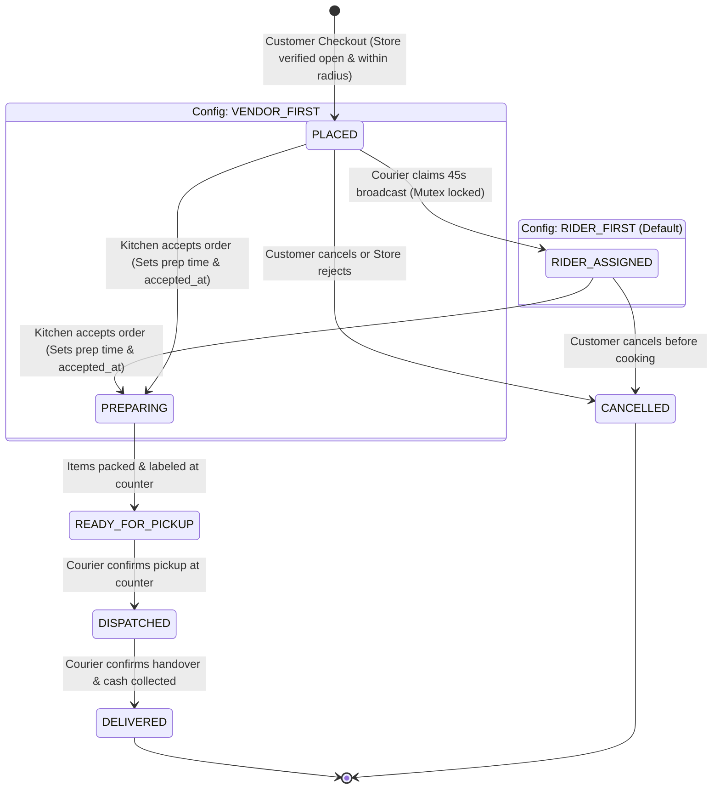

# 05 — Order State Machine & Dispatch Engine

This document specifies the internal mechanics of the **Order Finite State Machine (FSM)** and the **Real-Time Proximity Broadcast Dispatch Engine**.

---

## 1. Formal Order State Machine (FSM)

The system supports two sequence modes governed by `order_flow_config.mode` ([ADR-002](context_docs/architecture-decision-records/ADR-002-dynamic-dual-order-flow-fsm.md)):
- **`RIDER_FIRST` (Zero Food Waste Mode)**: `PLACED` ➔ `RIDER_ASSIGNED` ➔ `PREPARING` ➔ `READY_FOR_PICKUP` ➔ `DISPATCHED` ➔ `DELIVERED`.
- **`VENDOR_FIRST` (Traditional Retail Mode)**: `PLACED` ➔ `PREPARING` ➔ `READY_FOR_PICKUP` ➔ `DISPATCHED` ➔ `DELIVERED`.

> [!NOTE]
> **Direct Preparation Transition Invariant**:
> When a merchant accepts an incoming order, the order transitions directly to **`PREPARING`** with `accepted_at = NOW()` and `prep_time_minutes` populated. The intermediate legacy status `ACCEPTED` is deprecated in runtime execution.

> [!IMPORTANT]
> **Payment-Gated Dispatch Invariant (ADR-011)**:
> When `paymentMethod === ONLINE_GATEWAY`, an order in `PLACED` state with `paymentStatus === PENDING` will **NOT** broadcast to the courier pool or sound the kitchen alarm. Dispatch broadcast is held until cryptographic webhook verification confirms `paymentStatus === PAID` via `OrderFlowService.handleOrderPaid(orderId)`. Orders unpaid after 15 minutes are automatically transitioned to `CANCELLED`.



### Transition Validation Matrix:

| From State | Allowed Target State | Triggered By | Side Effects & Actions |
| :--- | :--- | :--- | :--- |
| `PLACED` | `RIDER_ASSIGNED` | Assigned Rider | *In RIDER_FIRST mode*: Rider claims order; triggers vendor kitchen alarm to review & accept. |
| `PLACED` | `PREPARING` | Vendor Store Manager | *In VENDOR_FIRST mode*: Vendor sets prep time; sets `accepted_at` and starts preparation. |
| `PLACED` | `CANCELLED` | Customer, Vendor, Admin | Cancels order before rider claim or kitchen prep. Releases payment hold or triggers refund. |
| `RIDER_ASSIGNED` | `PREPARING` | Vendor Store Manager | Vendor reviews items, chooses prep timer, and accepts. Kitchen starts cooking. |
| `RIDER_ASSIGNED` | `CANCELLED` | Customer, Admin | Customer cancellation prior to kitchen prep. Releases courier lock. |
| `PREPARING` | `READY_FOR_PICKUP`| Vendor Store Manager | Items packed at counter. If `VENDOR_FIRST`, triggers courier broadcast now. |
| `READY_FOR_PICKUP` | `DISPATCHED` | Assigned Rider | Rider collects parcel at store counter. Confirms physical handoff. |
| `DISPATCHED` | `DELIVERED` | Assigned Rider | Confirms doorstep delivery, validates COD cash checkbox, updates ledgers. |
| *Any Pre-Dispatched* | `CANCELLED` | Super Admin | Emergency operational cancellation with min-5-character audit reason. |

---

## 2. Redis Geospatial Indexing & Courier Coordinates

Rider coordinates are stored in Redis using high-speed spatial keys rather than writing to PostgreSQL on every GPS tick ([ADR-003](context_docs/architecture-decision-records/ADR-003-postgis-spatial-engine-and-redis-geohash.md)):

- **Redis Key**: `riders:locations`
- **Location Update Command**:
```typescript
// NestJS Redis Service:
await redis.geoadd(
  'riders:locations',
  longitude,
  latitude,
  riderId
);
```

---

## 3. Proximity Radius Broadcast Algorithm

The dispatch engine initiates search based on `order_flow_config.mode`:
- **If `RIDER_FIRST`**: Triggered immediately at checkout (after verifying store status and payment confirmation).
- **If `VENDOR_FIRST`**: Triggered after store staff marks order `READY_FOR_PICKUP`.

```typescript
// 1. Locate online, available riders within radius (e.g. 3–5 km of the store)
async function findNearbyRiders(vendorLat: number, vendorLng: number, radiusKm: number = 4) {
  const nearbyRiderIds = await redis.geosearch(
    'riders:locations',
    'FROMLONLAT',
    vendorLng,
    vendorLat,
    'BYRADIUS',
    radiusKm,
    'km',
    'WITHDIST',
    'ASC'
  );

  // Filter out riders who are currently busy on an active trip
  const availableRiders = [];
  for (const [riderId, distance] of nearbyRiderIds) {
    const isBusy = await redis.exists(`rider:active_order:${riderId}`);
    if (!isBusy) {
      availableRiders.push({ riderId, distanceKm: parseFloat(distance) });
    }
  }

  return availableRiders;
}
```

---

## 4. Concurrency Protection & Distributed Lock (Atomic Claim)

To prevent multiple riders claiming the same order simultaneously, the backend utilizes an atomic **Redis Distributed Mutex** ([ADR-004](context_docs/architecture-decision-records/ADR-004-atomic-dispatch-claim-mutex.md)):

```typescript
async function claimOrder(orderId: string, riderId: string, isRiderFirst: boolean): Promise<boolean> {
  const lockKey = `lock:order_claim:${orderId}`;
  
  // 1. Acquire exclusive lock for 45 seconds (broadcast duration)
  const acquired = await redis.set(lockKey, riderId, 'NX', 'EX', 45);
  if (!acquired) {
    throw new ConflictException('This order has already been claimed by another courier.');
  }

  try {
    // 2. Atomic Database Transaction
    await prisma.$transaction(async (tx) => {
      const order = await tx.order.findUnique({ where: { id: orderId } });
      if (order.riderId !== null) {
        throw new ConflictException('Order already assigned.');
      }

      await tx.order.update({
        where: { id: orderId },
        data: { 
          riderId: riderId,
          status: isRiderFirst ? OrderStatus.RIDER_ASSIGNED : order.status
        }
      });

      // Mark rider busy in Redis
      await redis.set(`rider:active_order:${riderId}`, orderId);

      // If RIDER_FIRST: Trigger vendor kitchen chime now that rider is secured!
      if (isRiderFirst) {
        socketGateway.server.to(`vendor_${order.vendorId}`).emit('order:new', {
          orderId: order.id,
          orderNumber: order.orderNumber,
          riderAssigned: true
        });
      }
    });

    return true;
  } finally {
    await redis.del(lockKey);
  }
}
```

---

## 5. Dispatch Escalation & Fallback Protocol

```
┌────────────────────────────────────────────────────────┐
│  T = 0s: Broadcast to riders within 3 km radius        │
│  - FCM Push + [dispatch:broadcast] to riders_pool      │
└───────────────────────────┬────────────────────────────┘
                            │ (If unassigned after > 45s)
                            ▼
┌────────────────────────────────────────────────────────┐
│  Tier 1 (T > 45s): Expand broadcast radius to 6 km     │
│  - Idempotent Redis key: dispatch:escalated:{id}:tier1 │
│  - Re-broadcasts via FCM + WebSockets to wider pool    │
└───────────────────────────┬────────────────────────────┘
                            │ (If unassigned after > 90s)
                            ▼
┌────────────────────────────────────────────────────────┐
│  Tier 2 (T > 90s): Expand to 10 km & Super Admin Radar │
│  - Idempotent Redis key: dispatch:escalated:{id}:tier2 │
│  - Emits [dispatch:escalated] to admin_hq socket room  │
│  - Dispatcher clicks "Manual Assign" ──► Selects Rider │
└────────────────────────────────────────────────────────┘
```

---

## 6. Financial Ledger Settlement & COD Offset Engine

Every completed delivery triggers deterministic double-entry accounting entries ([ADR-009](context_docs/architecture-decision-records/ADR-009-deterministic-financial-accounting-ledger.md)):

1. **Vendor Commission Entry (`CommissionLedger`)**:
   - `gross_amount`: Food subtotal minus coupon discounts.
   - `commission_deducted`: `Math.round(gross_amount * commissionRate * 100) / 100`.
   - `net_vendor_payable`: `gross_amount - commission_deducted`.
2. **Rider Trip Entry (`RiderTripLedger`)**:
   - `delivery_earnings`: Distance or flat remuneration credited to courier wallet.
   - `cod_collected`: Physical cash collected from customer added to courier's `cashInHand`.
3. **Cash-on-Delivery Offset**:
   - When a courier deposits cash at the central hub (`POST /riders/deposit-cash`), verified deposits decrement `cashInHand` and clear the safety limit.
