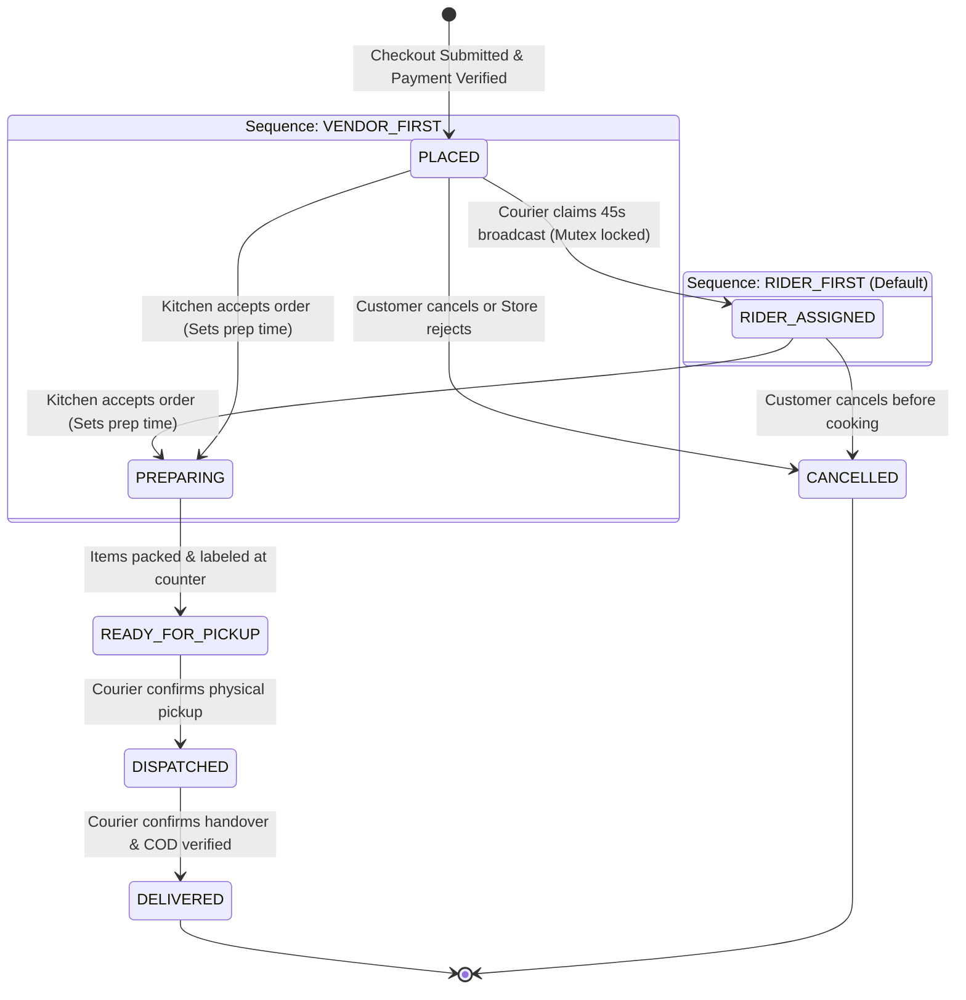

# 05 — Order State Machine & Dispatch Engine

Internal mechanics of the **Order Finite State Machine (FSM)**, Redis geospatial proximity search, distributed mutex locks, dispatch escalation, and double-entry accounting.

---

## 1. Formal Order Finite State Machine (FSM)

The system supports two sequence flows governed by `system_settings.order_flow_mode` ([ADR-002](context_docs/architecture-decision-records/ADR-002-dynamic-dual-order-flow-fsm.md)):
- **`RIDER_FIRST` (Zero Food Waste Mode — Default)**:
  `PLACED` ➔ `RIDER_ASSIGNED` ➔ `PREPARING` ➔ `READY_FOR_PICKUP` ➔ `DISPATCHED` ➔ `DELIVERED`.
- **`VENDOR_FIRST` (Traditional Retail Mode)**:
  `PLACED` ➔ `PREPARING` ➔ `READY_FOR_PICKUP` ➔ `DISPATCHED` ➔ `DELIVERED`.

### Critical Invariants:
- **Direct Preparation Transition Invariant**: When a vendor accepts an order, the runtime engine transitions the order directly to **`PREPARING`** with `accepted_at = NOW()` and `prep_time_minutes` populated. The legacy status `ACCEPTED` is deprecated in runtime execution.
- **Payment-Gated Invariant (ADR-011)**: When `paymentMethod === ONLINE_GATEWAY`, an order in `PLACED` with `paymentStatus === PENDING` will **NOT** broadcast to couriers or alert the store. Broadcast is held until cryptographic webhook verification confirms `paymentStatus === PAID`. Unpaid orders are cancelled after 15 minutes.



### Transition Validation Matrix:

| From State | Allowed Target | Permitted Roles | Invariants & Side Effects |
| :--- | :--- | :--- | :--- |
| `PLACED` | `RIDER_ASSIGNED` | `RIDER`, `SUPER_ADMIN` | In `RIDER_FIRST`: Courier claims order; triggers kitchen chime with guaranteed rider badge. |
| `PLACED` | `PREPARING` | `VENDOR_ADMIN`, `SUPER_ADMIN` | In `VENDOR_FIRST`: Vendor sets prep timer, sets `accepted_at = NOW()`, begins cooking. |
| `PLACED` | `CANCELLED` | `CUSTOMER`, `VENDOR_ADMIN`, `SUPER_ADMIN` | Pre-preparation cancellation. Releases payment holds or triggers refund. |
| `RIDER_ASSIGNED` | `PREPARING` | `VENDOR_ADMIN`, `SUPER_ADMIN` | Vendor reviews items, chooses prep duration, and taps Accept. |
| `RIDER_ASSIGNED` | `CANCELLED` | `CUSTOMER`, `SUPER_ADMIN` | Customer cancellation prior to kitchen prep. Releases courier lock. |
| `PREPARING` | `READY_FOR_PICKUP` | `VENDOR_ADMIN`, `SUPER_ADMIN` | Items packed at counter. In `VENDOR_FIRST`, triggers courier broadcast now. |
| `READY_FOR_PICKUP` | `DISPATCHED` | `RIDER`, `SUPER_ADMIN` | Courier confirms physical pickup at counter. Activates live GPS streaming. |
| `DISPATCHED` | `DELIVERED` | `RIDER`, `SUPER_ADMIN` | Confirms doorstep handover, validates COD cash checkbox, updates ledgers. |
| *Any Pre-Dispatched* | `CANCELLED` | `SUPER_ADMIN` | Administrative override cancellation with mandatory min-5-char audit reason. |

---

## 2. Redis Geospatial Indexing & Telemetry

Rider locations are maintained in Redis spatial sets to prevent high-frequency write pressure on PostgreSQL ([ADR-003](context_docs/architecture-decision-records/ADR-003-postgis-spatial-engine-and-redis-geohash.md)):

- **Redis Key**: `riders:locations`
- **Location Update Command**:
  ```typescript
  await redis.geoadd('riders:locations', longitude, latitude, riderId);
  ```

---

## 3. Proximity Radius Broadcast Algorithm

The dispatch engine executes proximity searches according to `order_flow_mode`:
- **`RIDER_FIRST`**: Triggered immediately at checkout (post payment verification).
- **`VENDOR_FIRST`**: Triggered after store staff marks order `READY_FOR_PICKUP`.

```typescript
async function findNearbyRiders(vendorLat: number, vendorLng: number, radiusKm: number = 4) {
  const nearbyRiderIds = await redis.geosearch(
    'riders:locations',
    'FROMLONLAT',
    vendorLng,
    vendorLat,
    'BYRADIUS',
    radiusKm,
    'km',
    'WITHDIST',
    'ASC'
  );

  const availableRiders: { riderId: string; distanceKm: number }[] = [];
  for (const [riderId, distance] of nearbyRiderIds) {
    const isBusy = await redis.exists(`rider:active_order:${riderId}`);
    if (!isBusy) {
      availableRiders.push({ riderId, distanceKm: parseFloat(distance) });
    }
  }

  return availableRiders;
}
```

---

## 4. Concurrency Protection & Atomic Mutex Lock

To prevent duplicate order claims, the backend executes an atomic **Redis Distributed Mutex** ([ADR-004](context_docs/architecture-decision-records/ADR-004-atomic-dispatch-claim-mutex.md)):

```typescript
async function claimOrder(orderId: string, riderId: string, isRiderFirst: boolean): Promise<boolean> {
  const lockKey = `lock:order_claim:${orderId}`;
  
  // 1. Acquire exclusive lock for 45 seconds (broadcast duration)
  const acquired = await redis.set(lockKey, riderId, 'NX', 'EX', 45);
  if (!acquired) {
    throw new ConflictException('This order has already been claimed by another courier.');
  }

  try {
    // 2. Atomic Database Transaction
    await prisma.$transaction(async (tx) => {
      const order = await tx.order.findUnique({ where: { id: orderId } });
      if (order.riderId !== null) {
        throw new ConflictException('Order already assigned.');
      }

      await tx.order.update({
        where: { id: orderId },
        data: { 
          riderId: riderId,
          status: isRiderFirst ? OrderStatus.RIDER_ASSIGNED : order.status
        }
      });

      // Mark courier busy in Redis
      await redis.set(`rider:active_order:${riderId}`, orderId);

      // If RIDER_FIRST: Trigger vendor kitchen chime now that courier is secured
      if (isRiderFirst) {
        socketGateway.server.to(`vendor_${order.vendorId}`).emit('order:new', {
          orderId: order.id,
          orderNumber: order.orderNumber,
          riderAssigned: true
        });
      }
    });

    return true;
  } finally {
    await redis.del(lockKey);
  }
}
```

---

## 5. Dispatch Escalation & Fallback Protocol

```
┌────────────────────────────────────────────────────────┐
│  Tier 0 (T = 0s): Broadcast within 3 km radius         │
│  - FCM Push + Socket [dispatch:broadcast] to riders    │
└───────────────────────────┬────────────────────────────┘
                            │ (Unassigned after > 45s)
                            ▼
┌────────────────────────────────────────────────────────┐
│  Tier 1 (T > 45s): Expand broadcast radius to 6 km     │
│  - Redis idempotency key: dispatch:escalated:{id}:tier1│
│  - Re-broadcasts to expanded courier radius            │
└───────────────────────────┬────────────────────────────┘
                            │ (Unassigned after > 90s)
                            ▼
┌────────────────────────────────────────────────────────┐
│  Tier 2 (T > 90s): Expand to 10 km & Super Admin Radar │
│  - Emits [dispatch:escalated] to admin_hq socket room  │
│  - Dispatcher executes manual override assignment      │
└────────────────────────────────────────────────────────┘
```

---

## 6. Financial Ledger Settlement & COD Offset Engine

Double-entry ledger records executed atomically upon order completion (`DELIVERED`) ([ADR-009](context_docs/architecture-decision-records/ADR-009-deterministic-financial-accounting-ledger.md)):

1. **Vendor Commission Entry (`CommissionLedger`)**:
   - `gross_amount`: Food subtotal minus coupon discounts.
   - `commission_amount`: `Math.round(gross_amount * (commissionRate / 100) * 100) / 100`.
   - `net_vendor_payable`: `gross_amount - commission_amount`.
2. **Rider Trip Entry (`RiderTripLedger`)**:
   - `delivery_earnings`: Configured trip remuneration credited to courier wallet.
   - `cod_collected`: Physical cash collected from customer added to courier's `cashInHand`.
3. **Cash-on-Delivery Offset**:
   - Hub cash deposits (`POST /riders/deposit-cash`) verified by admin decrement `cashInHand` and restore dispatch eligibility.
